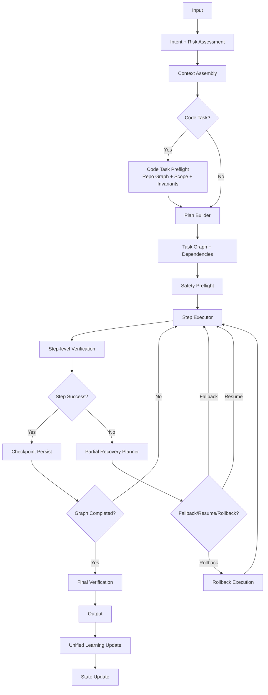

# 🧠 AI Karar ve Uygulama Motoru
## Reasoning + Orchestration Katmanı

> **"Diğer 6 dokümanı çalıştıran karar merkezi katman"**

---

## 📌 Doküman Kartı

| Alan | Değer |
|---|---|
| Rol | Orchestration ve karar yürütme katmanı |
| Durum | Living specification (`v1.5`) |
| Son güncelleme | 2026-04-03 |
| Birincil okur | Platform/AI sistem mühendisleri |
| Ana girdi | `query`, `engineState`, `policy`, `context` |
| Ana çıktı | `decision`, `executionPlan`, `telemetryEvent` |
| Bağımlı dokümanlar | [cross-layer-integration-contract.md](cross-layer-integration-contract.md), [ai-safety-trust-verification-layer.md](ai-safety-trust-verification-layer.md), [rag-source-quality-rubric.md](rag-source-quality-rubric.md), [failure-pattern-atlas.md](failure-pattern-atlas.md), [gguf_llm_katmanlari.md](gguf_llm_katmanlari.md), [typescript.md](typescript.md) |

**Kalite notu:** Bu dosyadaki kod blokları, tasarım sözleşmesini anlatan referans implementasyon örnekleridir; doğrudan production kodu olarak alınmamalıdır.

---

## 🎯 Misyon Beyanı

Bu doküman, AI sistemlerinin **"ne zaman ne yapacağını"** belirleyen karar motorunu tanımlar. GGUF, RAG, Failure Atlas ve TypeScript katmanlarını birbirine bağlayan **AI Kontrol Kulesi**'dir.

---

## 🔄 Temel Uygulama Akışı

> **Kod Durumu:** `Reference`


---

## 🗄️ 0.5. State Management (KRİTİK EKLENTİ)

### Motor Durumu

> **Kod Durumu:** `Reference`
```typescript
interface EngineState {
  currentTask: Task;
  currentStep: number;
  previousActions: Action[];
  failures: Failure[];
  confidence: number;
  retryCount: number;
  startTime: number;
  lastDecision: Decision;
  userHaltRequested: boolean;  // EKLENDİ
  tokensUsed: number;           // EKLENDİ
  tokenBudget: number;          // EKLENDİ
  lastUpdate: number;           // EKLENDİ
  sessionContext: SessionContext; // EKLENDİ
}

interface SessionContext {
  userId: string;
  preferences: UserPreferences;
  permissions: Permission[];
  riskLevel: 'low' | 'medium' | 'high' | 'critical';
}

interface StateManager {
  updateState(action: Action): void;
  getState(): EngineState;
  resetState(): void;
  shouldHalt(): boolean;
  canProceed(decision: Decision): boolean;
  updateMetrics(metrics: ExecutionMetrics): void;
}
```

### State-full Decision Logic

> **Kod Durumu:** `Reference`
```typescript
function makeDecision(query: Query, state: EngineState): Decision {
  // Önceki hatalardan etkilenen kararlar
  if (state.failures.length > 0) {
    const lastFailure = state.failures[state.failures.length - 1];
    if (lastFailure.type === "syntax") {
      return { route: "syntaxFirst", confidence: 0.9 };
    }
  }
  
  // Retry kontrolü
  if (state.retryCount > 3) {
    return { route: "humanIntervention", confidence: 0.95 };
  }
  
  // State-based routing
  return baseDecision(query, state);
}
```

---

## 🎛️ 1. Karar Katmanı

### Loop Control / Halt Mechanism (KRİTİK EKLENTİ)

> **Kod Durumu:** `Reference`
```typescript
interface LoopControl {
  maxRetries: number;
  maxDepth: number;
  timeoutMs: number;
  breakOnLowConfidence: boolean;
  exponentialBackoff: boolean;
}

interface HaltConditions {
  maxRetriesReached: boolean;
  timeoutExceeded: boolean;
  confidenceTooLow: boolean;
  userRequestedHalt: boolean;
  resourceExhausted: boolean;
}

function shouldHalt(state: EngineState, control: LoopControl): HaltConditions {
  return {
    maxRetriesReached: state.retryCount >= control.maxRetries,
    timeoutExceeded: Date.now() - state.startTime > control.timeoutMs,
    confidenceTooLow: control.breakOnLowConfidence && state.confidence < 0.3,
    userRequestedHalt: state.userHaltRequested,
    resourceExhausted: state.tokensUsed > state.tokenBudget
  };
}
```

### Temel Politika Kuralları

> **Kod Durumu:** `Reference`
```typescript
interface DecisionPolicy {
  evaluatePolicy(query: Query, context: Context, state: EngineState): Decision;
  updatePolicy(feedback: PolicyFeedback): void;
  getRoutingRules(): RoutingRule[];
}

interface Decision {
  route: string;
  confidence: number;
  reasoning: string;
  alternatives: Alternative[];
  estimatedCost: number;
  estimatedLatency: number;
  requiredApprovals: string[];
}

interface RoutingRule {
  condition: string;
  action: string;
  priority: number;
  confidence: number;
  cost: number;
}

class StandardDecisionPolicy implements DecisionPolicy {
  private routingRules: RoutingRule[];
  private adaptiveEngine: AdaptivePolicyEngine;
  
  constructor() {
    this.routingRules = this.initializeRules();
    this.adaptiveEngine = new DynamicPolicyEngine();
  }
  
  evaluatePolicy(query: Query, context: Context, state: EngineState): Decision {
    // Hata Ayıklama Senaryoları
    if (query.type === "debug" && state.confidence > 0.7) {
      return {
        route: "Failure Atlas",
        confidence: 0.85,
        reasoning: "High confidence debug request with available stack trace",
        alternatives: [
          { option: "RAG search", rejectedReason: "Less specific for debugging" },
          { option: "Direct reasoning", rejectedReason: "May miss known patterns" }
        ],
        estimatedCost: 0.02,
        estimatedLatency: 1200,
        requiredApprovals: []
      };
    }
    
    // Bilgi Geri Çağırma
    if (query.requiresExternalFacts === true) {
      return {
        route: "RAG + validation",
        confidence: 0.9,
        reasoning: "External facts required, using knowledge base with validation",
        alternatives: [
          { option: "Web search", rejectedReason: "Less reliable than curated knowledge" }
        ],
        estimatedCost: 0.015,
        estimatedLatency: 800,
        requiredApprovals: []
      };
    }
    
    // Eylem Uygulama
    if (query.requiresAction === true) {
      const riskLevel = this.assessRisk(query, state);
      const requiredApprovals = riskLevel === 'high' ? ['security'] : [];
      
      return {
        route: "Tool planning + execution",
        confidence: 0.75,
        reasoning: `Action required with risk level: ${riskLevel}`,
        alternatives: [
          { option: "Manual execution", rejectedReason: "Slower but safer" }
        ],
        estimatedCost: this.estimateActionCost(query),
        estimatedLatency: 2000,
        requiredApprovals
      };
    }
    
    // Açıklama Gereken
    if (state.confidence < 0.6 || this.calculateAmbiguity(query) > 0.4) {
      return {
        route: "Human clarification request",
        confidence: 0.95,
        reasoning: "Low confidence or high ambiguity detected",
        alternatives: [],
        estimatedCost: 0.001,
        estimatedLatency: 5000,
        requiredApprovals: []
      };
    }
    
    // Maliyet Optimizasyonu
    if (query.complexity === "low" && state.tokenBudget < 0.1) {
      return {
        route: "qwen-small",
        confidence: 0.8,
        reasoning: "Low complexity task with tight token budget",
        alternatives: [
          { option: "qwen-large", rejectedReason: "Too expensive for this task" }
        ],
        estimatedCost: 0.005,
        estimatedLatency: 500,
        requiredApprovals: []
      };
    }
    
    // Default routing
    return this.adaptiveEngine.adaptiveRouting(query);
  }
  
  private initializeRules(): RoutingRule[] {
    return [
      {
        condition: "query.type === 'debug' && confidence > 0.7",
        action: "routeToFailureAtlas",
        priority: 100,
        confidence: 0.85,
        cost: 0.02
      },
      {
        condition: "query.requiresExternalFacts === true",
        action: "routeToRagValidation",
        priority: 90,
        confidence: 0.9,
        cost: 0.015
      },
      {
        condition: "query.requiresAction === true",
        action: "routeToToolOrchestration",
        priority: 80,
        confidence: 0.75,
        cost: 0.03
      },
      {
        condition: "confidence < 0.6 || ambiguity > 0.4",
        action: "requestClarification",
        priority: 95,
        confidence: 0.95,
        cost: 0.001
      }
    ];
  }
  
  private assessRisk(query: Query, state: EngineState): 'low' | 'medium' | 'high' {
    let riskScore = 0;
    
    if (query.requiresFileSystem) riskScore += 2;
    if (query.requiresNetworkAccess) riskScore += 3;
    if (query.requiresElevatedPermissions) riskScore += 4;
    if (state.sessionContext.riskLevel === 'high') riskScore += 2;
    
    if (riskScore >= 6) return 'high';
    if (riskScore >= 3) return 'medium';
    return 'low';
  }
  
  updatePolicy(feedback: PolicyFeedback): void {
    this.adaptiveEngine.learnFromFeedback(feedback);
  }
  
  getRoutingRules(): RoutingRule[] {
    return [...this.routingRules];
  }
}
```

### Adaptive Policy Engine (ÖNEMLİ EKLENTİ)

> **Kod Durumu:** `Reference`
```typescript
interface AdaptivePolicy {
  updateFromFeedback: boolean;
  adjustThresholds: boolean;
  learnRoutingPatterns: boolean;
  performanceHistory: PerformanceRecord[];
}

interface PerformanceRecord {
  routing: string;
  success: boolean;
  latency: number;
  cost: number;
  userSatisfaction: number;
  timestamp: number;
}

class DynamicPolicyEngine {
  private policy: AdaptivePolicy;
  private thresholds: Thresholds;
  
  constructor() {
    this.policy = {
      updateFromFeedback: true,
      adjustThresholds: true,
      learnRoutingPatterns: true,
      performanceHistory: []
    };
  }
  
  // Performansa göre eşikleri ayarla
  adjustThresholds(performance: PerformanceRecord[]): void {
    const recentPerformance = performance.slice(-100);
    const avgSuccess = this.calculateAverageSuccess(recentPerformance);
    
    if (avgSuccess < 0.8) {
      this.thresholds.confidenceThreshold += 0.1; // Daha katı
    } else if (avgSuccess > 0.95) {
      this.thresholds.confidenceThreshold -= 0.05; // Daha esnek
    }
  }
  
  // Öğrenilen desenlere göre yönlendir
  adaptiveRouting(query: Query): string {
    const similarQueries = this.findSimilarQueries(query);
    const successfulRoutings = similarQueries.filter(q => q.success);
    
    if (successfulRoutings.length > 5) {
      return this.getMostSuccessfulRouting(successfulRoutings);
    }
    
    return this.defaultRouting(query);
  }
  
  // Geri bildirimden öğren
  learnFromFeedback(feedback: UserFeedback): void {
    this.policy.performanceHistory.push({
      routing: feedback.routing,
      success: feedback.success,
      latency: feedback.latency,
      cost: feedback.cost,
      userSatisfaction: feedback.satisfaction,
      timestamp: Date.now()
    });
    
    this.adjustThresholds(this.policy.performanceHistory);
  }
}
```

### Karar Tetikleyicileri

| Tetikleyici | Durum | Eylem | Güven Eşiği |
|---------|-----------|--------|---------------------|
| **Hata Ayıklama Modu** | Hata tespit edildi | Failure Atlas araması | > 0.7 |
| **Bilgi Eksikliği** | Harici gerçekler gerekli | RAG geri çağırma | > 0.8 |
| **Eylem Gerekli** | Görev uygulama gerekli | Tool orkestrasyonu | > 0.6 |
| **Açıklama** | Belirsiz girdi | Kullanıcı sor | < 0.6 |
| **Maliyet Tasarrufu** | Basit görev | Küçük model | N/A |

---

## 🧠 2. Akıl Yürütme Stratejisi

### Decision Trace (KRİTİK EKLENTİ)

> **Kod Durumu:** `Reference`
```typescript
interface DecisionTrace {
  sessionId: string;
  timestamp: number;
  steps: DecisionStep[];
  finalOutcome: Outcome;
  confidence: number;
  reasoningPath: string[];
}

interface DecisionStep {
  decision: string;
  reason: string;
  confidence: number;
  alternatives: Alternative[];
  contextUsed: Context;
  timestamp: number;
}

interface Alternative {
  option: string;
  rejectedReason: string;
  expectedConfidence: number;
}

class DecisionTracer {
  private trace: DecisionTrace;
  
  startTrace(sessionId: string): void {
    this.trace = {
      sessionId,
      timestamp: Date.now(),
      steps: [],
      finalOutcome: null,
      confidence: 0,
      reasoningPath: []
    };
  }
  
  addStep(step: DecisionStep): void {
    this.trace.steps.push(step);
    this.trace.reasoningPath.push(step.reason);
  }
  
  getTrace(): DecisionTrace {
    return this.trace;
  }
  
  // "Neden böyle karar verdi?" sorusuna cevap
  explainDecision(stepIndex: number): string {
    const step = this.trace.steps[stepIndex];
    return `
      Karar: ${step.decision}
      Sebep: ${step.reason}
      Güven: ${step.confidence}
      Bağlam: ${JSON.stringify(step.contextUsed, null, 2)}
    `;
  }
}
```

### Uncertainty Model (KRİTİK EKLENTİ)

> **Kod Durumu:** `Reference`
```typescript
interface UncertaintyModel {
  ambiguity: number;           // Belirsizlik seviyesi
  missingContext: number;      // Eksik bağlam
  conflictingEvidence: number; // Çelişkili kanıt
  complexity: number;         // Görev karmaşıklığı
}

interface ConfidenceModel {
  accuracy: number;           // Doğruluk güveni
  completeness: number;       // Bütünlük güveni
  reliability: number;        // Güvenilirlik güveni
}

function assessUncertainty(query: Query, context: Context): UncertaintyModel {
  return {
    ambiguity: calculateAmbiguity(query),
    missingContext: detectMissingContext(query, context),
    conflictingEvidence: detectConflicts(context),
    complexity: assessComplexity(query)
  };
}

function shouldProceed(uncertainty: UncertaintyModel, confidence: ConfidenceModel): Decision {
  if (uncertainty.ambiguity > 0.7) {
    return { action: "askClarification", reason: "highAmbiguity" };
  }
  
  if (uncertainty.missingContext > 0.6) {
    return { action: "fetchContext", reason: "missingContext" };
  }
  
  if (confidence.accuracy < 0.5) {
    return { action: "retryWithDifferentApproach", reason: "lowConfidence" };
  }
  
  return { action: "proceed", reason: "sufficientConfidence" };
}
```

### Strateji Seçim Matrisi

> **Kod Durumu:** `Reference`
```typescript
enum ReasoningStrategy {
  CHAIN_OF_THOUGHT = "adım-adım akıl yürütme",
  TOOL_FIRST = "anında tool kullanımı",
  SHALLOW_REASONING = "hızlı yanıt",
  DEEP_REASONING = "kapsamlı analiz",
  COST_AWARE = "bütçe-optimizasyonlu düşünce"
}

function selectStrategy(task: Task): ReasoningStrategy {
  if (task.complexity === "high" && budget === "generous") {
    return ReasoningStrategy.DEEP_REASONING;
  }
  
  if (task.hasExternalDependencies) {
    return ReasoningStrategy.TOOL_FIRST;
  }
  
  if (task.requiresExplanation) {
    return ReasoningStrategy.CHAIN_OF_THOUGHT;
  }
  
  if (budget === "tight") {
    return ReasoningStrategy.COST_AWARE;
  }
  
  return ReasoningStrategy.SHALLOW_REASONING;
}
```

### Akıl Yürütme Maliyet Analizi

| Strateji | Token Maliyeti | Gecikme | Doğruluk | En İyi For |
|----------|------------|---------|----------|----------|
| **Chain of Thought** | Yüksek | Yavaş | Yüksek | Karmaşık problemler |
| **Tool First** | Orta | Hızlı | Orta | Eylem görevleri |
| **Shallow** | Düşük | Hızlı | Orta | Basit sorgular |
| **Deep** | Çok Yüksek | Çok Yavaş | Çok Yüksek | Kritik görevler |
| **Cost Aware** | Değişken | Değişken | İyi | Bütçe kısıtları |

---

## 🔧 3. Tool Orkestrasyonu

### Orkestrasyon Pipeline'ı

> **Kod Durumu:** `Reference`
```typescript
interface ToolOrchestration {
  // Planlama Aşaması
  plan: {
    identifyRequiredTools(query: Query, context: Context): Tool[];
    sequenceTools(tools: Tool[]): ToolSequence;
    estimateExecution(plan: ToolSequence): ExecutionPlan;
    validatePermissions(tools: Tool[], userContext: SessionContext): boolean;
  };
  
  // Uygulama Aşaması
  execute: {
    callTool(tool: Tool, params: ToolParams): Promise<ToolResult>;
    verifyResult(result: ToolResult, expectations: ToolExpectations): boolean;
    handleFailure(error: ToolError, context: ExecutionContext): RecoveryAction;
    rollbackExecution(executionId: string): Promise<void>;
  };
  
  // Zincirleme Mantığı
  chain: {
    pipe(output: ToolResult, nextTool: Tool): Promise<ToolResult>;
    parallel(tools: Tool[], strategy: ParallelStrategy): Promise<ToolResult[]>;
    conditional(condition: Condition, trueTool: Tool, falseTool: Tool): Promise<ToolResult>;
    retry(tool: Tool, maxAttempts: number, backoff: BackoffStrategy): Promise<ToolResult>;
  };
  
  // Security ve Policy
  security: {
    validateToolAccess(tool: Tool, user: SessionContext): SecurityCheck;
    checkRiskLevel(operation: ToolOperation): RiskAssessment;
    enforcePolicy(tool: Tool, policy: SecurityPolicy): PolicyResult;
    auditExecution(execution: ToolExecution): AuditLog;
  };
}

interface ToolSequence {
  id: string;
  tools: ToolStep[];
  dependencies: Dependency[];
  estimatedDuration: number;
  estimatedCost: number;
  riskLevel: 'low' | 'medium' | 'high' | 'critical';
}

interface ToolStep {
  tool: Tool;
  parameters: ToolParams;
  timeout: number;
  retryPolicy: RetryPolicy;
  fallbackTool?: Tool;
}

class SecureToolOrchestrator implements ToolOrchestration {
  private securityManager: SecurityManager;
  private auditLogger: AuditLogger;
  private policyEngine: PolicyEngine;
  
  constructor() {
    this.securityManager = new SecurityManager();
    this.auditLogger = new AuditLogger();
    this.policyEngine = new PolicyEngine();
  }
  
  async executeSecureSequence(sequence: ToolSequence, userContext: SessionContext): Promise<ToolResult[]> {
    // Pre-execution security checks
    const securityCheck = await this.performSecurityCheck(sequence, userContext);
    if (!securityCheck.passed) {
      throw new SecurityError(securityCheck.reason);
    }
    
    // Policy validation
    const policyResult = await this.policyEngine.validate(sequence, userContext);
    if (!policyResult.allowed) {
      await this.handlePolicyViolation(policyResult, userContext);
    }
    
    // Execution with monitoring
    const results: ToolResult[] = [];
    const executionId = this.generateExecutionId();
    
    try {
      for (const step of sequence.tools) {
        const result = await this.executeStepWithMonitoring(step, executionId, userContext);
        results.push(result);
        
        // Mid-execution validation
        if (result.securityFlag) {
          await this.handleSecurityFlag(result, executionId);
        }
      }
      
      return results;
    } catch (error) {
      await this.rollbackExecution(executionId);
      throw error;
    } finally {
      await this.auditLogger.logExecution(executionId, sequence, results);
    }
  }
  
  private async performSecurityCheck(sequence: ToolSequence, user: SessionContext): Promise<SecurityCheck> {
    const checks = await Promise.all([
      this.validateAllTools(sequence.tools, user),
      this.checkSequenceRisk(sequence),
      this.validatePermissions(sequence, user),
      this.checkCompliance(sequence)
    ]);
    
    return this.aggregateSecurityChecks(checks);
  }
  
  private async handlePolicyViolation(violation: PolicyResult, user: SessionContext): Promise<void> {
    if (violation.severity === 'critical') {
      // Immediate halt
      await this.emergencyHalt(violation);
      throw new CriticalPolicyViolation(violation.message);
    }
    
    if (violation.requiresApproval) {
      const approval = await this.requestApproval(violation, user);
      if (!approval.granted) {
        throw new PolicyViolation("Approval denied");
      }
    }
    
    if (violation.requiresEscalation) {
      await this.escalateToAdmin(violation, user);
    }
  }
}
```

### Security Policy & Escalation (KRİTİK GÜVENLİK)

> **Kod Durumu:** `Reference`
```typescript
interface SecurityPolicy {
  // Risk seviyelerine göre kurallar
  riskLevels: {
    low: {
      allowedTools: string[];
      maxExecutionTime: number;
      requiresApproval: boolean;
      auditLevel: 'minimal' | 'standard' | 'detailed';
    };
    medium: {
      allowedTools: string[];
      maxExecutionTime: number;
      requiresApproval: boolean;
      auditLevel: 'minimal' | 'standard' | 'detailed';
    };
    high: {
      allowedTools: string[];
      maxExecutionTime: number;
      requiresApproval: boolean;
      requiresDualApproval: boolean;
      auditLevel: 'minimal' | 'standard' | 'detailed';
    };
    critical: {
      allowedTools: string[];
      maxExecutionTime: number;
      requiresApproval: boolean;
      requiresDualApproval: boolean;
      requiresAdminOverride: boolean;
      auditLevel: 'minimal' | 'standard' | 'detailed';
    };
  };
  
  // Asla otomatik çalıştırılmayacak tool'lar
  prohibitedTools: {
    autoRun: string[];  // Asla otomatik
    humanOnly: string[]; // Sadece insan müdahalesiyle
    quarantine: string[]; // Karantinada
  };
  
  // Sistem durumu kuralları
  systemHaltConditions: {
    securityBreach: boolean;
    dataCorruption: boolean;
    resourceExhaustion: boolean;
    policyViolation: PolicyViolation[];
  };
}

interface EscalationPolicy {
  trigger: 'securityIncident' | 'policyViolation' | 'systemError' | 'userRequest';
  severity: 'low' | 'medium' | 'high' | 'critical';
  escalationPath: string[];
  requiredNotifications: NotificationType[];
  autoRemediation: boolean;
  humanInterventionRequired: boolean;
}

class SecurityPolicyEngine {
  private policy: SecurityPolicy;
  private escalationManager: EscalationManager;
  private incidentLogger: IncidentLogger;
  
  evaluateToolExecution(tool: Tool, context: ExecutionContext): PolicyResult {
    const riskLevel = this.assessToolRisk(tool, context);
    const policyForLevel = this.policy.riskLevels[riskLevel];
    
    // Tool izin kontrolü
    if (!policyForLevel.allowedTools.includes(tool.id)) {
      return {
        allowed: false,
        reason: `Tool ${tool.id} not allowed for risk level ${riskLevel}`,
        severity: 'high',
        requiresApproval: true,
        requiresEscalation: true
      };
    }
    
    // Yasaklı tool kontrolü
    if (this.policy.prohibitedTools.autoRun.includes(tool.id)) {
      return {
        allowed: false,
        reason: `Tool ${tool.id} requires human intervention`,
        severity: 'critical',
        requiresApproval: true,
        requiresEscalation: true,
        humanInterventionRequired: true
      };
    }
    
    // Onay kontrolü
    const requiresApproval = this.checkApprovalRequirements(tool, riskLevel, context);
    
    return {
      allowed: true,
      riskLevel,
      requiresApproval,
      auditLevel: policyForLevel.auditLevel,
      maxExecutionTime: policyForLevel.maxExecutionTime
    };
  }
  
  async handleSecurityIncident(incident: SecurityIncident): Promise<void> {
    const escalation = this.determineEscalation(incident);
    
    // Sistem durdurma koşulları
    if (this.shouldHaltSystem(incident)) {
      await this.emergencySystemHalt(incident);
      return;
    }
    
    // Escalation
    await this.escalationManager.escalate(escalation);
    
    // Incident logging
    await this.incidentLogger.logIncident(incident, escalation);
    
    // Otomatik remediation
    if (escalation.autoRemediation) {
      await this.performAutoRemediation(incident);
    }
  }
  
  private shouldHaltSystem(incident: SecurityIncident): boolean {
    const haltConditions = this.policy.systemHaltConditions;
    
    return (
      (haltConditions.securityBreach && incident.type === 'breach') ||
      (haltConditions.dataCorruption && incident.type === 'corruption') ||
      (haltConditions.resourceExhaustion && incident.type === 'exhaustion') ||
      haltConditions.policyViolation.some(v => this.matchesViolation(incident, v))
    );
  }
  
  private async emergencySystemHalt(incident: SecurityIncident): Promise<void> {
    // Tüm çalışan görevleri durdur
    await this.haltAllExecutions();
    
    // Sistem durumunu koru
    await this.preserveSystemState();
    
    // Yönetici bildirimi
    await this.notifyAdministrators(incident, 'SYSTEM_HALT');
    
    // Audit log
    await this.auditLogger.criticalEvent('SYSTEM_HALT', {
      incident,
      timestamp: Date.now(),
      systemState: await this.captureSystemState()
    });
  }
}
```

### Tool Seçim Politikası

> **Kod Durumu:** `Reference`
```typescript
function selectTool(task: Task): Tool {
  const toolMatrix = {
    "fileOperation": task.needsFileSystem,
    "webSearch": task.needsExternalData,
    "codeExecution": task.needsRuntimeTest,
    "apiCall": task.needsExternalService,
    "databaseQuery": task.needsDataAccess
  };
  
  return Object.entries(toolMatrix)
    .filter(([_, needed]) => needed)
    .map(([tool, _]) => toolRegistry[tool])
    .sort(byPriority)[0];
}
```

---

## 🏗️ 4. Bağlam Oluşturucu

### Bağlam Montaj Pipeline'ı

> **Kod Durumu:** `Reference`
```typescript
interface ContextBuilder {
  buildContext(query: Query): Promise<Context> {
    return {
      // Statik Bağlam
      ast: await extractAST(query.codebase),
      rag: await retrieveRelevantKnowledge(query),
      
      // Dinamik Bağlam
      runtime: await getRuntimeState(),
      history: await getConversationHistory(),
      
      // Hata Bağlamı
      failures: await lookupFailurePatterns(query),
      
      // Meta Bağlam
      constraints: await getConstraints(),
      preferences: await getUserPreferences()
    };
  }
}
```

### Bağlam Önceliklendirme

> **Kod Durumu:** `Reference`
```typescript
const contextWeights = {
  immediateCode: 0.3,      // Mevcut dosya/seçim
  recentHistory: 0.2,      // Son 5-10 mesaj
  ragKnowledge: 0.2,       // İlgili dokümantasyon
  failurePatterns: 0.15,   // Bilinen hata desenleri
  runtimeState: 0.1,       // Mevcut uygulama durumu
  userPreferences: 0.05    // Kullanıcıya özel ayarlar
};
```

---

## 💾 5. Bellek Sistemi

### Memory Lifecycle Politikası (KRİTİK EKLENTİ)

> **Kod Durumu:** `Reference`
```typescript
interface MemoryLifecyclePolicy {
  // Working Memory → Persistent Memory geçişi
  workingToPersistent: {
    trigger: 'sessionEnd' | 'confidenceThreshold' | 'userExplicit' | 'periodic';
    conditions: TransferCondition[];
  };
  
  // Failure Memory update koşulları
  failureMemoryUpdate: {
    trigger: 'immediate' | 'batch' | 'thresholdReached';
    batchSize: number;
    maxAge: number; // milliseconds
  };
  
  // Data expiration politikası
  expiration: {
    workingMemory: number; // 1 hour
    recentHistory: number;  // 24 hours
    failurePatterns: number; // 30 days
    ragKnowledge: number;  // 1 year
    userPreferences: number; // Never expires
  };
  
  // Memory cleanup ve optimization
  cleanup: {
    schedule: 'hourly' | 'daily' | 'weekly';
    strategy: 'lru' | 'lfu' | 'ttl' | 'hybrid';
    maxMemoryUsage: number; // MB
  };
}

interface TransferCondition {
  type: 'confidence' | 'usageFrequency' | 'userRating' | 'errorPattern';
  threshold: number;
  action: 'promote' | 'archive' | 'delete';
}

class MemoryLifecycleManager {
  private policy: MemoryLifecyclePolicy;
  private memorySystem: MemorySystem;
  private scheduler: TaskScheduler;
  
  constructor(policy: MemoryLifecyclePolicy) {
    this.policy = policy;
    this.initializeCleanupSchedule();
  }
  
  // Working Memory'den Persistent Memory'ye transfer
  async transferToPersistent(sessionId: string, trigger: string): Promise<void> {
    const session = this.memorySystem.getWorkingMemory(sessionId);
    const transferData = this.evaluateTransferData(session);
    
    for (const data of transferData) {
      if (this.shouldTransfer(data, trigger)) {
        await this.memorySystem.promoteToPersistent(data);
        
        // Transfer log
        this.logTransfer({
          sessionId,
          dataId: data.id,
          from: 'working',
          to: 'persistent',
          reason: trigger,
          timestamp: Date.now()
        });
      }
    }
  }
  
  // Failure Memory update
  async updateFailureMemory(failure: Failure, context: Context): Promise<void> {
    const existingPattern = await this.findSimilarFailure(failure);
    
    if (existingPattern) {
      // Mevcut deseni güncelle
      await this.memorySystem.updateFailurePattern(existingPattern.id, {
        occurrenceCount: existingPattern.occurrenceCount + 1,
        lastOccurrence: Date.now(),
        contexts: [...existingPattern.contexts, context],
        solutions: await this.mergeSolutions(existingPattern.solutions, failure.suggestedSolution)
      });
    } else {
      // Yeni failure pattern oluştur
      await this.memorySystem.createFailurePattern({
        type: failure.type,
        description: failure.description,
        firstOccurrence: Date.now(),
        occurrenceCount: 1,
        contexts: [context],
        solutions: [failure.suggestedSolution],
        severity: this.assessSeverity(failure)
      });
    }
    
    // Pattern learning trigger
    if (this.shouldTriggerLearning(failure)) {
      await this.triggerPatternLearning(failure);
    }
  }
  
  // Data expiration ve cleanup
  async performCleanup(): Promise<void> {
    const cleanupResults = {
      workingMemory: await this.cleanupWorkingMemory(),
      recentHistory: await this.cleanupRecentHistory(),
      failurePatterns: await this.cleanupFailurePatterns(),
      ragKnowledge: await this.cleanupRAGKnowledge()
    };
    
    // Cleanup raporu
    this.generateCleanupReport(cleanupResults);
    
    // Memory optimization
    await this.optimizeMemoryLayout();
  }
  
  private async cleanupWorkingMemory(): Promise<CleanupResult> {
    const cutoffTime = Date.now() - this.policy.expiration.workingMemory;
    const expiredSessions = await this.memorySystem.getExpiredWorkingSessions(cutoffTime);
    
    let deletedCount = 0;
    let transferredCount = 0;
    
    for (const session of expiredSessions) {
      const shouldTransfer = this.evaluateTransferData(session).length > 0;
      
      if (shouldTransfer) {
        await this.transferToPersistent(session.id, 'sessionEnd');
        transferredCount++;
      }
      
      await this.memorySystem.deleteWorkingSession(session.id);
      deletedCount++;
    }
    
    return {
      deleted: deletedCount,
      transferred: transferredCount,
      freedMemory: this.calculateMemoryFreed(expiredSessions)
    };
  }
  
  private async cleanupFailurePatterns(): Promise<CleanupResult> {
    const cutoffTime = Date.now() - this.policy.expiration.failurePatterns;
    const oldPatterns = await this.memorySystem.getOldFailurePatterns(cutoffTime);
    
    let archivedCount = 0;
    let deletedCount = 0;
    
    for (const pattern of oldPatterns) {
      if (pattern.occurrenceCount >= 5) {
        // Yaygın desenleri arşivle
        await this.memorySystem.archiveFailurePattern(pattern.id);
        archivedCount++;
      } else {
        // Nadir desenleri sil
        await this.memorySystem.deleteFailurePattern(pattern.id);
        deletedCount++;
      }
    }
    
    return {
      deleted: deletedCount,
      archived: archivedCount,
      freedMemory: this.calculatePatternMemoryFreed(oldPatterns)
    };
  }
  
  // Memory optimization
  private async optimizeMemoryLayout(): Promise<void> {
    const memoryStats = await this.memorySystem.getMemoryStats();
    
    if (memoryStats.fragmentation > 0.3) {
      await this.memorySystem.defragment();
    }
    
    if (memoryStats.usage > this.policy.cleanup.maxMemoryUsage) {
      await this.aggressiveCleanup();
    }
    
    // Index optimization
    await this.memorySystem.optimizeIndexes();
  }
  
  // Learning and adaptation
  private async triggerPatternLearning(failure: Failure): Promise<void> {
    const similarFailures = await this.memorySystem.getSimilarFailures(failure, 50);
    
    if (similarFailures.length >= 10) {
      const newPattern = await this.extractNewPattern(similarFailures);
      if (newPattern.confidence > 0.8) {
        await this.memorySystem.addLearnedPattern(newPattern);
        
        // Decision engine güncelleme
        await this.updateDecisionEngineWithNewPattern(newPattern);
      }
    }
  }
  
  private shouldTransfer(data: any, trigger: string): boolean {
    const conditions = this.policy.workingToPersistent.conditions;
    
    for (const condition of conditions) {
      if (this.evaluateCondition(data, condition)) {
        return true;
      }
    }
    
    return false;
  }
  
  private initializeCleanupSchedule(): void {
    switch (this.policy.cleanup.schedule) {
      case 'hourly':
        this.scheduler.scheduleRecurring('memoryCleanup', 3600000, () => this.performCleanup());
        break;
      case 'daily':
        this.scheduler.scheduleRecurring('memoryCleanup', 86400000, () => this.performCleanup());
        break;
      case 'weekly':
        this.scheduler.scheduleRecurring('memoryCleanup', 604800000, () => this.performCleanup());
        break;
    }
  }
}

interface CleanupResult {
  deleted?: number;
  transferred?: number;
  archived?: number;
  freedMemory: number;
}
```

### Bellek Hiyerarşisi

> **Kod Durumu:** `Reference`
```typescript
interface MemorySystem {
  // Kısa süreli (Konuşma)
  workingMemory: {
    currentContext: Context;
    recentMessages: Message[];
    temporaryState: TemporaryState;
  };
  
  // Uzun süreli (RAG)
  persistentMemory: {
    documentation: KnowledgeBase;
    codePatterns: PatternLibrary;
    userHistory: InteractionHistory;
  };
  
  // Hata Belleği (Atlas)
  failureMemory: {
    errorPatterns: FailurePattern[];
    solutions: SolutionDatabase;
    recoveryStrategies: RecoveryPlan[];
  };
}
```

### Bellek Erişim Desenleri

| Bellek Türü | Erişim Hızı | Kalıcılık | Boyut | Kullanım Alanı |
|-------------|--------------|-------------|------|----------|
| **Çalışma Belleği** | Anında | Oturum | Küçük | Mevcut bağlam |
| **Kalıcı Bellek** | Hızlı | Kalıcı | Büyük | Bilgi tabanı |
| **Hata Belleği** | Orta | Kalıcı | Orta | Hata desenleri |

---

## 🔄 6. Kendi Kendini Düzeltme Döngüsü

### Extended Verification (ÖNEMLİ EKLENTİ)

> **Kod Durumu:** `Reference`
```typescript
interface ExtendedVerification {
  // Temel doğrulamalar
  syntactic: boolean;
  semantic: boolean;
  functional: boolean;
  constraint: boolean;
  
  // Ek doğrulamalar
  grounded: boolean;     // RAG ile tutarlılık
  typeSafe: boolean;     // TypeScript ile tip güvenliği
  reproducible: boolean; // Tekrarlanabilirlik
  secure: boolean;       // Güvenlik kontrolü
  performant: boolean;   // Performans kontrolü
}

interface VerificationResult {
  passed: boolean;
  confidence: number;
  issues: VerificationIssue[];
  suggestions: FixSuggestion[];
  metadata: VerificationMetadata;
}

interface VerificationMetadata {
  ragSources: string[];
  typeCheckResults: TypeCheckResult[];
  performanceMetrics: PerformanceMetrics;
  securityScanResults: SecurityScanResult[];
}

class AdvancedVerifier {
  async verifyExtended(output: Output, context: Context): Promise<VerificationResult> {
    const checks = await Promise.all([
      this.syntacticCheck(output),
      this.semanticCheck(output),
      this.functionalCheck(output),
      this.constraintCheck(output),
      this.groundednessCheck(output, context.rag),
      this.typeSafetyCheck(output, context.ast),
      this.reproducibilityCheck(output),
      this.securityCheck(output),
      this.performanceCheck(output)
    ]);
    
    const result = this.aggregateResults(checks);
    
    return {
      passed: result.overallScore > 0.8,
      confidence: result.overallScore,
      issues: result.issues,
      suggestions: this.generateFixes(result.issues),
      metadata: {
        ragSources: context.rag.sources,
        typeCheckResults: result.typeCheckResults,
        performanceMetrics: result.performanceMetrics,
        securityScanResults: result.securityScanResults
      }
    };
  }
  
  private async groundednessCheck(output: Output, ragContext: RAGContext): Promise<CheckResult> {
    // RAG kaynakları ile çıktı tutarlılığını kontrol et
    const claims = this.extractClaims(output);
    const sources = ragContext.retrievedDocuments;
    
    for (const claim of claims) {
      const supportingEvidence = await this.findSupportingEvidence(claim, sources);
      if (supportingEvidence.confidence < 0.7) {
        return {
          passed: false,
          reason: `Claim "${claim.text}" not sufficiently supported by RAG sources`,
          confidence: supportingEvidence.confidence
        };
      }
    }
    
    return { passed: true, confidence: 0.9, reason: "All claims well-supported" };
  }
  
  private async typeSafetyCheck(output: Output, astContext: ASTContext): Promise<CheckResult> {
    // TypeScript tip güvenliği kontrolü
    if (output.type === "code") {
      const typeCheck = await this.typeChecker.check(output.code, astContext);
      return {
        passed: typeCheck.success,
        confidence: typeCheck.success ? 0.95 : 0.3,
        reason: typeCheck.message,
        details: typeCheck.errors
      };
    }
    
    return { passed: true, confidence: 1.0, reason: "No code to type-check" };
  }
  
  private async reproducibilityCheck(output: Output): Promise<CheckResult> {
    // Sonucun tekrarlanabilirliğini kontrol et
    const reexecution = await this.reexecute(output);
    const reproducibility = this.compareResults(output, reexecution);
    
    return {
      passed: reproducibility.similarity > 0.9,
      confidence: reproducibility.similarity,
      reason: `Reproducibility: ${reproducibility.similarity}`,
      details: reproducibility
    };
  }
}
```

### Doğrulama Pipeline'ı

> **Kod Durumu:** `Reference`
```typescript
interface SelfCorrection {
  async verify(output: Output): Promise<VerificationResult> {
    const checks = [
      this.syntacticCheck(output),
      this.semanticCheck(output),
      this.functionalCheck(output),
      this.constraintCheck(output)
    ];
    
    const results = await Promise.all(checks);
    const confidence = this.calculateConfidence(results);
    
    return {
      passed: confidence > 0.8,
      confidence,
      issues: results.filter(r => !r.passed),
      suggestions: this.generateFixes(results)
    };
  }
  
  async correct(output: Output, issues: Issue[]): Promise<Output> {
    const strategy = this.selectCorrectionStrategy(issues);
    return await this.applyCorrection(output, strategy);
  }
}
```

### Düzeltme Stratejileri

> **Kod Durumu:** `Reference`
```typescript
const correctionStrategies = {
  "syntaxError": () => "applySyntaxFix",
  "logicError": () => "rerunWithDifferentApproach",
  "performanceIssue": () => "optimizeExecution",
  "constraintViolation": () => "adjustParameters",
  "knowledgeGap": () => "fetchAdditionalContext"
};
```

---

## 💰 7. Maliyet / Performans Zekası

### Kaynak Yönetimi

> **Kod Durumu:** `Reference`
```typescript
interface ResourceOptimizer {
  // Token Bütçe Yönetimi
  budget: {
    totalTokens: number;
    usedTokens: number;
    remainingTokens: number;
    priorityAllocation: PriorityMap;
  };
  
  // Model Yönlendirme
  modelRouting: {
    selectModel(task: Task, budget: Budget): Model;
    estimateTokens(input: Input): number;
    optimizePrompt(prompt: string): string;
  };
  
  // Performans Takasları
  performance: {
    latencyTarget: number;
    accuracyRequirement: number;
    costConstraint: number;
    qualityThreshold: number;
  };
}
```

### Maliyet Optimizasyon Kuralları

> **Kod Durumu:** `Reference`
```typescript
function optimizeExecution(task: Task): ExecutionPlan {
  // Model Seçimi
  const model = task.complexity === "low" ? "qwen-small" : "qwen-large";
  
  // Akıl Yürütme Stratejisi
  const strategy = budget.tight ? "costAware" : "deepReasoning";
  
  // Tool Kullanımı
  const tools = task.critical ? ["all"] : ["essential"];
  
  // Doğrulama Seviyesi
  const verification = task.safetyCritical ? "comprehensive" : "basic";
  
  return { model, strategy, tools, verification };
}
```

---

## 🚨 8. Hata Entegrasyonu

### Failure Atlas Entegrasyonu

> **Kod Durumu:** `Reference`
```typescript
interface FailureIntegration {
  async handleFailure(error: Error): Promise<RecoveryPlan> {
    // Desen Eşleştirme
    const pattern = await this.matchFailurePattern(error);
    
    // Çözüm Geri Çağırma
    const solutions = await this.getSolutions(pattern);
    
    // Kurtarma Planlama
    const plan = await this.createRecoveryPlan(solutions);
    
    // Uygulama
    return await this.executeRecovery(plan);
  }
  
  async learnFromFailure(error: Error, solution: Solution): Promise<void> {
    await this.updateFailureAtlas(error, solution);
    await this.updateDecisionPolicies(error, solution);
    await this.updateToolStrategies(error, solution);
  }
}
```

### Hata Yanıt Matrisi

| Hata Türü | Tespit | Yanıt | Kurtarma | Öğrenme |
|------------|-----------|----------|----------|----------|
| **Sözdizimi** | Ayrıştırıcı | Anında düzeltme | Otomatik düzelt | Desen güncelleme |
| **Mantık** | Test | Alternatif yaklaşım | Farklı şekilde dene | Strateji güncelleme |
| **Performans** | İzleme | Optimizasyon | Kod yeniden yazma | Performans veritabanı |
| **Harici** | API yanıtı | Yedek plan | Alternatif servis | Sağlayıcı güncelleme |

---

## 🎯 Politika Motoru Örnekleri

### Task Decomposition (ÖNEMLİ EKLENTİ)

> **Kod Durumu:** `Reference`
```typescript
interface TaskDecomposition {
  split(task: Task): SubTask[];
  executeSequential(): boolean;
  mergeResults(): Result;
  dependencies: TaskDependency[];
}

interface SubTask {
  id: string;
  description: string;
  type: "knowledge" | "action" | "generation" | "debug";
  priority: number;
  dependencies: string[];
  estimatedComplexity: number;
  requiredTools: Tool[];
}

interface TaskDependency {
  from: string;
  to: string;
  type: "sequential" | "parallel" | "conditional";
  condition?: string;
}

class TaskDecomposer {
  decomposeComplexTask(task: Task): SubTask[] {
    if (task.complexity < 0.7) {
      return [this.createSimpleSubTask(task)];
    }
    
    const decomposition = this.analyzeTask(task);
    
    switch (task.type) {
      case "complexDebug":
        return this.decomposeDebugTask(task);
      
      case "featureImplementation":
        return this.decomposeFeatureTask(task);
      
      case "researchAnalysis":
        return this.decomposeResearchTask(task);
      
      default:
        return this.decomposeGenericTask(task);
    }
  }
  
  private decomposeDebugTask(task: Task): SubTask[] {
    return [
      {
        id: "reproduceError",
        description: "Hata yeniden oluştur",
        type: "debug",
        priority: 1,
        dependencies: [],
        estimatedComplexity: 0.3,
        requiredTools: ["codeExecution"]
      },
      {
        id: "analyzeStackTrace",
        description: "Stack trace analiz et",
        type: "knowledge",
        priority: 2,
        dependencies: ["reproduceError"],
        estimatedComplexity: 0.5,
        requiredTools: ["failureAtlas", "rag"]
      },
      {
        id: "implementFix",
        description: "Düzeltme uygula",
        type: "generation",
        priority: 3,
        dependencies: ["analyzeStackTrace"],
        estimatedComplexity: 0.7,
        requiredTools: ["codeGenerator"]
      },
      {
        id: "verifyFix",
        description: "Düzeltmeyi doğrula",
        type: "action",
        priority: 4,
        dependencies: ["implementFix"],
        estimatedComplexity: 0.4,
        requiredTools: ["testRunner", "codeExecution"]
      }
    ];
  }
  
  private decomposeFeatureTask(task: Task): SubTask[] {
    return [
      {
        id: "researchRequirements",
        description: "Gereksinimleri araştır",
        type: "knowledge",
        priority: 1,
        dependencies: [],
        estimatedComplexity: 0.4,
        requiredTools: ["rag", "webSearch"]
      },
      {
        id: "designArchitecture",
        description: "Mimari tasar",
        type: "generation",
        priority: 2,
        dependencies: ["researchRequirements"],
        estimatedComplexity: 0.6,
        requiredTools: ["llmReasoning"]
      },
      {
        id: "implementCore",
        description: "Çekirdek kodu implemente et",
        type: "generation",
        priority: 3,
        dependencies: ["designArchitecture"],
        estimatedComplexity: 0.8,
        requiredTools: ["codeGenerator", "astAnalysis"]
      },
      {
        id: "writeTests",
        description: "Testler yaz",
        type: "generation",
        priority: 4,
        dependencies: ["implementCore"],
        estimatedComplexity: 0.5,
        requiredTools: ["testGenerator"]
      },
      {
        id: "integrationTest",
        description: "Entegrasyon testi",
        type: "action",
        priority: 5,
        dependencies: ["writeTests"],
        estimatedComplexity: 0.6,
        requiredTools: ["testRunner", "codeExecution"]
      }
    ];
  }
  
  executeDecomposedTasks(subTasks: SubTask[]): Promise<Result> {
    const executionPlan = this.createExecutionPlan(subTasks);
    return this.executeWithDependencies(executionPlan);
  }
  
  mergeResults(results: Map<string, Result>): Result {
    const finalResult = this.aggregateResults(results);
    return {
      success: finalResult.overallSuccess,
      output: finalResult.combinedOutput,
      confidence: finalResult.averageConfidence,
      metadata: {
        subTaskResults: Array.from(results.entries()),
        executionPath: this.getExecutionPath(results)
      }
    };
  }
}
```

### Human-in-the-Loop (ÖNEMLİ EKLENTİ)

> **Kod Durumu:** `Reference`
```typescript
interface HumanLoop {
  requireApproval: boolean;
  overrideDecision: boolean;
  interventionPoints: InterventionPoint[];
  userPreferences: UserInteractionPreferences;
}

interface InterventionPoint {
  type: "approval" | "clarification" | "override" | "guidance";
  condition: string;
  message: string;
  options?: string[];
  timeout?: number;
}

interface UserInteractionPreferences {
  approvalRequiredFor: string[];
  autoApproveBelow: number;
  interventionStyle: "passive" | "active" | "collaborative";
  notificationLevel: "minimal" | "standard" | "detailed";
}

class HumanInLoopManager {
  private humanLoop: HumanLoop;
  
  constructor() {
    this.humanLoop = {
      requireApproval: true,
      overrideDecision: true,
      interventionPoints: [
        {
          type: "approval",
          condition: "cost > 0.1",
          message: "Bu işlem $0.10'dan fazla maliyetli. Onaylıyor musunuz?",
          options: ["Evet, devam et", "Hayır, iptal et", "Alternatif göster"],
          timeout: 30000
        },
        {
          type: "clarification",
          condition: "ambiguity > 0.7",
          message: "İsteğiniz belirsiz. Lütfen açıklayın:",
          timeout: 60000
        },
        {
          type: "override",
          condition: "confidence < 0.4",
          message: "Düşük güvenle karar verildi. Müdahele etmek ister misiniz?",
          options: ["Kararı değiştir", "Güven artır", "İnsan yardımı al"]
        },
        {
          type: "guidance",
          condition: "multipleStrategiesAvailable",
          message: "Birden fazla strateji mevcut. Hangisini tercih edersiniz?",
          options: ["En hızlı", "En ucuz", "En güvenilir", "Kullanıcı seçimi"]
        }
      ],
      userPreferences: {
        approvalRequiredFor: ["fileDeletion", "apiCalls", "costlyOperations"],
        autoApproveBelow: 0.05,
        interventionStyle: "collaborative",
        notificationLevel: "standard"
      }
    };
  }
  
  async checkForIntervention(decision: Decision, context: Context): Promise<InterventionResult> {
    for (const point of this.humanLoop.interventionPoints) {
      if (this.evaluateCondition(point.condition, decision, context)) {
        const response = await this.requestHumanIntervention(point, decision, context);
        
        return {
          required: true,
          type: point.type,
          response,
          action: this.determineAction(response, point.type)
        };
      }
    }
    
    return { required: false };
  }
  
  private async requestHumanIntervention(
    point: InterventionPoint, 
    decision: Decision, 
    context: Context
  ): Promise<HumanResponse> {
    const intervention = {
      type: point.type,
      message: point.message,
      options: point.options,
      context: {
        decision: decision,
        confidence: decision.confidence,
        cost: decision.estimatedCost,
        alternatives: decision.alternatives
      },
      timeout: point.timeout || 30000
    };
    
    return await this.sendToUser(intervention);
  }
  
  private determineAction(response: HumanResponse, type: string): string {
    switch (type) {
      case "approval":
        return response.approved ? "proceed" : "halt";
      
      case "clarification":
        return "retryWithClarification";
      
      case "override":
        return response.override ? "applyOverride" : "continueOriginal";
      
      case "guidance":
        return `applyGuidance${response.selectedOption}`;
      
      default:
        return "continue";
    }
  }
  
  // Kullanıcı geri bildirimini öğren
  learnFromInteraction(interaction: HumanInteraction): void {
    this.updateUserPreferences(interaction);
    this.adjustInterventionPoints(interaction);
  }
}
```

### Örnek 1: Hata Ayıklama İsteği
> **Kod Durumu:** `Reference`
```typescript
// Girdi: "Kodumu çalıştırınca çöküyor"
if (query.type === "debug" && hasStackTrace) {
  confidence = 0.85;
  route = "Failure Atlas";
  context = addStackTrace(context);
  verification = "comprehensive";
}
```

### Örnek 2: Bilgi Sorgusu
> **Kod Durumu:** `Reference`
```typescript
// Girdi: "React useEffect nasıl çalışır?"
if (query.type === "knowledge" && requiresDocumentation) {
  confidence = 0.9;
  route = "RAG + validation";
  sources = ["officialDocs", "stackOverflow"];
  verification = "factCheck";
}
```

### Örnek 3: Kod Üretimi
> **Kod Durumu:** `Reference`
```typescript
// Girdi: "Diziyi sıralayan bir fonksiyon yaz"
if (query.type === "generation" && hasRequirements) {
  confidence = 0.7;
  route = "Tool orchestration";
  tools = ["codeGenerator", "testRunner"];
  verification = "automatedTest";
}
```

---

## 📊 Performans Metrikleri

### Temel Performans Göstergeleri

| Metrik | Hedef | Ölçüm | Etki |
|--------|--------|-------------|--------|
| **Karar Doğruluğu** | > %90 | Doğru yönlendirme yüzdesi | Sistem etkinliği |
| **Yanıt Gecikmesi** | < 2s | Uçtan uca yanıt süresi | Kullanıcı deneyimi |
| **Maliyet Verimliliği** | < $0.01/sorgu | İstek başına token maliyeti | Bütçe optimizasyonu |
| **Hata Kurtarma** | > %80 | Başarılı otomatik kurtarma | Sistem güvenilirliği |
| **Bağlam İlgisi** | > %85 | Bağlam kesinlik skoru | Yanıt kalitesi |

---

## 🚀 Uygulama Yol Haritası

### Aşama 1: Temel Karar Motoru
- [ ] Temel niyet sınıflandırması
- [ ] Basit yönlendirme mantığı
- [ ] Tool seçim çerçevesi

### Aşama 2: Bağlam & Bellek
- [ ] Bağlam oluşturucu uygulaması
- [ ] Bellek sistemi entegrasyonu
- [ ] RAG bağlantısı

### Aşama 3: Kendi Kendini Düzeltme
- [ ] Doğrulama pipeline'ı
- [ ] Otomatik düzeltme mekanizmaları
- [ ] Öğrenme döngüleri

### Aşama 4: Optimizasyon
- [ ] Maliyet optimizasyonu
- [ ] Performans ayarı
- [ ] Gelişmiş hata yönetimi

---

## 🎯 Başarı Kriterleri

✅ **Karar Doğruluğu**: >%90 doğru yönlendirme  
✅ **Otomatik Kurtarma**: >%80 hata çözümü  
✅ **Maliyet Verimliliği**: < $0.01 sorgu başına  
✅ **Yanıt Kalitesi**: >%85 kullanıcı memnuniyeti  
✅ **Sistem Güvenilirliği**: >%99 çalışma süresi  

---

## 🔮 Gelecek Geliştirmeleri

### Multi-Path Execution (GELİŞMİŞ ÖZELLİK)

> **Kod Durumu:** `Reference`
```typescript
interface MultiPathExecution {
  strategies: ExecutionPlan[];
  compareResults: boolean;
  selectBest: boolean;
  parallelExecution: boolean;
}

interface ExecutionPlan {
  id: string;
  strategy: ReasoningStrategy;
  tools: Tool[];
  expectedConfidence: number;
  estimatedCost: number;
  estimatedLatency: number;
}

class MultiPathExecutor {
  async executeWithMultipleStrategies(task: Task): Promise<ExecutionResult[]> {
    const strategies = this.generateExecutionPlans(task);
    const results: ExecutionResult[] = [];
    
    // Paralel execution
    if (this.parallelExecution) {
      const promises = strategies.map(plan => this.executePlan(plan));
      results.push(...await Promise.all(promises));
    } else {
      // Sequential execution
      for (const plan of strategies) {
        const result = await this.executePlan(plan);
        results.push(result);
        
        // Early stopping if high confidence found
        if (result.confidence > 0.9) break;
      }
    }
    
    return results;
  }
  
  selectBestResult(results: ExecutionResult[]): ExecutionResult {
    return results.reduce((best, current) => {
      const bestScore = this.calculateScore(best);
      const currentScore = this.calculateScore(current);
      return currentScore > bestScore ? current : best;
    });
  }
  
  private calculateScore(result: ExecutionResult): number {
    return (
      result.confidence * 0.4 +
      (1 - result.cost / 0.1) * 0.3 +
      (1 - result.latency / 5000) * 0.2 +
      result.accuracy * 0.1
    );
  }
}
```

### Task Scheduler (KISA VERSİYON)

> **Kod Durumu:** `Reference`
```typescript
interface TaskScheduler {
  priority: "low" | "medium" | "high" | "critical";
  queue: Task[];
  preemption: boolean;
  resourceAllocation: ResourceAllocation;
}

interface ResourceAllocation {
  cpuCores: number;
  memoryMB: number;
  tokenBudget: number;
  maxConcurrentTasks: number;
}

class BasicTaskScheduler implements TaskScheduler {
  private taskQueue: PriorityQueue<Task>;
  private executingTasks: Map<string, Task>;
  
  scheduleTask(task: Task): string {
    const taskId = this.generateTaskId(task);
    this.taskQueue.enqueue(task, this.calculatePriority(task));
    this.processQueue();
    return taskId;
  }
  
  private calculatePriority(task: Task): number {
    const priorityWeight = {
      critical: 1000,
      high: 100,
      medium: 10,
      low: 1
    };
    
    return priorityWeight[task.priority] + (task.urgency * 0.1);
  }
}
```

### Gelişmiş Özellikler
- **Çok modlu akıl yürütme** (metin + kod + görsel)
- **Dağıtık uygulama** birden çok model üzerinde
- **Gerçek zamanlı öğrenme** kullanıcı etkileşimlerinden
- **Tahminleyici hata önleme**
- **Uyarlanabilir maliyet optimizasyonu**

### Entegrasyon Fırsatları
- **IDE eklentileri** gerçek zamanlı yardım için
- **CI/CD entegrasyonu** otomatik hata ayıklama için
- **Dokümantasyon üretimi** koddan
- **Kod inceleme otomasyonu**
- **Performans izleme**

---

## 🚨 5. ERROR HANDLING & RECOVERY LAYER (KRITIK EKLENTI)

### Hata Sınıflandırması ve Strateji

> **Kod Durumu:** `Reference`
```typescript
type ErrorSeverity = 'critical' | 'high' | 'medium' | 'low' | 'info';
type ErrorRecoveryStrategy = 'retry' | 'fallback' | 'escalate' | 'halt' | 'ignore';

interface DecisionError {
  id: string;
  errorType: 'routingError' | 'executionError' | 'validationError' | 'timeoutError' | 'safetyError';
  severity: ErrorSeverity;
  message: string;
  code: string;
  
  // Root cause analysis
  rootCause?: string;
  affectedComponent: string;
  cascadingRisks?: string[];
  
  // Recovery information
  recoveryStrategy: ErrorRecoveryStrategy;
  recoveryAttempts: number;
  maxRecoveryAttempts: number;
  estimatedRecoveryTimeMs: number;
  
  // Context
  decisionId: string;
  taskId: string;
  timestamp: number;
  environmentContext: Record<string, any>;
}

interface ErrorRecoveryPlan {
  error: DecisionError;
  steps: RecoveryStep[];
  fallbackDecision?: Decision;
  preventionMeasures: string[];
  estimatedSuccessRate: number;
}

interface RecoveryStep {
  order: number;
  action: string;
  timeout: number;
  rollbackAction?: () => Promise<void>;
  condition?: (state: EngineState) => boolean;
  verificationCriteria: VerificationCriteria;
}

interface VerificationCriteria {
  shouldSucceed: boolean;
  expectedOutput?: string;
  healthCheck?: () => Promise<boolean>;
  metricsThresholds?: Record<string, number>;
}
```

### Cascading Failure Prevention

> **Kod Durumu:** `Reference`
```typescript
interface CascadingFailureDetection {
  // Bir hatanın başka hatalara sebep oluş zinciri
  errorDependencyGraph: Map<string, string[]>;
  detectedChains: FailureChain[];
  breakCircuitIfNeeded(failureChain: FailureChain): CircuitBreakerAction;
}

interface FailureChain {
  primaryError: DecisionError;
  triggeredErrors: DecisionError[];
  chainDepth: number;
  estimatedDamageScope: string[]; // Etkileyeceği sistem componentleri
}

class CascadingFailurePreventionEngine {
  private errorHistory: Map<string, DecisionError[]> = new Map();
  private circuitBreakers: Map<string, CircuitBreakerState> = new Map();
  
  async detectAndPrevent(error: DecisionError, state: EngineState): Promise<PreventionAction> {
    // Pattern matching - bu hata öncesinde görüldü mü?
    const historicalPattern = this.findHistoricalPattern(error);
    if (historicalPattern) {
      return {
        action: 'applyHistoricalRemedy',
        remedy: historicalPattern.successfulRemedy,
        confidence: historicalPattern.successRate
      };
    }
    
    // Circuit breaker - çok fazla aynı hata mı?
    const breaker = this.getOrCreateCircuitBreaker(error.affectedComponent);
    if (breaker.state === 'open') {
      return {
        action: 'haltAndEscalate',
        reason: 'Circuit breaker açık - çok fazla hata tespit edildi',
        escalationLevel: 'critical'
      };
    }
    
    // Cascade detection - bu hata başka hataları tetikleyecek mi?
    const potentialCascade = await this.predictCascade(error, state);
    if (potentialCascade.likelihood > 0.7) {
      return {
        action: 'preventiveIsolation',
        isolationStrategy: potentialCascade.preventionStrategy,
        affectedSystems: potentialCascade.affectedSystems
      };
    }
    
    return { action: 'proceedWithMonitoring' };
  }
  
  private async predictCascade(error: DecisionError, state: EngineState): Promise<CascadePrediction> {
    // Decision graph'ında cascade yolunu izle
    const downstreamDependencies = this.getDownstreamDependencies(error.affectedComponent);
    const predictions = [];
    
    for (const dependent of downstreamDependencies) {
      const healthStatus = await this.checkComponentHealth(dependent);
      if (healthStatus.vulnerable) {
        predictions.push({
          component: dependent,
          failureLikelihood: healthStatus.vulnerabilityScore,
          failureType: this.predictFailureType(error, dependent)
        });
      }
    }
    
    return {
      likelihood: Math.max(...predictions.map(p => p.failureLikelihood)),
      affectedSystems: predictions,
      preventionStrategy: this.selectPreventionStrategy(predictions)
    };
  }
}
```

---

## 📊 6. TELEMETRY & STRUCTURED LOGGING

### Telemetry Framework

> **Kod Durumu:** `Reference`
```typescript
interface TelemetryPoint {
  timestamp: number;
  traceId: string;
  spanId: string;
  spanName: string;
  parentSpanId?: string;
  
  // Decision context
  decisionId: string;
  taskId: string;
  stage: 'routing' | 'execution' | 'verification' | 'recovery';
  
  // Metrics
  duration: number; // ms
  success: boolean;
  errorId?: string;
  
  // Resource usage
  tokensUsed: number;
  computeUnits: number;
  memoryMB: number;
  costUSD: number;
  
  // Business metrics
  confidence: number;
  alternativesCount: number;
  routingDecision: string;
  
  // Tags for filtering
  tags: Record<string, string>;
  attributes: Record<string, any>;
}

interface TelemetryBatch {
  batchId: string;
  points: TelemetryPoint[];
  exportedAt: number;
  compressionRatio?: number;
}

class StructuredLogger {
  private telemetryCollector: TelemetryCollector;
  private logBuffer: ExecutionLog[] = [];
  private flushInterval: number = 5000; // 5 seconds
  
  log(level: LogLevel, stage: ExecutionStage, message: string, context: any): void {
    const logEntry: ExecutionLog = {
      timestamp: Date.now(),
      level,
      stage,
      message,
      context,
      source: 'DecisionEngine',
      hostname: process.env.HOSTNAME || 'unknown'
    };
    
    this.logBuffer.push(logEntry);
    
    // Immediate flush untuk critical logs
    if (level === 'error' || level === 'critical') {
      this.flush();
    }
  }
  
  async recordDecisionMetrics(decision: Decision, result: ExecutionResult): Promise<void> {
    const telemetryPoint: TelemetryPoint = {
      timestamp: Date.now(),
      traceId: decision.traceId || generateTraceId(),
      spanId: generateSpanId(),
      spanName: `decision.execute.${decision.route}`,
      
      decisionId: decision.id,
      taskId: decision.taskId,
      stage: 'verification',
      
      duration: result.executionTimeMs,
      success: result.success,
      errorId: result.error?.id,
      
      tokensUsed: result.tokensUsed,
      computeUnits: result.computeUnits,
      memoryMB: result.memoryMB,
      costUSD: result.costUSD,
      
      confidence: decision.confidence,
      alternativesCount: decision.alternatives.length,
      routingDecision: decision.route,
      
      tags: {
        environment: process.env.ENVIRONMENT || 'production',
        service: 'decision-engine',
        version: process.env.ENGINE_VERSION || 'unknown'
      },
      attributes: {
        userSegment: decision.context.userId ? hashUserId(decision.context.userId) : 'anonymous',
        taskComplexity: classifyTaskComplexity(decision)
      }
    };
    
    await this.telemetryCollector.record(telemetryPoint);
  }
  
  private async flush(): Promise<void> {
    if (this.logBuffer.length === 0) return;
    
    const batch = this.createBatch();
    try {
      await this.export(batch);
    } catch (error) {
      console.error('Telemetry export failed:', error);
      // Fallback: write to local file
      this.writeToLocalFile(batch);
    }
    
    this.logBuffer = [];
  }
}

interface ExecutionLog {
  timestamp: number;
  level: LogLevel;
  stage: ExecutionStage;
  message: string;
  context: Record<string, any>;
  source: string;
  hostname: string;
  traceId?: string;
}
```

### Distributed Tracing Integration

> **Kod Durumu:** `Reference`
```typescript
interface TraceContext {
  traceId: string;
  spanId: string;
  parentSpanId?: string;
  baggage: Map<string, string>;
}

class OpenTelemetryIntegration {
  private tracer = trace.getTracer('decision-engine');
  
  async executeWithTracing(
    decision: Decision,
    execute: () => Promise<ExecutionResult>
  ): Promise<ExecutionResult> {
    const span = this.tracer.startSpan(`decision.${decision.route}`, {
      attributes: {
        'decision.id': decision.id,
        'decision.confidence': decision.confidence,
        'decision.route': decision.route,
        'task.id': decision.taskId,
        'user.id': decision.context.userId
      }
    });
    
    try {
      return await context.with(
        trace.setSpan(context.active(), span),
        async () => {
          const startTime = performance.now();
          const result = await execute();
          const duration = performance.now() - startTime;
          
          span.setAttributes({
            'execution.success': result.success,
            'execution.durationMs': duration,
            'tokens.used': result.tokensUsed,
            'cost.usd': result.costUSD
          });
          
          if (result.error) {
            span.recordException(result.error);
            span.setStatus({ code: SpanStatusCode.ERROR });
          } else {
            span.setStatus({ code: SpanStatusCode.OK });
          }
          
          return result;
        }
      );
    } finally {
      span.end();
    }
  }
}
```

### Monitoring Dashboards & Alerts

> **Kod Durumu:** `Reference`
```typescript
interface MonitoringDashboard {
  // Real-time metrics
  successRate: Metric; // % başarılı kararlar
  averageDecisionLatency: Metric; // ortalaması
  costPerDecision: Metric;
  confidenceDistribution: Metric;
  
  // Error tracking
  errorRate: Metric;
  topErrorTypes: Metric;
  cascadingFailureIncidents: Metric;
  recoverySuccessRate: Metric;
  
  // Resource usage
  tokenUsagePercentile: Metric; // P50, P95, P99
  computeUnitsPercentile: Metric;
  memoryUsagePercentile: Metric;
  
  // SLO tracking
  sloCompliance: {
    availability: number; // % uptime
    latencyP99: number; // ms
    errorRate: number; // %
  };
}

interface AlertRule {
  name: string;
  condition: string; // e.g., "errorRate > 5%"
  threshold: number;
  evaluationWindow: number; // seconds
  severity: 'critical' | 'warning' | 'info';
  action: 'page' | 'notify' | 'autoRemediate';
  autoRemediationAction?: () => Promise<void>;
}

// Örnek alert configuration
const alertRules: AlertRule[] = [
  {
    name: 'HighErrorRate',
    condition: 'errorRate > 5%',
    threshold: 5,
    evaluationWindow: 300,
    severity: 'critical',
    action: 'page',
    autoRemediationAction: async () => {
      // Circuit breaker aç
      await engineState.enableCircuitBreaker('decisionRouting');
    }
  },
  {
    name: 'DecisionLatencyHigh',
    condition: 'p99_latency > 5000ms',
    threshold: 5000,
    evaluationWindow: 600,
    severity: 'warning',
    action: 'notify'
  },
  {
    name: 'CostAnomalyDetected',
    condition: 'costPerDecision > baseline * 2',
    threshold: 0.5, // 2x baseline çarpanı
    evaluationWindow: 900,
    severity: 'warning',
    action: 'autoRemediate',
    autoRemediationAction: async () => {
      // Daha ucuz routing seçeneğine geç
      await policyEngine.switchToEconomyMode();
    }
  }
];
```

---

## 🧱 Production Hardening Delta (`v1.4`)

Bu bölüm, prototip seviyesinden production-ready seviyesine geçiş için zorunlu kapatma kalemlerini standartlaştırır.

### 1) Unified Telemetry + Replay Contract (KRİTİK)

> **Kod Durumu:** `Reference`
```typescript
type LayerName = 'decision' | 'rag' | 'model' | 'safety' | 'tool' | 'verification';

interface TraceEnvelope {
  traceId: string;
  spanId: string;
  parentSpanId?: string;
  sessionId: string;
  taskId: string;
  layer: LayerName;
  stage: string;
  timestamp: number;
}

interface ReplayEvent {
  envelope: TraceEnvelope;
  inputHash: string;
  outputHash?: string;
  policySnapshotId: string;
  modelSnapshotId?: string;
  toolSnapshotId?: string;
  safetySnapshotId?: string;
  outcome: 'success' | 'failure' | 'degraded' | 'halted';
  error?: ContractError;
}

interface ReplayStore {
  append(event: ReplayEvent): Promise<void>;
  getTrace(traceId: string): Promise<ReplayEvent[]>;
  rebuildExecution(traceId: string): Promise<ExecutionReplay>;
}
```

Zorunlu kural: Her katman giriş/çıkışında aynı `traceId` propagate edilir; span hiyerarşisi `decision -> rag/model/tool -> safety -> verification` biçiminde tek zincir olarak korunur.

### 2) Global Learning Coordinator (TEK LEARNING LOOP)

> **Kod Durumu:** `Reference`
```typescript
interface LearningSignal {
  traceId: string;
  decisionRoute: string;
  retrievalQuality?: number;
  trustScore?: number;
  userSatisfaction?: number;
  failurePatternId?: string;
  latencyMs: number;
  costUSD: number;
  success: boolean;
  timestamp: number;
}

interface LearningCoordinator {
  ingest(signal: LearningSignal): Promise<void>;
  correlate(traceId: string): Promise<CorrelatedOutcome>;
  updatePolicies(outcome: CorrelatedOutcome): Promise<void>;
}
```

Zorunlu kural: `decision`, `safety`, `rag`, `failure-atlas` geri bildirimleri ayrı öğrenme hattı yerine merkezi koordinatörde birleştirilir.

### 3) Global Cost Orchestrator + Dynamic SLA Modes

> **Kod Durumu:** `Reference`
```typescript
type SLAMode = 'cheap' | 'balanced' | 'critical';

interface BudgetPolicy {
  mode: SLAMode;
  maxCostPerTaskUSD: number;
  maxLatencyMs: number;
  minAccuracy: number;
}

interface GlobalBudgetOrchestrator {
  selectMode(task: Task, context: Context): SLAMode;
  allocate(traceId: string, policy: BudgetPolicy): Promise<void>;
  canSpend(traceId: string, deltaCost: number): Promise<boolean>;
  optimizeTradeoff(task: Task, candidates: ExecutionPlan[]): ExecutionPlan;
}
```

Zorunlu kural: Maliyet kararı sadece route seviyesinde değil, görev yaşam döngüsü boyunca global bütçe üzerinden verilir.

### 4) Multi-step Planning + Partial Success Engine

> **Kod Durumu:** `Reference`
```typescript
type PlanNodeState = 'pending' | 'running' | 'succeeded' | 'failed' | 'skipped' | 'compensated';

interface PlanNode {
  id: string;
  action: string;
  dependencies: string[];
  fallbackNodeId?: string;
  compensation?: string;
  state: PlanNodeState;
}

interface DependencyPlan {
  traceId: string;
  nodes: PlanNode[];
  successCriteria: string[];
}

interface PlanningEngine {
  decompose(task: Task): DependencyPlan;
  execute(plan: DependencyPlan): Promise<PlanExecutionResult>;
  resume(planId: string): Promise<PlanExecutionResult>;
}
```

Zorunlu kural: Karmaşık görevler tek adım route ile çalıştırılamaz; bağımlılık grafı ve partial-success semantiği zorunludur.

### 5) Tool Intelligence: Registry + Reliability Learning

> **Kod Durumu:** `Reference`
```typescript
interface ToolCapability {
  toolId: string;
  capabilities: string[];
  riskLevel: 'low' | 'medium' | 'high' | 'critical';
  averageLatencyMs: number;
  successRate: number;
  lastFailureAt?: number;
}

interface ToolRegistry {
  getCandidates(requirement: string): ToolCapability[];
  updateFromExecution(result: ToolExecutionResult): void;
}
```

Zorunlu kural: Tool seçimi statik isim eşleşmesiyle değil, capability + geçmiş performans + risk birleşimiyle yapılır.

### 6) Exploration vs Exploitation + Uncertainty Mapping

> **Kod Durumu:** `Reference`
```typescript
interface RoutePolicyState {
  route: string;
  reward: number;
  pulls: number;
  uncertaintyPenalty: number;
}

interface AdaptiveRouter {
  selectRoute(task: Task, uncertainty: UncertaintyModel): string;
  updateReward(route: string, reward: number): void;
}
```

Zorunlu kural: Belirsizlik yüksekse kontrollü exploration penceresi açılır; kritik görevlerde exploration kapatılır.

### 7) Safety Hardening (Realtime + Poisoning Defense + Trust Policy)

> **Kod Durumu:** `Reference`
```typescript
interface StreamingGuardrail {
  validateToken(token: string, context: SafetyContext): SafetyTokenDecision;
}

interface ContextPoisoningDetector {
  scoreChunk(chunk: RetrievedChunk): number;
  detectPromptInjection(chunk: RetrievedChunk): boolean;
  quarantine(chunkId: string, reason: string): Promise<void>;
}

interface TrustActionPolicy {
  decide(trustScore: number, domain: string): 'halt' | 'escalate' | 'monitor' | 'proceed';
}
```

Örnek trust policy tablosu:

| Trust Score | Aksiyon |
|---|---|
| `0.00 - 0.29` | `halt + human escalation` |
| `0.30 - 0.59` | `monitor + restricted execution` |
| `0.60 - 0.79` | `proceed + post-verification` |
| `0.80 - 1.00` | `proceed` |

### 8) Cross-layer Contract Governance (Version + Error + Idempotency)

> **Kod Durumu:** `Reference`
```typescript
interface ContractVersion {
  schemaName: string;
  version: `${number}.${number}.${number}`;
  backwardCompatibleWith: string[];
  deprecatedAfter?: string; // ISO date
}

type ContractErrorCode =
  | 'E_VALIDATION'
  | 'E_TIMEOUT'
  | 'E_DEPENDENCY'
  | 'E_SAFETY'
  | 'E_POLICY'
  | 'E_RESOURCE'
  | 'E_INTERNAL';

interface ContractError {
  code: ContractErrorCode;
  message: string;
  layer: LayerName;
  traceId: string;
  retriable: boolean;
  details?: Record<string, unknown>;
}

interface IdempotencyContract {
  idempotencyKey: string;
  operation: string;
  ttlMs: number;
  replaySafe: boolean;
}
```

Zorunlu kural: Tool çağrılarında `idempotencyKey` olmadan mutasyon işlemi başlatılamaz.

### 9) Failure Atlas: Ranking + Lifecycle + Live Hooks

> **Kod Durumu:** `Reference`
```typescript
interface RankedFailurePattern {
  patternId: string;
  posteriorProbability: number;
  contextScore: number;
  finalRank: number;
}

interface PatternLifecycle {
  ageDays: number;
  driftScore: number;
  status: 'active' | 'stale' | 'deprecated';
}

interface LiveFailureHook {
  onRuntimeError(error: DecisionError, traceId: string): Promise<void>;
}
```

Zorunlu kural: Atlas sadece post-mortem değil, runtime hata anında route önerisi verecek canlı hook ile bağlı olur.

### 10) RAG + Model Runtime Adaptation

> **Kod Durumu:** `Reference`
```typescript
interface QueryRewriteEngine {
  expand(query: string): string[];
  refineIntent(query: string, context: Context): string;
}

interface MultiHopPlanner {
  plan(question: string): RetrievalHop[];
}

interface ModelSelectionPolicy {
  select(task: Task, mode: SLAMode): Model;
  adaptTemperature(risk: number): number;
  adaptContextWindow(task: Task): number;
}
```

Zorunlu kural: Yüksek riskte düşük sıcaklık, düşük riskte daha yaratıcı sampling uygulanır.

### 11) Runtime Type Enforcement + Contract Tests

> **Kod Durumu:** `Reference`
```typescript
interface RuntimeContractGate {
  validateInput(layer: LayerName, payload: unknown): ValidationResult;
  validateOutput(layer: LayerName, payload: unknown): ValidationResult;
}

interface ContractTestSuite {
  runSchemaCompatibilityTests(): Promise<TestReport>;
  runCrossLayerIntegrationTests(): Promise<TestReport>;
  runErrorPropagationTests(): Promise<TestReport>;
}
```

Zorunlu kural: Şema geçmeyen payload, bir sonraki katmana iletilemez.

### Production Exit Criteria (En Kritik 5)

1. Unified telemetry + replay zinciri `decision -> rag/model/tool -> safety -> verification` için tam çalışır durumda.
2. Multi-step planning (DAG) ve partial-success / compensation akışı çalışır durumda.
3. Context poisoning + prompt injection defense canlı traffic üzerinde etkin.
4. Tüm öğrenme sinyalleri merkezi Learning Coordinator üzerinden korelasyonlu güncelleniyor.
5. Schema versioning, standart error taxonomy ve idempotency sözleşmeleri tüm katmanlarda enforced.

---

## ⚙️ v1.4 Execution Intelligence & Production Semantics (Executable)

Bu bölümdeki kontratlar sadece tip değil, zorunlu yürütme davranışıdır.

### 1) Plan-First Orchestration (Route-Only Yasak)

> **Kod Durumu:** `Reference`
```typescript
interface ExecutionState {
  traceId: string;
  planId: string;
  currentNodeId?: string;
  completedNodes: string[];
  failedNodes: string[];
  compensatedNodes: string[];
}

async function orchestrateTask(query: Query, context: Context): Promise<ExecutionResult> {
  const traceId = createTraceId();
  const task = normalizeTask(query, context);
  const plan = planningEngine.decompose(task); // MUST: always called for non-trivial tasks

  const state: ExecutionState = {
    traceId,
    planId: plan.id,
    completedNodes: [],
    failedNodes: [],
    compensatedNodes: []
  };

  for (const node of topologicalOrder(plan.nodes)) {
    if (!dependenciesSatisfied(node, state.completedNodes)) continue;

    const outcome = await executePlanNode(node, state, context);
    if (outcome.status === 'succeeded') {
      state.completedNodes.push(node.id);
      continue;
    }

    state.failedNodes.push(node.id);
    await applyCompensationIfDefined(node, state);

    if (outcome.recoverable && node.fallbackNodeId) {
      await executeFallbackNode(node.fallbackNodeId, state, context);
      continue;
    }

    return { success: false, traceId, reason: `node_failed:${node.id}` };
  }

  return { success: true, traceId };
}
```

Kural: `query -> route -> execute` akışı production'da geçersizdir; zorunlu akış `query -> plan -> steps -> execute -> adapt` olmalıdır.

### 2) Deterministic Replay + Event Sourcing

> **Kod Durumu:** `Reference`
```typescript
type DecisionEventType =
  | 'task_received'
  | 'plan_created'
  | 'node_started'
  | 'node_succeeded'
  | 'node_failed'
  | 'fallback_started'
  | 'safety_blocked'
  | 'task_completed';

interface DecisionEvent {
  eventId: string;
  traceId: string;
  sequence: number; // strict monotonic
  type: DecisionEventType;
  timestamp: number;
  payload: Record<string, unknown>;
  deterministicInputs: {
    policySnapshotId: string;
    modelSnapshotId?: string;
    toolSnapshotId?: string;
    randomSeed?: number;
  };
}

interface EventStore {
  append(event: DecisionEvent): Promise<void>;
  list(traceId: string): Promise<DecisionEvent[]>;
}

async function replayDeterministic(traceId: string): Promise<ExecutionReplay> {
  const events = await eventStore.list(traceId);
  const ordered = events.sort((a, b) => a.sequence - b.sequence);
  return rebuildFromEvents(ordered);
}
```

Kural: Replay için sadece trace değil, `sequence + deterministicInputs` zorunludur.

### 3) Proactive Safety (Input + Context + Tool Chain)

> **Kod Durumu:** `Reference`
```typescript
interface SafetyPreflightResult {
  allowed: boolean;
  action: 'halt' | 'modify' | 'monitor' | 'proceed';
  reason?: string;
}

async function runSafetyPreflight(input: Query, ctx: Context, tools: Tool[]): Promise<SafetyPreflightResult> {
  if (contextPoisoningDetector.detectPromptInjectionInQuery(input)) {
    return { allowed: false, action: 'halt', reason: 'prompt_injection' };
  }

  const poisoned = ctx.rag.retrievedDocuments.some(d => contextPoisoningDetector.detectPromptInjection(d));
  if (poisoned) {
    await quarantinePoisonedDocs(ctx.rag.retrievedDocuments);
    return { allowed: false, action: 'modify', reason: 'context_poisoning' };
  }

  const untrustedTool = tools.some(t => !toolTrustRegistry.isTrusted(t.id));
  if (untrustedTool) return { allowed: true, action: 'monitor', reason: 'tool_untrusted' };

  return { allowed: true, action: 'proceed' };
}
```

### 4) Hard Trust -> Action Mapping (Soft Recommendation Yasak)

> **Kod Durumu:** `Reference`
```typescript
function enforceTrustAction(trustScore: number): 'halt' | 'modify' | 'proceed' {
  if (trustScore < 0.4) return 'halt';
  if (trustScore < 0.7) return 'modify';
  return 'proceed';
}
```

Kural: Trust sonucu sadece bilgilendirme olamaz; zorunlu aksiyona map edilmelidir.

### 5) Unified Learning Loop (Cross-Signal)

> **Kod Durumu:** `Reference`
```typescript
interface UnifiedLearningRecord {
  traceId: string;
  failureSignal?: FailureLearningSignal;
  trustSignal?: { trustScore: number; actionTaken: string };
  ragSignal?: { retrievalQuality: number; conflictRate: number };
  decisionSignal?: { route: string; success: boolean; costUSD: number; latencyMs: number };
}

async function closeLearningLoop(traceId: string): Promise<void> {
  const record = await learningCoordinator.correlate(traceId);
  await learningCoordinator.updatePolicies(record);
}
```

Kural: Öğrenme güncellemesi trace kapanışında tek noktadan çalıştırılır.

### 6) Idempotency + Retry Semantics (Mutating Tool Calls)

> **Kod Durumu:** `Reference`
```typescript
interface IdempotencyRecord {
  key: string;
  operation: string;
  status: 'in_progress' | 'succeeded' | 'failed';
  responseHash?: string;
  expiresAt: number;
}

async function executeWithIdempotency(
  idempotencyKey: string,
  operation: string,
  run: () => Promise<ToolResult>
): Promise<ToolResult> {
  const existing = await idemStore.get(idempotencyKey, operation);
  if (existing?.status === 'succeeded') return await idemStore.replayResult(existing);
  if (existing?.status === 'in_progress') throw new Error('E_RESOURCE:duplicate_inflight');

  await idemStore.markInProgress(idempotencyKey, operation);
  try {
    const result = await retryEngine.run(run, { retryableOnly: true, maxAttempts: 3 });
    await idemStore.markSucceeded(idempotencyKey, operation, result);
    return result;
  } catch (e) {
    await idemStore.markFailed(idempotencyKey, operation, String(e));
    throw e;
  }
}
```

### 7) Active SLA + Budget Enforcement

> **Kod Durumu:** `Reference`
```typescript
async function enforceBudget(traceId: string, deltaCostUSD: number): Promise<void> {
  const allowed = await globalBudgetOrchestrator.canSpend(traceId, deltaCostUSD);
  if (!allowed) throw new Error('E_RESOURCE:budget_exceeded');
}
```

### 8) Human-in-the-Loop Workflow + Audit Trail

> **Kod Durumu:** `Reference`
```typescript
interface ApprovalRequest {
  requestId: string;
  traceId: string;
  reason: string;
  expiresAt: number;
  proposedAction: string;
}

interface ApprovalDecision {
  requestId: string;
  approved: boolean;
  actorId: string;
  note?: string;
  timestamp: number;
}
```

Kural: `halt/modify/escalate` kararları için approval ve override kayıtları immutable audit log'a yazılır.

### v1.4 Exit Gate (Release Blockers)

1. Deterministic replay en az `%99.5` trace için reconstruct edilebiliyor.
2. Non-trivial görevlerin `%100`ü DAG plan üzerinden çalışıyor.
3. Mutating tool çağrılarının `%100`ünde `idempotencyKey` var.
4. Trust kararı `%100` hard mapping ile enforce ediliyor.
5. Learning update `%100` trace kapanışında unified record üzerinden tetikleniyor.

---

## 🧠 v1.5 Dominant Engine Enforcement Layer (Non-Optional)

Bu bölüm, mimari doğruluk seviyesinden dominant motor seviyesine geçiş için zorunlu runtime enforcement setidir.

### 1) Real Execution Brain (Task Graph + Checkpoint + Partial Recovery)

> **Kod Durumu:** `Reference`
```typescript
interface TaskGraph {
  graphId: string;
  nodes: PlanNode[];
  edges: Array<{ from: string; to: string; condition?: string }>;
}

interface CheckpointStore {
  save(traceId: string, nodeId: string, snapshot: Record<string, unknown>): Promise<void>;
  loadLatest(traceId: string): Promise<Record<string, unknown> | null>;
}

interface PartialRecoveryPlanner {
  recoverFrom(nodeId: string, error: Error): Promise<'resume' | 'fallback' | 'rollback' | 'halt'>;
}
```

Kural: Non-trivial görevler route ile değil `TaskGraph` ile yürütülür; her mutasyon sonrası checkpoint yazılır.

> **Kod Durumu:** `Reference`
```typescript
type StepState =
  | 'pending'
  | 'ready'
  | 'running'
  | 'verifying'
  | 'succeeded'
  | 'failed'
  | 'compensated'
  | 'rolledBack';

interface StepRuntime {
  stepId: string;
  state: StepState;
  attempts: number;
  startedAt?: number;
  endedAt?: number;
  verificationScore?: number;
  rollbackRequired: boolean;
}

interface TaskGraphExecutor {
  resolveReadySteps(graph: TaskGraph, runtime: Map<string, StepRuntime>): string[];
  executeStep(stepId: string): Promise<void>;
  verifyStep(stepId: string): Promise<{ passed: boolean; score: number }>;
  checkpoint(stepId: string): Promise<void>;
  rollback(stepId: string): Promise<void>;
}
```

Operational semantik:

1. `pending -> ready`: dependency koşulları sağlanınca.
2. `ready -> running`: safety preflight ve trust gate geçince.
3. `running -> verifying`: step çıktısı oluşunca.
4. `verifying -> succeeded`: verification score eşik üstünde.
5. `verifying -> failed`: eşik altı veya exception.
6. `failed -> compensated|rolledBack|halt`: `PartialRecoveryPlanner` kararına göre.

### 1.1 Parallel Branch Execution Rules

> **Kod Durumu:** `Reference`
```typescript
interface ParallelBranchPolicy {
  maxParallelSteps: number;
  joinStrategy: 'all' | 'quorum' | 'bestEffort';
  cancellationPolicy: 'cancelSiblingsOnCriticalFail' | 'isolateFailures';
}
```

Kural: Parallel branch'ler yalnızca bağımsız node kümelerinde çalışır; shared mutating resource varsa serialized yürütülür.

### 2) Deterministic Replay + Forensic Memory

> **Kod Durumu:** `Reference`
```typescript
interface DeterministicCapture {
  traceId: string;
  seed: number;
  policySnapshotId: string;
  modelSnapshotId: string;
  toolVersions: Record<string, string>;
  normalizedInputsHash: string;
}

interface ForensicReplayStore {
  append(event: DecisionEvent, capture: DeterministicCapture): Promise<void>;
  reconstruct(traceId: string): Promise<ExecutionReplay>;
  explainFailure(traceId: string): Promise<{ failingStep?: string; rootSignal?: string }>;
}
```

Kural: Replay başarısı için trace + event sırası + deterministic capture birlikte tutulur.

### 3) Proactive Safety Firewall (Input/Context/ToolChain)

> **Kod Durumu:** `Reference`
```typescript
interface ProactiveSafetyFirewall {
  inputGuard(query: Query): Promise<GateResult>;
  contextGuard(context: Context): Promise<GateResult>;
  toolChainGuard(tools: Tool[]): Promise<GateResult>;
  secretExfiltrationGuard(payload: string): Promise<GateResult>;
  permissionSandbox(action: ToolOperation, scope: PermissionScope): Promise<GateResult>;
}
```

Kural: Output güvenliği tek başına yeterli değildir; bu beş guard geçmeden execution başlayamaz.

### 4) Hard Trust Enforcement (Bypass Forbidden)

> **Kod Durumu:** `Reference`
```typescript
function enforceHardTrust(trustScore: number): 'halt' | 'modify' | 'proceed' {
  if (trustScore < 0.4) return 'halt';
  if (trustScore < 0.7) return 'modify';
  return 'proceed';
}
```

Kural: Hiçbir tool call, mutating action veya autonomous branch bu kararı bypass edemez.

### 5) Unified Online Learning Orchestrator

> **Kod Durumu:** `Reference`
```typescript
interface LearningFeatureVector {
  traceId: string;
  queryType: string;
  contextQuality: number;
  chosenModel: string;
  selectedTools: string[];
  trustScore: number;
  failurePatternId?: string;
  finalOutcome: 'success' | 'partial' | 'failure';
  userOutcomeScore?: number;
}

interface OnlineLearningOrchestrator {
  record(vector: LearningFeatureVector): Promise<void>;
  trainIncremental(): Promise<void>;
  publishPolicyDelta(): Promise<void>;
}
```

Kural: Öğrenme route bazında değil, birleşik feature vector üzerinden yapılır.

> **Kod Durumu:** `Reference`
```typescript
interface CreditAssignment {
  assign(vector: LearningFeatureVector): Promise<{
    routeCredit: number;
    retrievalCredit: number;
    modelCredit: number;
    toolCredit: number;
    safetyCredit: number;
  }>;
}

interface LearningStore {
  append(vector: LearningFeatureVector): Promise<void>;
  queryByTrace(traceId: string): Promise<LearningFeatureVector | null>;
}
```

Kural: Policy güncellemesi doğrudan ham başarı oranıyla değil, credit assignment çıktısıyla yapılır.

### 6) Predictive Failure Atlas Hooks

> **Kod Durumu:** `Reference`
```typescript
interface PreFailureHeuristic {
  id: string;
  signal: 'latencySpike' | 'trustDrop' | 'retrievalConflict' | 'retryStorm';
  threshold: number;
}

interface LiveGuardrailHook {
  evaluate(traceId: string, metrics: RuntimeMetrics): Promise<'warn' | 'degrade' | 'halt'>;
}
```

Kural: Atlas yalnızca postmortem merkez değil, pre-failure uyarı sistemi olarak çalışır.

### 7) Evidence-Based RAG Reasoning

> **Kod Durumu:** `Reference`
```typescript
interface EvidenceNode {
  sourceId: string;
  claimId: string;
  confidence: number;
  freshnessDays: number;
}

interface EvidenceGraph {
  nodes: EvidenceNode[];
  edges: Array<{ from: string; to: string; relation: 'supports' | 'contradicts' }>;
}

interface ContradictionScorer {
  score(graph: EvidenceGraph): number;
}
```

Kural: Contradiction skoru eşik üstündeyse yanıt üretimi bloke edilir veya clarification istenir.

### 8) Dynamic Model Policy Engine

> **Kod Durumu:** `Reference`
```typescript
interface ModelPolicyEngine {
  selectModel(task: Task, risk: number, mode: SLAMode): Model;
  selectDecodingProfile(taskType: string, risk: number): {
    temperature: number;
    topP: number;
    verificationLevel: 'basic' | 'standard' | 'strict';
  };
}
```

Kural: Model ve decoding seçimi statik konfig ile sabitlenemez.

### 9) Runtime Contract Gate (Fail-Closed)

> **Kod Durumu:** `Reference`
```typescript
interface FailClosedGate {
  validateOrBlock(layer: LayerName, payload: unknown): Promise<void>;
  detectSchemaDrift(layer: LayerName, payload: unknown): Promise<boolean>;
}
```

Kural: Drift veya validation hatasında sistem fail-open değil fail-closed davranır.

### 10) Idempotent Mutation Safety

> **Kod Durumu:** `Reference`
```typescript
interface MutationSafetyExecutor {
  execute(
    action: MutatingAction,
    idempotencyKey: string,
    rollbackPlan: RollbackPlan
  ): Promise<MutationResult>;
}
```

Kural: `idempotencyKey` veya rollback planı yoksa mutating action reject edilir.

### 11) Rollback-First Autonomous Action

> **Kod Durumu:** `Reference`
```typescript
interface RollbackPlan {
  strategy: 'snapshot' | 'inverseOperation' | 'transactionAbort';
  validated: boolean;
  estimatedRecoveryTimeSec: number;
}
```

Kural: Rollback planı doğrulanmadan autonomous mutation başlatılamaz.

### 12) Repo-Aware Code Intelligence

> **Kod Durumu:** `Reference`
```typescript
interface RepoIntelligence {
  buildRepoGraph(rootPath: string): Promise<RepoGraph>;
  predictTestImpact(changedFiles: string[]): Promise<string[]>;
  validateEditScope(patch: CodePatch): Promise<{ valid: boolean; reason?: string }>;
  checkInvariants(changedFiles: string[]): Promise<InvariantReport>;
}
```

Kural: Edit hedef doğruluğu ve partial-refactor güvenliği, patch apply öncesi zorunlu kontrol edilir.

### 13) Strategic Human Control Model

> **Kod Durumu:** `Reference`
```typescript
interface StrategicApproval {
  approvalClass: 'low' | 'medium' | 'high' | 'critical';
  dryRunPreview: string;
  blastRadiusEstimate: string;
  reversible: boolean;
}
```

Kural: İnsan onayı salt "izin ver" değil; etki, risk ve geri dönüş planıyla birlikte sunulur.

### 14) League-Table Dominance Metrics

| Metric | Tanım |
|---|---|
| `taskSuccessRate` | Görev başarı oranı |
| `groundedAnswerRate` | Kaynağa dayalı yanıt oranı |
| `unsafeActionBlockRate` | Güvensiz aksiyon blok oranı |
| `falseBlockRate` | Hatalı blok oranı |
| `retryRecoveryRate` | Retry sonrası kurtarma oranı |
| `editCorrectness` | İlk denemede doğru edit oranı |
| `timeToCorrectness` | Doğru sonuca ulaşma süresi |
| `costPerSuccess` | Başarı başına maliyet |
| `duplicateActionRate` | Yinelenen mutasyon oranı |
| `hallucinationEscapeRate` | Kaçan halüsinasyon oranı |

### 15) Interaction Policy Layer (Product Intelligence)

> **Kod Durumu:** `Reference`
```typescript
interface InteractionPolicy {
  decideMode(context: {
    ambiguity: number;
    risk: number;
    userIntentConfidence: number;
  }): 'act' | 'ask' | 'explain' | 'silent';
}
```

Kural: Motor sadece doğru çalışan değil, doğru davranan sistem olmalıdır.

### v1.5 Exit Gate (Dominance Blockers)

1. Plan-first execution oranı `%100` (non-trivial tasks).
2. Deterministic replay reconstruction başarı oranı `>= %99.9`.
3. Hard trust enforcement bypass oranı `%0`.
4. Duplicate mutation oranı `<= %0.1`.
5. Rollback planı olmayan autonomous mutation oranı `%0`.
6. Prompt injection/poisoning detection coverage `>= %99`.
7. Online learning feature vector completeness `>= %98`.
8. Contradiction-blocked response correctness audit pass `>= %95`.

---

### v1.5.1 Proof-of-Execution Contracts (Operational Evidence)

> **Kod Durumu:** `Reference`
```typescript
interface TaskGraphExecutionAudit {
  traceId: string;
  graphId: string;
  executedSteps: Array<{
    stepId: string;
    dependenciesSatisfied: boolean;
    finalState: StepState;
    verificationScore: number;
  }>;
  pass: boolean;
}

interface DeterministicReplayAudit {
  traceId: string;
  sequenceComplete: boolean;
  deterministicInputsMatch: boolean;
  replayHash: string;
  pass: boolean;
}

interface RollbackReadinessAudit {
  traceId: string;
  mutatingSteps: Array<{
    stepId: string;
    rollbackPlanValidated: boolean;
    allowedToExecute: boolean;
  }>;
  pass: boolean;
}

interface EvidenceResolutionAudit {
  traceId: string;
  contradictionScore: number;
  mergedConfidence: number;
  freshnessPolicyPass: boolean;
  pass: boolean;
}
```

Kural: `pass=false` olan herhangi bir audit varsa trace `production-grade success` olarak işaretlenemez.

### v1.5.2 Hard Mutation Precondition (Non-Negotiable)

> **Kod Durumu:** `Reference`
```typescript
function canExecuteMutatingStep(input: {
  idempotencyKeyPresent: boolean;
  rollbackValidated: boolean;
  trustDecision: 'halt' | 'modify' | 'proceed';
}): boolean {
  if (!input.idempotencyKeyPresent) return false;
  if (!input.rollbackValidated) return false;
  if (input.trustDecision === 'halt') return false;
  return true;
}
```

Kural: `rollbackValidated=false` ise mutating step hiçbir koşulda çalıştırılamaz.

> **Kod Durumu:** `Reference`
```typescript
const BLOCK_EXECUTION = 'BLOCK_EXECUTION' as const;

function enforceRollbackVerified(rollbackPlanVerified: boolean): void {
  if (!rollbackPlanVerified) {
    throw new Error(BLOCK_EXECUTION);
  }
}
```

Kural: `enforceRollbackVerified` tüm mutating step'lerin zorunlu precondition kontrolüdür.

### v1.5.3 Repo-Intelligence as Core Execution Stage

> **Kod Durumu:** `Reference`
```typescript
interface CodeTaskPreflight {
  repoGraphBuilt: boolean;
  editScopeSafe: boolean;
  invariantCheckPass: boolean;
  impactedTestsSelected: boolean;
}
```

Kural: Kod görevlerinde `CodeTaskPreflight` geçmeden plan graph execution başlatılamaz.

### v1.5.4 Mandatory Evidence-First Decision Precondition

> **Kod Durumu:** `Reference`
```typescript
interface EvidenceDecisionPrecondition {
  traceId: string;
  decisionType: 'knowledge' | 'action' | 'hybrid';
  evidenceResolverRun: boolean;
  evidenceResolutionPass: boolean;
}

function enforceEvidenceFirst(precondition: EvidenceDecisionPrecondition): void {
  const needsEvidence = precondition.decisionType === 'knowledge' || precondition.decisionType === 'hybrid';
  if (needsEvidence && (!precondition.evidenceResolverRun || !precondition.evidenceResolutionPass)) {
    throw new Error('BLOCK_EXECUTION:evidence_resolution_required');
  }
}
```

Kural: Knowledge veya hybrid kararlar evidence resolver tamamlanmadan finalize edilemez.

---

### v1.5.5 Runtime Scheduling Semantics (Load-Ready)

> **Kod Durumu:** `Reference`
```typescript
interface SchedulerRuntimeState {
  queuedTasks: number;
  runningTasks: number;
  maxConcurrentTasks: number;
  cpuPressure: number; // 0-1
  memoryPressure: number; // 0-1
}

type BackpressureAction = 'throttle' | 'defer' | 'degrade' | 'reject';

interface BackpressurePolicy {
  decide(state: SchedulerRuntimeState): BackpressureAction;
}

function handleQueuePressure(state: SchedulerRuntimeState): BackpressureAction {
  const tooManyConcurrentTasks = state.runningTasks >= state.maxConcurrentTasks;
  const resourceHot = state.cpuPressure > 0.85 || state.memoryPressure > 0.85;
  if (tooManyConcurrentTasks && resourceHot) return 'degrade';
  if (tooManyConcurrentTasks) return 'defer';
  if (resourceHot) return 'throttle';
  return 'reject';
}
```

Kural: Scheduler `tooManyConcurrentTasks` durumunu explicit backpressure aksiyonuna map etmeden yeni görev kabul edemez.

### v1.5.6 Multi-Agent / Multi-Actor Coordination

> **Kod Durumu:** `Reference`
```typescript
interface DistributedLease {
  key: string;
  holderId: string;
  leaseUntil: number;
}

interface CoordinationFabric {
  acquireLease(key: string, holderId: string, ttlMs: number): Promise<boolean>;
  renewLease(key: string, holderId: string, ttlMs: number): Promise<boolean>;
  releaseLease(key: string, holderId: string): Promise<void>;
  arbitrateSharedState(traceId: string, proposals: StateProposal[]): Promise<StateProposal>;
}
```

Kural: Shared mutable state üzerinde lease alınmadan write yapılamaz; yarış durumunda `arbitrateSharedState` tek karar vericidir.

### v1.5.7 Evaluation & Regression Loop (Self-Evaluation)

> **Kod Durumu:** `Reference`
```typescript
interface EvaluationLoop {
  runOfflineEval(datasetId: string): Promise<EvalReport>;
  detectRegression(current: EvalReport, baseline: EvalReport): Promise<boolean>;
  rollbackPolicyIfNeeded(policyId: string, reason: string): Promise<void>;
}
```

Kural: `detectRegression=true` ise yeni policy production'da kalamaz; otomatik rollback zorunludur.

### v1.5.8 Explicit Cost Degradation Tiers

> **Kod Durumu:** `Reference`
```typescript
type DegradationTier = 'deepReasoning' | 'shallowReasoning' | 'cachedAnswer' | 'refuse';

function selectDegradationTier(input: {
  budgetRemainingUSD: number;
  latencyPressure: number;
  riskScore: number;
}): DegradationTier {
  if (input.riskScore > 0.8) return 'deepReasoning';
  if (input.budgetRemainingUSD < 0.02) return 'cachedAnswer';
  if (input.latencyPressure > 0.85) return 'shallowReasoning';
  if (input.budgetRemainingUSD <= 0) return 'refuse';
  return 'deepReasoning';
}
```

Kural: `deep -> shallow -> cached -> refuse` fallback zinciri explicit ve deterministik olmalıdır.

### v1.5.9 Developer Ergonomics Layer

> **Kod Durumu:** `Reference`
```typescript
interface EngineDSLConfig {
  mode: 'local' | 'staging' | 'production';
  safetyPreset: 'strict' | 'balanced';
  budgetPreset: 'cheap' | 'balanced' | 'critical';
}

interface EngineFacadeAPI {
  runTask(input: { query: string; config?: Partial<EngineDSLConfig> }): Promise<ExecutionResult>;
  explainTrace(traceId: string): Promise<string>;
}
```

Kural: Geliştirici entegrasyonları `EngineFacadeAPI` üzerinden başlatılır; düşük seviyeli kontratlar doğrudan tüketiciye açılmaz.

### v1.5.10 Exit Addendum (Load & Concurrency Proof)

1. Backpressure aksiyonu olmadan kabul edilen overloaded task oranı `%0`.
2. Lease'siz shared-state write oranı `%0`.
3. Regresyon tespit edildiği halde rollback edilmeyen policy oranı `%0`.
4. Degradation tier kararlarının deterministik replay tutarlılığı `>= %99.9`.
5. Developer onboarding'de `EngineFacadeAPI` ile ilk başarılı akış süresi `< 30 dakika`.

---

> **Bu doküman, AI sisteminizin beynidir.**  
> Diğer 6 doküman "ne" sorusunu cevaplıyor, bu doküman "ne zaman" ve "nasıl" sorularını cevaplıyor.
