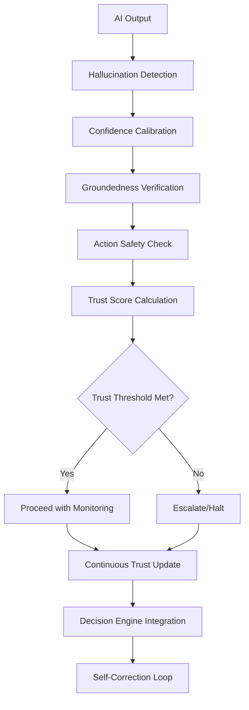

# 🛡️ AI Safety, Trust & Verification Layer
## Confidence Calibration & Trust Management

> **"AI'ya ne kadar güvenebiliriz ve hangi koşulda güvenemeyiz?"**

---

## 📌 Doküman Kartı

| Alan | Değer |
|---|---|
| Rol | Güven, risk ve emniyet doğrulama katmanı |
| Durum | Living specification (`v1.5`) |
| Son güncelleme | 2026-04-03 |
| Birincil okur | AI güvenlik/safety mühendisleri ve platform ekipleri |
| Ana girdi | `output`, `decision`, `context`, `trustSignals` |
| Ana çıktı | `safetyDecision`, `trustScore`, `overrideDecision` |
| Bağımlı dokümanlar | [cross-layer-integration-contract.md](cross-layer-integration-contract.md), [ai-decision-execution-engine.md](ai-decision-execution-engine.md), [rag-source-quality-rubric.md](rag-source-quality-rubric.md), [failure-pattern-atlas.md](failure-pattern-atlas.md) |

**Kalite notu:** Kod blokları doğrulama mimarisini anlatan referans sözleşmelerdir. Uygulama ortamında politika/izin katmanı ile birlikte ele alınmalıdır.

---

## 🎯 Misyon Beyanı

Bu doküman, AI sistemlerinin **güvenilirliğini ve güvenilirlik sınırlarını** belirleyen safety & trust katmanını tanımlar. Dağılmış safety parçalarını (Failure Atlas, RAG Rubric, TypeScript validation, Decision Engine checks) bir araya getiren **AI Trust Management System**'dir.

---

## 🔄 Trust Assessment Pipeline

> **Kod Durumu:** `Reference`


---

## 🔗 0.5. Decision Engine ↔ Safety Layer Integration

### Safety Integration Framework

> **Kod Durumu:** `Reference`
```typescript
interface SafetyIntegration {
  validateBeforeExecution(output: Output): Promise<SafetyDecision>;
  overrideDecisionIfUnsafe(decision: Decision): Promise<OverrideDecision>;
  provideFeedbackToDecisionEngine(safetyResult: SafetyResult): Promise<void>;
  requestContextualInformation(decision: Decision): Promise<Context>;
}

interface SafetyDecision {
  safeToProceed: boolean;
  trustLevel: number;
  requiredActions: RequiredAction[];
  monitoringLevel: 'minimal' | 'standard' | 'intensive';
  overrideReason?: string;
}

interface OverrideDecision {
  shouldOverride: boolean;
  overrideType: 'proceed' | 'halt' | 'modify' | 'escalate' | 'retry';
  newDecision?: Decision;
  overrideReason: string;
  requiresHumanApproval: boolean;
}

class DecisionSafetyIntegrator implements SafetyIntegration {
  private safetyLayer: SafetyLayer;
  private decisionEngine: DecisionEngine;
  private trustCalculator: TrustScoreCalculator;
  
  async validateBeforeExecution(output: Output): Promise<SafetyDecision> {
    // Run full safety pipeline
    const safetyReport = await this.safetyLayer.assessSafety(output);
    const trustScore = await this.trustCalculator.calculateTrustScore(safetyReport);
    
    // Check against environment-specific thresholds
    const threshold = this.getEnvironmentThreshold();
    
    if (trustScore.overallTrust >= threshold.minimumTrust) {
      return {
        safeToProceed: true,
        trustLevel: trustScore.overallTrust,
        requiredActions: [],
        monitoringLevel: this.determineMonitoringLevel(trustScore)
      };
    }
    
    return {
      safeToProceed: false,
      trustLevel: trustScore.overallTrust,
      requiredActions: this.determineRequiredActions(safetyReport),
      monitoringLevel: 'intensive',
      overrideReason: `Trust score ${trustScore.overallTrust} below threshold ${threshold.minimumTrust}`
    };
  }
  
  async overrideDecisionIfUnsafe(decision: Decision): Promise<OverrideDecision> {
    const safetyCheck = await this.validateDecision(decision);
    
    if (safetyCheck.safeToProceed) {
      return {
        shouldOverride: false,
        overrideType: 'proceed',
        overrideReason: 'Decision is safe'
      };
    }
    
    // Determine override strategy based on safety violation
    const overrideStrategy = this.selectOverrideStrategy(safetyCheck);
    
    return {
      shouldOverride: true,
      overrideType: overrideStrategy.type,
      newDecision: overrideStrategy.alternativeDecision,
      overrideReason: overrideStrategy.reason,
      requiresHumanApproval: overrideStrategy.requiresHumanApproval
    };
  }
  
  async provideFeedbackToDecisionEngine(safetyResult: SafetyResult): Promise<void> {
    // Update decision engine policies based on safety outcomes
    const policyUpdates = this.generatePolicyUpdates(safetyResult);
    await this.decisionEngine.updatePolicies(policyUpdates);
    
    // Update routing weights based on safety performance
    const routingUpdates = this.generateRoutingUpdates(safetyResult);
    await this.decisionEngine.updateRoutingWeights(routingUpdates);
    
    // Log safety feedback for learning
    await this.logSafetyFeedback(safetyResult);
  }
  
  private selectOverrideStrategy(safetyCheck: SafetyCheck): OverrideStrategy {
    switch (safetyCheck.violationType) {
      case 'hallucinationHigh':
        return {
          type: 'retry',
          alternativeDecision: this.createRetryDecision(safetyCheck),
          reason: 'High hallucination detected, retry with different approach',
          requiresHumanApproval: false
        };
        
      case 'trustCritical':
        return {
          type: 'escalate',
          alternativeDecision: null,
          reason: 'Critical trust violation, human intervention required',
          requiresHumanApproval: true
        };
        
      case 'safetyViolation':
        return {
          type: 'halt',
          alternativeDecision: null,
          reason: 'Safety violation detected, execution halted',
          requiresHumanApproval: true
        };
        
      default:
        return {
          type: 'modify',
          alternativeDecision: this.createModifiedDecision(safetyCheck),
          reason: 'Moderate safety issue, decision modified',
          requiresHumanApproval: false
        };
    }
  }
}
```

---

## 🧠 1. Hallucination Detection

### False Positive/Negative Handling

> **Kod Durumu:** `Reference`
```typescript
interface HallucinationDetectorReliability {
  detectorConfidence: number;
  falsePositiveRate: number;
  falseNegativeRate: number;
  precision: number;
  recall: number;
  f1Score: number;
  calibrationMetrics: DetectorCalibration;
}

interface DetectorCalibration {
  confidenceAccuracy: number;
  overconfidencePenalty: number;
  underconfidencePenalty: number;
  calibrationCurve: CalibrationPoint[];
}

class ReliableHallucinationDetector implements HallucinationDetector {
  private reliabilityMetrics: HallucinationDetectorReliability;
  private confidenceThreshold: number;
  private adaptationHistory: AdaptationHistory[];
  
  constructor() {
    this.reliabilityMetrics = this.initializeReliabilityMetrics();
    this.confidenceThreshold = 0.7;
  }
  
  async detectHallucinationsWithReliability(output: Output, context: Context): Promise<ReliableHallucinationReport> {
    const basicDetection = await this.performBasicDetection(output, context);
    
    // Apply reliability adjustments
    const adjustedDetection = this.applyReliabilityAdjustment(basicDetection);
    
    // Calculate detector confidence
    const detectorConfidence = this.calculateDetectorConfidence(adjustedDetection);
    
    // Estimate false positive/negative risks
    const riskAssessment = this.assessDetectionRisks(adjustedDetection);
    
    return {
      hallucinations: adjustedDetection.inconsistencies,
      detectorConfidence,
      falsePositiveRisk: riskAssessment.falsePositiveRisk,
      falseNegativeRisk: riskAssessment.falseNegativeRisk,
      reliabilityScore: this.reliabilityMetrics.f1Score,
      recommendedThreshold: this.calculateOptimalThreshold(),
      adaptationNeeded: this.shouldAdaptThreshold(riskAssessment)
    };
  }
  
  private applyReliabilityAdjustment(detection: HallucinationDetection): AdjustedDetection {
    const adjustedInconsistencies = detection.inconsistencies.map(inconsistency => ({
      ...inconsistency,
      adjustedSeverity: this.adjustSeverity(inconsistency, this.reliabilityMetrics),
      adjustedConfidence: this.adjustConfidence(inconsistency, this.reliabilityMetrics)
    }));
    
    return {
      inconsistencies: adjustedInconsistencies,
      overallConfidence: this.calculateAdjustedOverallConfidence(adjustedInconsistencies),
      reliabilityAdjustment: this.calculateReliabilityAdjustment()
    };
  }
  
  private assessDetectionRisks(detection: AdjustedDetection): DetectionRiskAssessment {
    // False positive risk: marking non-hallucination as hallucination
    const falsePositiveRisk = this.calculateFalsePositiveRisk(detection);
    
    // False negative risk: missing actual hallucination
    const falseNegativeRisk = this.calculateFalseNegativeRisk(detection);
    
    // Overall risk assessment
    const overallRisk = this.combineRisks(falsePositiveRisk, falseNegativeRisk);
    
    return {
      falsePositiveRisk,
      falseNegativeRisk,
      overallRisk,
      riskLevel: this.categorizeRiskLevel(overallRisk),
      mitigationStrategy: this.selectRiskMitigation(overallRisk)
    };
  }
  
  updateReliabilityMetrics(feedback: DetectionFeedback): void {
    // Update confusion matrix
    this.updateConfusionMatrix(feedback);
    
    // Recalculate metrics
    this.reliabilityMetrics.precision = this.calculatePrecision();
    this.reliabilityMetrics.recall = this.calculateRecall();
    this.reliabilityMetrics.f1Score = this.calculateF1Score();
    
    // Update calibration metrics
    this.updateCalibrationMetrics(feedback);
    
    // Adapt threshold if needed
    if (this.shouldAdaptThreshold()) {
      this.adaptThreshold();
    }
  }
  
  private adaptThreshold(): void {
    const optimalThreshold = this.calculateOptimalThreshold();
    const adaptationRate = 0.1; // Learning rate
    
    this.confidenceThreshold = this.confidenceThreshold + 
      (optimalThreshold - this.confidenceThreshold) * adaptationRate;
    
    // Log adaptation
    this.adaptationHistory.push({
      timestamp: Date.now(),
      oldThreshold: this.confidenceThreshold - (optimalThreshold - this.confidenceThreshold) * adaptationRate,
      newThreshold: this.confidenceThreshold,
      optimalThreshold,
      reason: 'performanceOptimization',
      metrics: { ...this.reliabilityMetrics }
    });
  }
}
```

### Detector Reliability Matrix

| Metric | Target | Good | Poor | Action |
|--------|--------|-------|-------|--------|
| **Precision** | > 0.9 | > 0.8 | < 0.8 | Threshold adjustment |
| **Recall** | > 0.85 | > 0.75 | < 0.75 | Sensitivity increase |
| **F1 Score** | > 0.87 | > 0.77 | < 0.77 | Model retraining |
| **False Positive Rate** | < 0.05 | < 0.1 | > 0.1 | Threshold increase |
| **False Negative Rate** | < 0.1 | < 0.2 | > 0.2 | Sensitivity increase |

---

> **Kod Durumu:** `Reference`
```typescript
interface HallucinationDetector {
  detectFactualInconsistencies(output: Output, context: Context): Inconsistency[];
  detectLogicalContradictions(output: Output): Contradiction[];
  detectConfabulation(output: Output, sources: Source[]): Confabulation[];
  detectOverconfidence(output: Output): Overconfidence[];
}

interface Inconsistency {
  type: 'factual' | 'temporal' | 'causal';
  claim: string;
  evidence: Evidence[];
  confidence: number;
  severity: 'low' | 'medium' | 'high' | 'critical';
}

class AdvancedHallucinationDetector implements HallucinationDetector {
  private factChecker: FactChecker;
  private logicAnalyzer: LogicAnalyzer;
  private sourceValidator: SourceValidator;
  
  async detectHallucinations(output: Output, context: Context): Promise<HallucinationReport> {
    const detections = await Promise.all([
      this.detectFactualInconsistencies(output, context),
      this.detectLogicalContradictions(output),
      this.detectConfabulation(output, context.sources),
      this.detectOverconfidence(output)
    ]);
    
    return {
      totalInconsistencies: detections.flat().length,
      severityBreakdown: this.categorizeBySeverity(detections.flat()),
      confidence: this.calculateDetectionConfidence(detections.flat()),
      recommendations: this.generateRecommendations(detections.flat()),
      shouldBlock: this.shouldBlockOutput(detections.flat())
    };
  }
  
  private async detectFactualInconsistencies(output: Output, context: Context): Promise<Inconsistency[]> {
    const claims = this.extractClaims(output);
    const inconsistencies: Inconsistency[] = [];
    
    for (const claim of claims) {
      const verification = await this.factChecker.verify(claim, context);
      
      if (!verification.supported) {
        inconsistencies.push({
          type: 'factual',
          claim: claim.text,
          evidence: verification.counterEvidence,
          confidence: verification.confidence,
          severity: this.assessSeverity(verification)
        });
      }
    }
    
    return inconsistencies;
  }
  
  private detectOverconfidence(output: Output): Overconfidence[] {
    const confidencePatterns = [
      { pattern: /\b(always|never|certainly|definitely)\b/i, severity: 'high' },
      { pattern: /\b(probably|maybe|perhaps|likely)\b/i, severity: 'low' },
      { pattern: /\b(100%|perfect|exact|precise)\b/i, severity: 'medium' }
    ];
    
    const overconfidence: Overconfidence[] = [];
    
    for (const pattern of confidencePatterns) {
      const matches = output.text.match(pattern.pattern);
      if (matches) {
        overconfidence.push({
          type: 'overconfidence',
          matches: matches,
          severity: pattern.severity,
          suggestedAlternatives: this.generateConfidenceAlternatives(matches)
        });
      }
    }
    
    return overconfidence;
  }
}
```

### Hallucination Types & Detection

| Type | Detection Method | Severity | Example |
|-------|------------------|-----------|----------|
| **Factual** | Source verification | High | "Python 3.10 released in 2020" (false) |
| **Logical** | Contradiction analysis | Medium | "If A then B" and "If A then not B" |
| **Confabulation** | Pattern matching | High | Making up sources that don't exist |
| **Overconfidence** | Language pattern analysis | Low-Medium | "This will always work" |

---

## 📊 2. Confidence Calibration

### Trust vs Confidence vs Uncertainty Model

> **Kod Durumu:** `Reference`
```typescript
interface TrustConfidenceUncertaintyModel {
  // Modelin kendine güveni (internal)
  confidence: {
    modelConfidence: number;    // Modelin kendi tahmini
    predictionCertainty: number; // Tahminin kesinliği
    internalCalibration: number; // İçsel kalibrasyon
  };
  
  // Bilgi eksikliği (external)
  uncertainty: {
    informationalUncertainty: number; // Bilgi eksikliği
    aleatoricUncertainty: number; // Rastgelelik
    epistemicUncertainty: number; // Bilgisel belirsizlik
    totalUncertainty: number;      // Toplam belirsizlik
  };
  
  // Dışarıdan güvenilirlik (external trust)
  trust: {
    historicalAccuracy: number;    // Geçmiş performans
    userFeedback: number;         // Kullanıcı geri bildirimi
    peerValidation: number;       // Akran doğrulaması
    externalValidation: number;    // Harici doğrulama
    systemReliability: number;     // Sistem güvenilirliği
  };
  
  // İlişki modeli
  relationship: {
    confidenceToTrust: number;     // Confidence'nin trust'e etkisi
    uncertaintyToTrust: number;   // Uncertainty'nin trust'e etkisi
    calibrationQuality: number;   // Kalibrasyon kalitesi
    reliabilityScore: number;      // Güvenilirlik skoru
  };
}

class TrustConfidenceUncertaintyAnalyzer {
  private historicalData: HistoricalPerformance;
  private calibrationModel: CalibrationModel;
  
  analyzeRelationship(prediction: Prediction, context: Context): TrustConfidenceUncertaintyModel {
    // Confidence analizi
    const confidence = this.analyzeConfidence(prediction);
    
    // Uncertainty analizi
    const uncertainty = this.analyzeUncertainty(prediction, context);
    
    // Trust analizi
    const trust = this.analyzeTrust(prediction, context);
    
    // İlişki analizi
    const relationship = this.analyzeRelationship(confidence, uncertainty, trust);
    
    return {
      confidence,
      uncertainty,
      trust,
      relationship
    };
  }
  
  private analyzeConfidence(prediction: Prediction): ConfidenceAnalysis {
    return {
      modelConfidence: prediction.confidence,
      predictionCertainty: this.calculateCertainty(prediction),
      internalCalibration: this.assessInternalCalibration(prediction)
    };
  }
  
  private analyzeUncertainty(prediction: Prediction, context: Context): UncertaintyAnalysis {
    return {
      informationalUncertainty: this.measureInformationalUncertainty(context),
      aleatoricUncertainty: this.measureAleatoricUncertainty(prediction),
      epistemicUncertainty: this.measureEpistemicUncertainty(prediction, context),
      totalUncertainty: this.calculateTotalUncertainty(prediction, context)
    };
  }
  
  private analyzeTrust(prediction: Prediction, context: Context): TrustAnalysis {
    return {
      historicalAccuracy: this.getHistoricalAccuracy(prediction.type),
      userFeedback: this.getUserFeedbackScore(prediction.id),
      peerValidation: this.getPeerValidationScore(prediction),
      externalValidation: this.getExternalValidationScore(prediction),
      systemReliability: this.getSystemReliabilityScore()
    };
  }
  
  private analyzeRelationship(confidence: ConfidenceAnalysis, uncertainty: UncertaintyAnalysis, trust: TrustAnalysis): RelationshipAnalysis {
    // Confidence'nin trust'e etkisi
    const confidenceToTrust = this.calculateConfidenceTrustCorrelation(confidence, trust);
    
    // Uncertainty'nin trust'e etkisi
    const uncertaintyToTrust = this.calculateUncertaintyTrustCorrelation(uncertainty, trust);
    
    // Kalibrasyon kalitesi
    const calibrationQuality = this.assessCalibrationQuality(confidence, trust);
    
    // Güvenilirlik skoru
    const reliabilityScore = this.calculateReliabilityScore(confidence, uncertainty, trust);
    
    return {
      confidenceToTrust,
      uncertaintyToTrust,
      calibrationQuality,
      reliabilityScore
    };
  }
  
  // İlişki tablosu
  generateRelationshipMatrix(): RelationshipMatrix {
    return {
      highConfidence_HighTrust: {
        reliability: 'high',
        action: 'proceed',
        monitoring: 'standard'
      },
      highConfidence_LowTrust: {
        reliability: 'questionable',
        action: 'verify',
        monitoring: 'intensive'
      },
      lowConfidence_HighTrust: {
        reliability: 'calibrated',
        action: 'proceed',
        monitoring: 'standard'
      },
      lowConfidence_LowTrust: {
        reliability: 'unreliable',
        action: 'escalate',
        monitoring: 'intensive'
      },
      highUncertainty: {
        reliability: 'low',
        action: 'gatherMoreContext',
        monitoring: 'intensive'
      },
      lowUncertainty: {
        reliability: 'high',
        action: 'proceed',
        monitoring: 'minimal'
      }
    };
  }
}
```

### İlişki Matrisi

| Confidence | Trust | Uncertainty | Reliability | Action | Monitoring |
|-----------|--------|-------------|--------------|---------|------------|
| High | High | Low | High | Proceed | Standard |
| High | Low | Low | Questionable | Verify | Intensive |
| Low | High | Low | Calibrated | Proceed | Standard |
| Low | Low | High | Unreliable | Escalate | Intensive |
| Any | Any | High | Low | Gather Context | Intensive |
| Any | Any | Low | High | Proceed | Minimal |

---

> **Kod Durumu:** `Reference`
```typescript
interface ConfidenceCalibration {
  actualAccuracy: number;
  predictedConfidence: number;
  calibrationCurve: CalibrationPoint[];
  reliabilityDiagram: ReliabilityData;
  brierScore: number;
}

interface CalibrationPoint {
  confidence: number;
  accuracy: number;
  sampleSize: number;
  expectedAccuracy: number;
  calibrationError: number;
}

class ConfidenceCalibrator {
  private historicalData: CalibrationData[];
  private calibrationModel: CalibrationModel;
  
  calibrateConfidence(prediction: Prediction, context: Context): CalibratedPrediction {
    const historicalAccuracy = this.getHistoricalAccuracy(prediction.type, context);
    const calibrationAdjustment = this.calculateAdjustment(prediction.confidence, historicalAccuracy);
    
    return {
      originalConfidence: prediction.confidence,
      calibratedConfidence: Math.max(0.1, Math.min(0.99, 
        prediction.confidence * calibrationAdjustment)),
      adjustmentFactor: calibrationAdjustment,
      reliability: this.calculateReliability(prediction.confidence),
      uncertaintyBounds: this.calculateUncertaintyBounds(prediction.confidence)
    };
  }
  
  private calculateAdjustment(confidence: number, historicalAccuracy: number): number {
    // Overconfidence correction
    if (confidence > historicalAccuracy + 0.1) {
      return historicalAccuracy / confidence;
    }
    
    // Underconfidence correction
    if (confidence < historicalAccuracy - 0.1) {
      return 1 + (historicalAccuracy - confidence) * 0.5;
    }
    
    return 1.0; // Well calibrated
  }
  
  generateCalibrationReport(): CalibrationReport {
    const calibrationCurve = this.buildCalibrationCurve();
    const brierScore = this.calculateBrierScore();
    const reliabilityDiagram = this.buildReliabilityDiagram();
    
    return {
      overallCalibration: this.assessOverallCalibration(),
      brierScore,
      reliabilityScore: this.calculateReliabilityScore(),
      calibrationCurve,
      reliabilityDiagram,
      recommendations: this.generateCalibrationRecommendations()
    };
  }
}
```

### Calibration Metrics

| Metric | Target | Good | Poor | Action |
|---------|---------|-------|-------|--------|
| **Brier Score** | < 0.1 | < 0.2 | > 0.2 | Retraining needed |
| **Reliability** | > 0.9 | > 0.8 | < 0.8 | Model adjustment |
| **Calibration Error** | < 0.05 | < 0.1 | > 0.1 | Data collection |
| **Confidence-Accuracy Gap** | < 0.1 | < 0.2 | > 0.2 | Model recalibration |

---

## 🏗️ 3. Groundedness Verification

### Groundedness Framework

> **Kod Durumu:** `Reference`
```typescript
interface GroundednessVerification {
  sourceAttribution: SourceAttribution[];
  claimSupport: ClaimSupport[];
  citationQuality: CitationQuality;
  temporalConsistency: TemporalConsistency;
}

interface SourceAttribution {
  claim: string;
  source: Source;
  relevanceScore: number;
  credibilityScore: number;
  freshnessScore: number;
  attributionType: 'direct' | 'paraphrased' | 'inferred';
}

interface ClaimSupport {
  claim: string;
  supportingEvidence: Evidence[];
  contradictingEvidence: Evidence[];
  supportStrength: number;
  confidence: number;
}

class GroundednessVerifier {
  private sourceValidator: SourceValidator;
  private claimExtractor: ClaimExtractor;
  private evidenceRetriever: EvidenceRetriever;
  
  async verifyGroundedness(output: Output, context: Context): Promise<GroundednessReport> {
    const claims = await this.claimExtractor.extract(output);
    const attributions: SourceAttribution[] = [];
    const supportAnalysis: ClaimSupport[] = [];
    
    for (const claim of claims) {
      const attribution = await this.attributionAnalysis(claim, context);
      const support = await this.analyzeClaimSupport(claim, context);
      
      attributions.push(attribution);
      supportAnalysis.push(support);
    }
    
    return {
      overallGroundedness: this.calculateOverallGroundedness(attributions, supportAnalysis),
      attributionScore: this.calculateAttributionScore(attributions),
      supportScore: this.calculateSupportScore(supportAnalysis),
      citationQuality: this.assessCitationQuality(attributions),
      temporalConsistency: this.checkTemporalConsistency(attributions, context),
      recommendations: this.generateGroundednessRecommendations(attributions, supportAnalysis)
    };
  }
  
  private async attributionAnalysis(claim: Claim, context: Context): Promise<SourceAttribution> {
    const relevantSources = await this.evidenceRetriever.findSources(claim, context);
    const bestSource = this.selectBestSource(relevantSources, claim);
    
    if (!bestSource) {
      return {
        claim: claim.text,
        source: null,
        relevanceScore: 0,
        credibilityScore: 0,
        freshnessScore: 0,
        attributionType: 'inferred'
      };
    }
    
    return {
      claim: claim.text,
      source: bestSource,
      relevanceScore: this.calculateRelevance(claim, bestSource),
      credibilityScore: this.assessCredibility(bestSource),
      freshnessScore: this.calculateFreshness(bestSource),
      attributionType: this.determineAttributionType(claim, bestSource)
    };
  }
  
  private calculateOverallGroundedness(attributions: SourceAttribution[], support: ClaimSupport[]): number {
    const attributionWeight = 0.6;
    const supportWeight = 0.4;
    
    const avgAttributionScore = attributions.reduce((sum, attr) => 
      sum + (attr.relevanceScore * attr.credibilityScore * attr.freshnessScore), 0) / attributions.length;
    
    const avgSupportScore = support.reduce((sum, supp) => 
      sum + (sopp.supportStrength * supp.confidence), 0) / support.length;
    
    return (avgAttributionScore * attributionWeight) + (avgSupportScore * supportWeight);
  }
}
```

### Groundedness Levels

| Level | Score | Characteristics | Action |
|-------|--------|------------------|--------|
| **Fully Grounded** | > 0.9 | All claims supported by credible sources | Proceed |
| **Mostly Grounded** | 0.7-0.9 | Most claims supported, minor gaps | Highlight gaps |
| **Partially Grounded** | 0.5-0.7 | Some claims supported, significant gaps | Request clarification |
| **Poorly Grounded** | 0.3-0.5 | Few claims supported, many gaps | Human review required |
| **Ungrounded** | < 0.3 | No credible source support | Block output |

---

## 🚨 4. Action Safety Framework

### Tool Safety Integration

> **Kod Durumu:** `Reference`
```typescript
interface ToolSafetyIntegration {
  toolPolicies: Map<string, ToolPolicy>;
  safetyChecks: ToolSafetyCheck[];
  riskAssessment: ToolRiskAssessment;
  enforcement: ToolSafetyEnforcement;
}

interface ToolPolicy {
  toolId: string;
  category: 'read' | 'write' | 'execute' | 'network' | 'system' | 'destructive';
  autoExecution: AutoExecutionPolicy;
  approvalRequirements: ApprovalRequirement[];
  riskLevel: 'minimal' | 'low' | 'medium' | 'high' | 'critical';
  monitoringLevel: 'none' | 'basic' | 'enhanced' | 'comprehensive';
  rollbackCapability: RollbackCapability;
}

interface AutoExecutionPolicy {
  allowed: boolean;
  conditions: ExecutionCondition[];
  maxFrequency: FrequencyLimit;
  resourceLimits: ResourceLimit[];
  timeRestrictions: TimeRestriction[];
}

interface ToolSafetyCheck {
  type: 'preExecution' | 'duringExecution' | 'postExecution';
  condition: SafetyCondition;
  action: SafetyAction;
  priority: number;
}

class ToolSafetyIntegrator implements ToolSafetyIntegration {
  private toolPolicies: Map<string, ToolPolicy>;
  private safetyEnforcer: ToolSafetyEnforcer;
  private auditLogger: ToolAuditLogger;
  
  constructor() {
    this.initializeToolPolicies();
    this.safetyEnforcer = new ToolSafetyEnforcer();
    this.auditLogger = new ToolAuditLogger();
  }
  
  async validateToolExecution(tool: Tool, params: ToolParams, context: ExecutionContext): Promise<ToolSafetyDecision> {
    const policy = this.toolPolicies.get(tool.id);
    
    if (!policy) {
      return {
        allowed: false,
        reason: 'Tool not registered in safety policy',
        requiresApproval: true,
        riskLevel: 'critical'
      };
    }
    
    // Pre-execution safety checks
    const preExecutionChecks = await this.performPreExecutionChecks(tool, params, policy);
    
    if (!preExecutionChecks.passed) {
      return {
        allowed: false,
        reason: preExecutionChecks.reason,
        requiresApproval: preExecutionChecks.requiresApproval,
        riskLevel: preExecutionChecks.riskLevel,
        violations: preExecutionChecks.violations
      };
    }
    
    // Auto-execution evaluation
    const autoExecutionDecision = this.evaluateAutoExecution(tool, params, policy, context);
    
    if (!autoExecutionDecision.allowed) {
      return {
        allowed: false,
        reason: autoExecutionDecision.reason,
        requiresApproval: true,
        riskLevel: policy.riskLevel,
        suggestedAction: autoExecutionDecision.suggestedAction
      };
    }
    
    // Resource limit checks
    const resourceCheck = await this.checkResourceLimits(tool, params, policy);
    
    if (!resourceCheck.passed) {
      return {
        allowed: false,
        reason: resourceCheck.reason,
        requiresApproval: resourceCheck.requiresApproval,
        riskLevel: 'high',
        resourceViolations: resourceCheck.violations
      };
    }
    
    return {
      allowed: true,
      riskLevel: policy.riskLevel,
      monitoringLevel: policy.monitoringLevel,
      rollbackCapability: policy.rollbackCapability,
      executionConditions: this.getExecutionConditions(policy)
    };
  }
  
  private initializeToolPolicies(): void {
    this.toolPolicies = new Map([
      // Read-only tools
      ['fileRead', {
        toolId: 'fileRead',
        category: 'read',
        autoExecution: {
          allowed: true,
          conditions: [
            { type: 'pathValidation', required: true },
            { type: 'permissionCheck', required: true }
          ],
          maxFrequency: { requests: 100, per: 'minute' },
          resourceLimits: [
            { type: 'fileSize', max: 1024 * 1024 * 10 }, // 10MB
            { type: 'concurrentReads', max: 5 }
          ]
        },
        approvalRequirements: [],
        riskLevel: 'low',
        monitoringLevel: 'basic',
        rollbackCapability: { enabled: false, reason: 'read-onlyOperation' }
      }],
      
      // Write tools
      ['fileWrite', {
        toolId: 'fileWrite',
        category: 'write',
        autoExecution: {
          allowed: false,
          conditions: [
            { type: 'humanApproval', required: true },
            { type: 'backupCheck', required: true },
            { type: 'pathValidation', required: true }
          ],
          maxFrequency: { requests: 10, per: 'hour' },
          resourceLimits: [
            { type: 'fileSize', max: 1024 * 1024 * 5 }, // 5MB
            { type: 'diskSpaceCheck', required: true }
          ]
        },
        approvalRequirements: [
          { type: 'humanApproval', approvers: ['supervisor'] },
          { type: 'backupVerification', approvers: ['system'] }
        ],
        riskLevel: 'medium',
        monitoringLevel: 'enhanced',
        rollbackCapability: { enabled: true, method: 'fileRestore' }
      }],
      
      // Destructive tools
      ['fileDelete', {
        toolId: 'fileDelete',
        category: 'destructive',
        autoExecution: {
          allowed: false,
          conditions: [
            { type: 'dualApproval', required: true },
            { type: 'backupMandatory', required: true },
            { type: 'confirmationDialog', required: true },
            { type: 'timeDelay', required: true, delay: 30000 } // 30 seconds
          ],
          maxFrequency: { requests: 1, per: 'hour' },
          resourceLimits: [
            { type: 'fileCount', max: 10 },
            { type: 'criticalPathProtection', required: true }
          ]
        },
        approvalRequirements: [
          { type: 'dualApproval', approvers: ['supervisor', 'securityOfficer'] },
          { type: 'backupVerification', approvers: ['system'] },
          { type: 'securityReview', approvers: ['securityTeam'] }
        ],
        riskLevel: 'critical',
        monitoringLevel: 'comprehensive',
        rollbackCapability: { enabled: true, method: 'backupRestore' }
      }],
      
      // Network tools
      ['apiCall', {
        toolId: 'apiCall',
        category: 'network',
        autoExecution: {
          allowed: false,
          conditions: [
            { type: 'urlValidation', required: true },
            { type: 'rateLimitCheck', required: true },
            { type: 'sslVerification', required: true }
          ],
          maxFrequency: { requests: 50, per: 'hour' },
          resourceLimits: [
            { type: 'dataSize', max: 1024 * 1024 }, // 1MB
            { type: 'timeout', max: 30000 } // 30 seconds
          ]
        },
        approvalRequirements: [
          { type: 'supervisorApproval', approvers: ['supervisor'] },
          { type: 'rateLimitMonitor', approvers: ['system'] }
        ],
        riskLevel: 'high',
        monitoringLevel: 'enhanced',
        rollbackCapability: { enabled: false, reason: 'networkOperation' }
      }],
      
      // System configuration tools
      ['systemConfig', {
        toolId: 'systemConfig',
        category: 'system',
        autoExecution: {
          allowed: false,
          conditions: [
            { type: 'adminApproval', required: true },
            { type: 'impactAssessment', required: true },
            { type: 'rollbackPlan', required: true },
            { type: 'maintenanceWindow', required: true }
          ],
          maxFrequency: { requests: 5, per: 'day' },
          resourceLimits: [
            { type: 'configScope', allowed: ['nonCritical'] },
            { type: 'serviceImpact', max: 'minimal' }
          ]
        },
        approvalRequirements: [
          { type: 'adminApproval', approvers: ['systemAdmin'] },
          { type: 'securityApproval', approvers: ['securityTeam'] },
          { type: 'businessApproval', approvers: ['businessOwner'] }
        ],
        riskLevel: 'critical',
        monitoringLevel: 'comprehensive',
        rollbackCapability: { enabled: true, method: 'configRestore' }
      }]
    );
  }
  
  async monitorToolExecution(execution: ToolExecution): Promise<ToolMonitoringResult> {
    const monitoringData = await this.collectMonitoringData(execution);
    
    // Real-time safety checks during execution
    const duringExecutionChecks = await this.performDuringExecutionChecks(execution, monitoringData);
    
    if (!duringExecutionChecks.passed) {
      await this.safetyEnforcer.emergencyStop(execution);
      return {
        status: 'stopped',
        reason: duringExecutionChecks.reason,
        violations: duringExecutionChecks.violations
      };
    }
    
    // Post-execution validation
    const postExecutionValidation = await this.performPostExecutionValidation(execution, monitoringData);
    
    // Log all execution data
    await this.auditLogger.logExecution(execution, monitoringData, duringExecutionChecks, postExecutionValidation);
    
    return {
      status: 'completed',
      monitoringData,
      safetyChecks: {
        pre: execution.preChecks,
        during: duringExecutionChecks,
        post: postExecutionValidation
      }
    };
  }
}
```

### Tool Safety Policy Matrix

| Tool Category | Auto Execution | Approval Required | Monitoring | Risk Level | Rollback |
|--------------|---------------|------------------|------------|------------|----------|
| **Read** | Yes | None | Basic | Low | No |
| **Write** | No | Supervisor | Enhanced | Medium | Yes |
| **Network** | No | Supervisor | Enhanced | High | No |
| **System** | No | Admin + Security | Comprehensive | Critical | Yes |
| **Destructive** | No | Dual + Security | Comprehensive | Critical | Yes |

---

> **Kod Durumu:** `Reference`
```typescript
interface ActionSafety {
  riskAssessment: RiskAssessment;
  permissionValidation: PermissionValidation;
  impactAnalysis: ImpactAnalysis;
  rollbackCapability: RollbackCapability;
}

interface RiskAssessment {
  riskLevel: 'minimal' | 'low' | 'medium' | 'high' | 'critical';
  riskFactors: RiskFactor[];
  mitigationStrategies: MitigationStrategy[];
  residualRisk: number;
}

interface RiskFactor {
  type: 'dataIntegrity' | 'systemStability' | 'security' | 'privacy' | 'cost';
  severity: number;
  probability: number;
  impact: string;
}

class ActionSafetyAssessor {
  private riskMatrix: RiskMatrix;
  private permissionChecker: PermissionChecker;
  private impactAnalyzer: ImpactAnalyzer;
  
  async assessActionSafety(action: Action, context: Context): Promise<SafetyAssessment> {
    const riskAssessment = await this.assessRisk(action, context);
    const permissionValidation = await this.validatePermissions(action, context);
    const impactAnalysis = await this.analyzeImpact(action, context);
    const rollbackCapability = await this.assessRollbackCapability(action);
    
    const overallSafety = this.calculateOverallSafety({
      riskAssessment,
      permissionValidation,
      impactAnalysis,
      rollbackCapability
    });
    
    return {
      safeToProceed: overallSafety > 0.7,
      safetyScore: overallSafety,
      riskLevel: riskAssessment.riskLevel,
      requiredApprovals: this.determineRequiredApprovals(riskAssessment),
      safetyMeasures: this.recommendSafetyMeasures(riskAssessment),
      monitoringRequired: riskAssessment.riskLevel !== 'minimal',
      humanOversightRequired: riskAssessment.riskLevel === 'critical'
    };
  }
  
  private async assessRisk(action: Action, context: Context): Promise<RiskAssessment> {
    const riskFactors = await this.identifyRiskFactors(action, context);
    const riskLevel = this.calculateRiskLevel(riskFactors);
    const mitigationStrategies = this.generateMitigationStrategies(riskFactors);
    const residualRisk = this.calculateResidualRisk(riskFactors, mitigationStrategies);
    
    return {
      riskLevel,
      riskFactors,
      mitigationStrategies,
      residualRisk
    };
  }
  
  private determineRequiredApprovals(riskAssessment: RiskAssessment): ApprovalRequirement[] {
    const requirements: ApprovalRequirement[] = [];
    
    switch (riskAssessment.riskLevel) {
      case 'critical':
        requirements.push(
          { type: 'dualApproval', required: true },
          { type: 'securityReview', required: true },
          { type: 'businessApproval', required: true }
        );
        break;
        
      case 'high':
        requirements.push(
          { type: 'securityReview', required: true },
          { type: 'supervisorApproval', required: true }
        );
        break;
        
      case 'medium':
        requirements.push(
          { type: 'supervisorApproval', required: false }
        );
        break;
        
      case 'low':
        requirements.push(
          { type: 'automaticApproval', required: true }
        );
        break;
    }
    
    return requirements;
  }
}
```

### Action Safety Matrix

| Action Type | Risk Level | Required Approvals | Monitoring | Rollback |
|-------------|------------|-------------------|-------------|-----------|
| **File Read** | Low | Auto | Basic | N/A |
| **File Write** | Medium | Supervisor | Enhanced | Yes |
| **File Delete** | High | Security + Supervisor | Full | Yes |
| **Network Call** | Medium | Supervisor | Enhanced | Yes |
| **System Config** | High | Security + Business | Full | Yes |
| **Data Export** | High | Security + Business | Full | Yes |
| **User Creation** | Critical | Dual + Security + Business | Full | Yes |

---

### Trust Calculation with Time Decay

> **Kod Durumu:** `Reference`
```typescript
interface TrustScore {
  overallTrust: number;
  componentScores: ComponentScore[];
  trustTrend: TrustTrend;
  confidenceInterval: ConfidenceInterval;
  lastUpdated: number;
  timeDecay?: TimeDecayComponent;
  trustVelocity?: number;
}

interface ComponentScore {
  component: 'hallucinationDetection' | 'confidenceCalibration' | 'groundedness' | 'actionSafety';
  score: number;
  weight: number;
  trend: 'improving' | 'stable' | 'declining';
  lastAssessment: number;
}

class TrustScoreCalculator {
  private componentWeights: ComponentWeights;
  private historicalData: TrustHistory[];
  private timeDecayCalculator?: TimeDecayTrustCalculator;
  
  constructor() {
    this.timeDecayCalculator = new TimeDecayTrustCalculator();
  }
  
  calculateTrustScore(assessment: SafetyAssessment, historicalTrust?: number): TrustScore {
    const componentScores = this.calculateComponentScores(assessment);
    let overallTrust = this.calculateWeightedScore(componentScores);
    const trustTrend = this.calculateTrend();
    const confidenceInterval = this.calculateConfidenceInterval(overallTrust);
    
    // Apply time decay if historical trust is available
    let timeDecay: TimeDecayComponent | undefined;
    let trustVelocity: number | undefined;
    
      if (historicalTrust && this.timeDecayCalculator) {
      const decayResult = this.timeDecayCalculator.calculateTrustWithDecay(assessment, historicalTrust);
      overallTrust = decayResult.currentTrust;
      timeDecay = decayResult.timeDecay;
      trustVelocity = decayResult.trustVelocity;
    }
    
    return {
      overallTrust,
      componentScores,
      trustTrend,
      confidenceInterval,
      lastUpdated: Date.now(),
      timeDecay,
      trustVelocity
    };
  }
  
  private calculateComponentScores(assessment: SafetyAssessment): ComponentScore[] {
    return [
      {
        component: 'hallucinationDetection',
        score: this.assessHallucinationScore(assessment.hallucinationReport),
        weight: this.componentWeights.hallucination,
        trend: this.getComponentTrend('hallucinationDetection'),
        lastAssessment: Date.now()
      },
      {
        component: 'confidenceCalibration',
        score: this.assessCalibrationScore(assessment.calibrationReport),
        weight: this.componentWeights.calibration,
        trend: this.getComponentTrend('confidenceCalibration'),
        lastAssessment: Date.now()
      },
      {
        component: 'groundedness',
        score: this.assessGroundednessScore(assessment.groundednessReport),
        weight: this.componentWeights.groundedness,
        trend: this.getComponentTrend('groundedness'),
        lastAssessment: Date.now()
      },
      {
        component: 'actionSafety',
        score: this.assessSafetyScore(assessment.safetyAssessment),
        weight: this.componentWeights.safety,
        trend: this.getComponentTrend('actionSafety'),
        lastAssessment: Date.now()
      }
    ];
  }
  
  private calculateWeightedScore(componentScores: ComponentScore[]): number {
    return componentScores.reduce((total, component) => 
      total + (component.score * component.weight), 0
    ) / componentScores.reduce((total, component) => total + component.weight, 0);
  }
  
  private calculateTrend(): TrustTrend {
    // Implementation for trend calculation
    return { trend: 'stable', confidence: 0.8 };
  }
  
  private calculateConfidenceInterval(overallTrust: number): ConfidenceInterval {
    const margin = 0.05; // 5% margin
    return {
      lower: Math.max(0, overallTrust - margin),
      upper: Math.min(1, overallTrust + margin),
      confidence: 0.95
    };
  }
  
  private assessHallucinationScore(report: HallucinationReport): number {
    // Implementation for hallucination scoring
    return 0.8;
  }
  
  private assessCalibrationScore(report: CalibrationReport): number {
    // Implementation for calibration scoring
    return 0.85;
  }
  
  private assessGroundednessScore(report: GroundednessReport): number {
    // Implementation for groundedness scoring
    return 0.9;
  }
  
  private assessSafetyScore(assessment: SafetyAssessment): number {
    // Implementation for safety scoring
    return 0.95;
  }
  
  private getComponentTrend(component: string): 'improving' | 'stable' | 'declining' {
    // Implementation for component trend
    return 'stable';
  }
}
```

### Trust Decay Parameters

| Parameter | Default | Range | Description |
|----------|---------|-------|-------------|
| **Decay Rate** | 0.05/day | 0.01-0.2 | How fast trust decays |
| **Half Life** | 14 days | 1-90 days | Time for trust to halve |
| **Recency Window** | 7 days | 1-30 days | Observation window for bonus |
| **Success Bonus** | +0.1 | 0.01-0.3 | Bonus for recent success |
| **Failure Penalty** | -0.2 | -0.1 to -0.5 | Penalty for recent failure |
| **Bonus Decay Rate** | 0.1/day | 0.05-0.3 | How fast bonus decays |

---

### Adaptive Weight Configuration

> **Kod Durumu:** `Production-Ready`
```typescript
interface AdaptiveWeightConfiguration {
  environment: 'development' | 'staging' | 'production' | 'research';
  context: ContextType;
  weights: ComponentWeights;
  adaptationHistory: WeightAdaptation[];
  performanceMetrics: WeightPerformanceMetrics;
}

interface ComponentWeights {
  hallucination: WeightConfig;
  calibration: WeightConfig;
  groundedness: WeightConfig;
  safety: WeightConfig;
  userFeedback: WeightConfig;
  historicalPerformance: WeightConfig;
}

interface WeightConfig {
  baseWeight: number;
  currentWeight: number;
  minWeight: number;
  maxWeight: number;
  adaptationRate: number;
  lastAdaptation: number;
  performanceHistory: number[];
}

class AdaptiveWeightManager {
  private weightConfig: AdaptiveWeightConfiguration;
  private performanceTracker: PerformanceTracker;
  
  constructor(environment: string) {
    this.weightConfig = this.initializeWeights(environment);
    this.performanceTracker = new PerformanceTracker();
  }
  
  calculateAdaptiveTrustScore(assessment: SafetyAssessment): TrustScore {
    const currentWeights = this.getCurrentWeights();
    const componentScores = this.getComponentScores(assessment);
    
    // Environment-specific weight adjustment
    const adjustedWeights = this.adjustWeightsForEnvironment(currentWeights);
    
    // Context-specific weight adjustment
    const contextWeights = this.adjustWeightsForContext(adjustedWeights, assessment.context);
    
    // Calculate weighted trust score
    const overallTrust = this.calculateWeightedScore(componentScores, contextWeights);
    
    // Update weight performance tracking
    this.updateWeightPerformance(componentScores, contextWeights, overallTrust);
    
    return {
      overallTrust,
      componentScores,
      weightsUsed: contextWeights,
      adaptationLevel: this.calculateAdaptationLevel(),
      confidenceInterval: this.calculateConfidenceInterval(overallTrust)
    };
  }
  
  private adjustWeightsForEnvironment(weights: ComponentWeights): ComponentWeights {
    const environmentMultipliers = {
      development: {
        hallucination: 0.8,  // Less critical in dev
        calibration: 1.0,
        groundedness: 0.7,
        safety: 1.2,        // More safety in dev
        userFeedback: 1.1,
        historicalPerformance: 0.9
      },
      staging: {
        hallucination: 0.9,
        calibration: 1.0,
        groundedness: 0.8,
        safety: 1.3,
        userFeedback: 1.0,
        historicalPerformance: 0.95
      },
      production: {
        hallucination: 1.2,  // More critical in prod
        calibration: 1.1,
        groundedness: 1.3,
        safety: 1.5,        // Highest safety in prod
        userFeedback: 0.9,
        historicalPerformance: 1.0
      },
      research: {
        hallucination: 1.4,  // Very critical in research
        calibration: 1.2,
        groundedness: 1.5,  // Highest importance in research
        safety: 1.0,
        userFeedback: 0.8,
        historicalPerformance: 0.85
      }
    };
    
    const multiplier = environmentMultipliers[this.weightConfig.environment];
    
    return {
      hallucination: this.applyWeightMultiplier(weights.hallucination, multiplier.hallucination),
      calibration: this.applyWeightMultiplier(weights.calibration, multiplier.calibration),
      groundedness: this.applyWeightMultiplier(weights.groundedness, multiplier.groundedness),
      safety: this.applyWeightMultiplier(weights.safety, multiplier.safety),
      userFeedback: this.applyWeightMultiplier(weights.userFeedback, multiplier.userFeedback),
      historicalPerformance: this.applyWeightMultiplier(weights.historicalPerformance, multiplier.historicalPerformance)
    };
  }
  
  private adjustWeightsForContext(weights: ComponentWeights, context: Context): ComponentWeights {
    const contextAdjustments = {
      codeGeneration: {
        hallucination: 1.2,
        calibration: 1.0,
        groundedness: 0.8,
        safety: 1.3
      },
      dataAnalysis: {
        hallucination: 1.1,
        calibration: 1.1,
        groundedness: 1.4,
        safety: 1.0
      },
      userInteraction: {
        hallucination: 0.9,
        calibration: 0.8,
        groundedness: 1.0,
        safety: 1.2,
        userFeedback: 1.5
      },
      systemOperation: {
        hallucination: 0.7,
        calibration: 1.2,
        groundedness: 0.9,
        safety: 1.6
      }
    };
    
    const adjustment = contextAdjustments[context.type] || contextAdjustments.dataAnalysis;
    
    return {
      hallucination: this.applyWeightMultiplier(weights.hallucination, adjustment.hallucination),
      calibration: this.applyWeightMultiplier(weights.calibration, adjustment.calibration),
      groundedness: this.applyWeightMultiplier(weights.groundedness, adjustment.groundedness),
      safety: this.applyWeightMultiplier(weights.safety, adjustment.safety),
      userFeedback: this.applyWeightMultiplier(weights.userFeedback, adjustment.userFeedback),
      historicalPerformance: weights.historicalPerformance // Context-independent
    };
  }
  
  adaptWeightsBasedOnPerformance(): void {
    const performance = this.performanceTracker.getRecentPerformance();
    
    for (const [component, weightConfig] of Object.entries(this.weightConfig.weights)) {
      const componentPerformance = performance[component];
      
      if (componentPerformance) {
        const performanceScore = this.calculatePerformanceScore(componentPerformance);
        const adaptationNeeded = Math.abs(performanceScore - 0.5) > 0.1;
        
        if (adaptationNeeded) {
          const adjustment = this.calculateWeightAdjustment(performanceScore, weightConfig);
          weightConfig.currentWeight = Math.max(
            weightConfig.minWeight,
            Math.min(weightConfig.maxWeight, weightConfig.currentWeight + adjustment)
          );
          weightConfig.lastAdaptation = Date.now();
          
          // Log adaptation
          this.logWeightAdaptation(component, weightConfig.currentWeight, performanceScore, adjustment);
        }
      }
    }
  }
}
```

### Environment-Specific Weight Matrices

| Environment | Hallucination | Calibration | Groundedness | Safety | User Feedback | Historical |
|------------|---------------|-------------|--------------|---------|---------------|------------|
| **Development** | 0.8 | 1.0 | 0.7 | 1.2 | 1.1 | 0.9 |
| **Staging** | 0.9 | 1.0 | 0.8 | 1.3 | 1.0 | 0.95 |
| **Production** | 1.2 | 1.1 | 1.3 | 1.5 | 0.9 | 1.0 |
| **Research** | 1.4 | 1.2 | 1.5 | 1.0 | 0.8 | 0.85 |

#### Weight Configuration Rationale

**Production Environment**: Safety weight artırılır çünkü üretim sistemlerinde hata maliyeti yüksektir. Hallucination detection daha kritiktir çünkü yanlış bilgi kullanıcıları doğrudan etkiler.

**Research Environment**: Groundedness weight artırılır çünkü araştırmada kaynak doğruluğu en önemli faktördür. Hallucination detection en yüksek weight'e sahiptir çünkü araştırmada doğruluk kritiktir.

**Development Environment**: Safety weight artırılır çünkü geliştirme sırasında deneme yanılma riski yönetilmelidir. Diğer component'lar daha düşük weight'e sahiptir çünkü geliştirme ortamında esneklik önemlidir.

**Staging Environment**: Production ve development arasında dengeli bir yaklaşım. Safety weight yüksektir ama production kadar değildir.

#### Context-Based Adjustments

**Code Generation**: Hallucination ve safety weight'leri artırılır çünkü kod hataları sistemde ciddi sorunlara yol açabilir.

**Data Analysis**: Groundedness weight artırılır çünkü veri analizinde kaynak doğruluğu önemlidir.

**User Interaction**: User feedback weight artırılır çünkü kullanıcı etkileşimlerinde memnuniyet takibi kritiktir.

**System Operation**: Safety weight en yüksektir çünkü sistem operasyonlarında güvenlik ve stabilite en önemlidir.

---

> **Kod Durumu:** `Reference`
```typescript
interface TrustScore {
  overallTrust: number;
  componentScores: ComponentScore[];
  trustTrend: TrustTrend;
  confidenceInterval: ConfidenceInterval;
  lastUpdated: number;
  timeDecay?: TimeDecayComponent;
  trustVelocity?: number;
}

interface ComponentScore {
  component: 'hallucinationDetection' | 'confidenceCalibration' | 'groundedness' | 'actionSafety';
  score: number;
  weight: number;
  trend: 'improving' | 'stable' | 'declining';
  lastAssessment: number;
}

class TrustScoreCalculator {
  private componentWeights: ComponentWeights;
  private historicalData: TrustHistory[];
  private timeDecayCalculator?: TimeDecayTrustCalculator;
  
  constructor() {
    this.timeDecayCalculator = new TimeDecayTrustCalculator();
  }
  
  calculateTrustScore(assessment: SafetyAssessment, historicalTrust?: number): TrustScore {
    const componentScores = this.calculateComponentScores(assessment);
    let overallTrust = this.calculateWeightedScore(componentScores);
    const trustTrend = this.calculateTrend();
    const confidenceInterval = this.calculateConfidenceInterval(overallTrust);
    
    // Apply time decay if historical trust is available
    let timeDecay: TimeDecayComponent | undefined;
    let trustVelocity: number | undefined;
    
      if (historicalTrust && this.timeDecayCalculator) {
      const decayResult = this.timeDecayCalculator.calculateTrustWithDecay(assessment, historicalTrust);
      overallTrust = decayResult.currentTrust;
      timeDecay = decayResult.timeDecay;
      trustVelocity = decayResult.trustVelocity;
    }
    
    return {
      overallTrust,
      componentScores,
      trustTrend,
      confidenceInterval,
      lastUpdated: Date.now(),
      timeDecay,
      trustVelocity
    };
  }
  
  private calculateComponentScores(assessment: SafetyAssessment): ComponentScore[] {
    return [
      {
        component: 'hallucinationDetection',
        score: this.assessHallucinationScore(assessment.hallucinationReport),
        weight: this.componentWeights.hallucination,
        trend: this.getComponentTrend('hallucinationDetection'),
        lastAssessment: Date.now()
      },
      {
        component: 'confidenceCalibration',
        score: this.assessCalibrationScore(assessment.calibrationReport),
        weight: this.componentWeights.calibration,
        trend: this.getComponentTrend('confidenceCalibration'),
        lastAssessment: Date.now()
      },
      {
        component: 'groundedness',
        score: this.assessGroundednessScore(assessment.groundednessReport),
        weight: this.componentWeights.groundedness,
        trend: this.getComponentTrend('groundedness'),
        lastAssessment: Date.now()
      },
      {
        component: 'actionSafety',
        score: this.assessSafetyScore(assessment.safetyAssessment),
        weight: this.componentWeights.safety,
        trend: this.getComponentTrend('actionSafety'),
        lastAssessment: Date.now()
      }
    ];
  }
  
  shouldProceed(trustScore: TrustScore, context: Context): Decision {
    const trustThreshold = this.getTrustThreshold(context);
    const riskTolerance = this.getRiskTolerance(context);
    
    if (trustScore.overallTrust >= trustThreshold) {
      return {
        action: 'proceed',
        confidence: trustScore.overallTrust,
        reasoning: 'Trust score above threshold',
        monitoringLevel: this.determineMonitoringLevel(trustScore)
      };
    }
    
    if (trustScore.overallTrust < trustThreshold - riskTolerance) {
      return {
        action: 'halt',
        confidence: 1 - trustScore.overallTrust,
        reasoning: 'Trust score below minimum threshold',
        requiredAction: 'humanIntervention'
      };
    }
    
    return {
      action: 'escalate',
      confidence: trustScore.overallTrust,
      reasoning: 'Trust score in caution zone',
      requiredAction: 'additionalVerification'
    };
  }
}
```

### Trust Thresholds

| Context | Trust Threshold | Risk Tolerance | Action |
|----------|------------------|------------------|--------|
| **Development** | 0.7 | 0.2 | Proceed with monitoring |
| **Staging** | 0.8 | 0.1 | Require additional verification |
| **Production** | 0.9 | 0.05 | Strict approval required |
| **Critical Systems** | 0.95 | 0.02 | Human oversight mandatory |

---

## 🚦 6. Escalation Rules & Boundaries

### Escalation Framework

> **Kod Durumu:** `Reference`
```typescript
interface EscalationRule {
  trigger: EscalationTrigger;
  condition: EscalationCondition;
  action: EscalationAction;
  timeout: number;
  escalationPath: string[];
}

interface EscalationTrigger {
  type: 'trustScore' | 'hallucination' | 'safetyViolation' | 'confidenceMismatch';
  threshold: number;
  operator: 'lessThan' | 'greaterThan' | 'equals';
  duration?: number; // For sustained issues
}

class EscalationManager {
  private escalationRules: EscalationRule[];
  private activeEscalations: Map<string, Escalation>;
  
  async evaluateEscalation(assessment: SafetyAssessment): Promise<EscalationResult> {
    const triggeredRules = this.findTriggeredRules(assessment);
    
    if (triggeredRules.length === 0) {
      return { escalated: false };
    }
    
    // Prioritize by severity
    const highestPriorityRule = this.selectHighestPriorityRule(triggeredRules);
    const escalation = await this.executeEscalation(highestPriorityRule, assessment);
    
    return {
      escalated: true,
      escalation,
      rule: highestPriorityRule,
      estimatedResolutionTime: this.estimateResolutionTime(highestPriorityRule)
    };
  }
  
  private findTriggeredRules(assessment: SafetyAssessment): EscalationRule[] {
    return this.escalationRules.filter(rule => 
      this.evaluateCondition(rule.trigger, assessment)
    );
  }
  
  private async executeEscalation(rule: EscalationRule, assessment: SafetyAssessment): Promise<Escalation> {
    const escalationId = this.generateEscalationId();
    
    // Notify stakeholders
    await this.notifyStakeholders(rule, assessment);
    
    // Initiate escalation path
    await this.initiateEscalationPath(rule.escalationPath, assessment);
    
    // Set timeout for resolution
    this.setEscalationTimeout(escalationId, rule.timeout);
    
    return {
      id: escalationId,
      rule: rule,
      timestamp: Date.now(),
      status: 'active',
      assignedTo: rule.escalationPath[0],
      context: assessment
    };
  }
}
```

### Escalation Matrix

| Trigger | Threshold | Escalation Path | Timeout | Auto-Action |
|----------|------------|------------------|----------|--------------|
| **Trust Score < 0.5** | Immediate | Human Reviewer → Manager | 5 min | Halt AI |
| **Critical Hallucination** | > 0.8 severity | Security Team → Admin | 1 min | Immediate halt |
| **Safety Violation** | High/Critical | Safety Officer → Admin | 30 sec | System lockdown |
| **Confidence Mismatch** | > 0.3 gap | Technical Lead → Admin | 2 min | Model switch |
| **Repeated Failures** | 3+ in 10 min | Incident Response → Admin | 1 min | Service degradation |

---

## 🎯 7. Human Approval Boundaries

### Approval Framework

> **Kod Durumu:** `Reference`
```typescript
interface HumanApprovalBoundary {
  boundaryType: 'automatic' | 'reviewRequired' | 'approvalRequired' | 'humanOnly';
  conditions: ApprovalCondition[];
  approvers: Approver[];
  approvalWorkflow: ApprovalWorkflow;
}

interface ApprovalCondition {
  metric: 'trustScore' | 'riskLevel' | 'cost' | 'impactScope';
  operator: 'greaterThan' | 'lessThan' | 'equals' | 'between';
  threshold: number | [number, number];
  weight: number;
}

class HumanApprovalManager {
  private approvalBoundaries: Map<string, HumanApprovalBoundary>;
  private approvalHistory: ApprovalHistory[];
  
  async evaluateApproval(action: Action, context: Context): Promise<ApprovalResult> {
    const boundary = this.findApplicableBoundary(action, context);
    
    switch (boundary.boundaryType) {
      case 'automatic':
        return {
          approved: true,
          autoApproved: true,
          reasoning: 'Within automatic approval boundaries'
        };
        
      case 'reviewRequired':
        return await this.initiateReview(action, boundary);
        
      case 'approvalRequired':
        return await this.requestApproval(action, boundary);
        
      case 'humanOnly':
        return await this.requireHumanExecution(action, boundary);
    }
  }
  
  private async requestApproval(action: Action, boundary: HumanApprovalBoundary): Promise<ApprovalResult> {
    const approvalRequest = {
      id: this.generateApprovalId(),
      action,
      boundary,
      timestamp: Date.now(),
      status: 'pending',
      approvers: boundary.approvers,
      timeout: this.calculateApprovalTimeout(boundary)
    };
    
    // Send approval requests
    await this.sendApprovalRequests(approvalRequest);
    
    // Wait for approvals or timeout
    const result = await this.waitForApproval(approvalRequest);
    
    return {
      approved: result.approved,
      approvalId: approvalRequest.id,
      approvers: result.approvers,
      reasoning: result.reasoning,
      conditions: result.conditions
    };
  }
  
  private findApplicableBoundary(action: Action, context: Context): HumanApprovalBoundary {
    for (const [key, boundary] of this.approvalBoundary.entries()) {
      if (this.matchesBoundary(action, context, boundary)) {
        return boundary;
      }
    }
    
    // Default boundary
    return this.approvalBoundary.get('default');
  }
}
```

### Approval Boundaries

| Action Type | Trust < 0.6 | Trust 0.6-0.8 | Trust 0.8-0.9 | Trust > 0.9 |
|-------------|---------------|----------------|----------------|-------------|
| **Code Generation** | Human Only | Approval Required | Review Required | Automatic |
| **File Operations** | Human Only | Approval Required | Approval Required | Review Required |
| **API Calls** | Human Only | Approval Required | Review Required | Automatic |
| **Data Analysis** | Approval Required | Review Required | Review Required | Automatic |
| **Recommendations** | Review Required | Review Required | Automatic | Automatic |

---

## 📊 8. Monitoring & Continuous Trust Update

### Self-Correction Loop Integration

> **Kod Durumu:** `Reference`
```typescript
interface SelfCorrectionLoopIntegration {
  retryStrategy: RetryStrategy;
  adaptiveRetry: AdaptiveRetry;
  learningFromFailures: FailureLearning;
  contextEnhancement: ContextEnhancement;
}

interface RetryStrategy {
  maxRetries: number;
  retryConditions: RetryCondition[];
  backoffStrategy: BackoffStrategy;
  alternativeApproaches: AlternativeApproach[];
}

interface RetryCondition {
  trigger: 'trustBelowThreshold' | 'hallucinationDetected' | 'safetyViolation' | 'uncertaintyHigh';
  threshold: number;
  action: 'retryWithContext' | 'retryWithModel' | 'retryWithTools' | 'escalate';
}

interface AlternativeApproach {
  type: 'betterContext' | 'differentModel' | 'toolUsage' | 'humanIntervention';
  priority: number;
  expectedImprovement: number;
  resourceCost: number;
}

class SelfCorrectionLoopIntegrator implements SelfCorrectionLoopIntegration {
  private retryStrategy: RetryStrategy;
  private contextEnhancer: ContextEnhancer;
  private modelSelector: ModelSelector;
  private toolOrchestrator: ToolOrchestrator;
  
  constructor() {
    this.initializeRetryStrategy();
  }
  
  async shouldRetry(trustScore: TrustScore, assessment: SafetyAssessment): Promise<RetryDecision> {
    const retryConditions = this.evaluateRetryConditions(trustScore, assessment);
    
    if (retryConditions.length === 0) {
      return { shouldRetry: false, reason: 'No retry conditions met' };
    }
    
    const highestPriorityCondition = this.selectHighestPriorityCondition(retryConditions);
    const retryApproach = this.selectRetryApproach(highestPriorityCondition);
    
    return {
      shouldRetry: true,
      condition: highestPriorityCondition,
      approach: retryApproach,
      estimatedSuccess: this.estimateRetrySuccess(retryApproach),
      resourceCost: this.calculateRetryCost(retryApproach)
    };
  }
  
  async executeRetry(retryDecision: RetryDecision, originalQuery: Query): Promise<RetryResult> {
    switch (retryDecision.approach.type) {
      case 'betterContext':
        return await this.retryWithBetterContext(originalQuery, retryDecision);
        
      case 'differentModel':
        return await this.retryWithDifferentModel(originalQuery, retryDecision);
        
      case 'toolUsage':
        return await this.retryWithTools(originalQuery, retryDecision);
        
      case 'humanIntervention':
        return await this.requestHumanIntervention(originalQuery, retryDecision);
        
      default:
        throw new Error(`Unknown retry approach: ${retryDecision.approach.type}`);
    }
  }
  
  private async retryWithBetterContext(query: Query, retryDecision: RetryDecision): Promise<RetryResult> {
    // Gather additional context
    const enhancedContext = await this.contextEnhancer.enhanceContext(query, {
      sources: ['documentation', 'similarCases', 'historicalPerformance'],
      depth: 'deep',
      freshness: 'recent'
    });
    
    // Retry with enhanced context
    const newAssessment = await this.assessWithEnhancedContext(query, enhancedContext);
    
    return {
      success: newAssessment.trustScore.overallTrust > retryDecision.condition.threshold,
      newTrustScore: newAssessment.trustScore,
      improvement: newAssessment.trustScore.overallTrust - this.originalTrustScore,
      approach: 'betterContext',
      contextUsed: enhancedContext
    };
  }
  
  private async retryWithDifferentModel(query: Query, retryDecision: RetryDecision): Promise<RetryResult> {
    // Select alternative model based on failure type
    const alternativeModel = await this.modelSelector.selectAlternativeModel({
      originalModel: query.model,
      failureType: retryDecision.condition.trigger,
      performanceHistory: this.getModelPerformanceHistory(),
      costConstraints: query.costConstraints
    });
    
    // Execute with alternative model
    const newAssessment = await this.assessWithAlternativeModel(query, alternativeModel);
    
    return {
      success: newAssessment.trustScore.overallTrust > retryDecision.condition.threshold,
      newTrustScore: newAssessment.trustScore,
      improvement: newAssessment.trustScore.overallTrust - this.originalTrustScore,
      approach: 'differentModel',
      modelUsed: alternativeModel
    };
  }
  
  private async retryWithTools(query: Query, retryDecision: RetryDecision): Promise<RetryResult> {
    // Determine required tools based on failure
    const requiredTools = await this.determineRequiredTools(query, retryDecision.condition);
    
    // Execute with tool orchestration
    const toolResults = await this.toolOrchestrator.executeWithTools(query, requiredTools);
    const newAssessment = await this.assessWithToolResults(query, toolResults);
    
    return {
      success: newAssessment.trustScore.overallTrust > retryDecision.condition.threshold,
      newTrustScore: newAssessment.trustScore,
      improvement: newAssessment.trustScore.overallTrust - this.originalTrustScore,
      approach: 'toolUsage',
      toolsUsed: requiredTools,
      toolResults
    };
  }
  
  private evaluateRetryConditions(trustScore: TrustScore, assessment: SafetyAssessment): RetryCondition[] {
    const conditions: RetryCondition[] = [];
    
    // Trust below threshold
    if (trustScore.overallTrust < 0.6) {
      conditions.push({
        trigger: 'trustBelowThreshold',
        threshold: 0.6,
        action: 'retryWithContext',
        priority: 1
      });
    }
    
    // Hallucination detected
    if (assessment.hallucinationReport.totalInconsistencies > 2) {
      conditions.push({
        trigger: 'hallucinationDetected',
        threshold: 2,
        action: 'retryWithTools',
        priority: 2
      });
    }
    
    // Safety violation
    if (assessment.safetyAssessment.riskLevel === 'high' || assessment.safetyAssessment.riskLevel === 'critical') {
      conditions.push({
        trigger: 'safetyViolation',
        threshold: 0.7,
        action: 'escalate',
        priority: 3
      });
    }
    
    // High uncertainty
    if (assessment.uncertaintyAnalysis.totalUncertainty > 0.7) {
      conditions.push({
        trigger: 'uncertaintyHigh',
        threshold: 0.7,
        action: 'retryWithContext',
        priority: 1
      });
    }
    
    return conditions.sort((a, b) => a.priority - b.priority);
  }
  
  private initializeRetryStrategy(): void {
    this.retryStrategy = {
      maxRetries: 3,
      retryConditions: [
        {
          trigger: 'trustBelowThreshold',
          threshold: 0.6,
          action: 'retryWithContext'
        },
        {
          trigger: 'hallucinationDetected',
          threshold: 2,
          action: 'retryWithTools'
        },
        {
          trigger: 'safetyViolation',
          threshold: 0.7,
          action: 'escalate'
        }
      ],
      backoffStrategy: {
        type: 'exponential',
        baseDelay: 1000,
        maxDelay: 10000,
        jitter: true
      },
      alternativeApproaches: [
        {
          type: 'betterContext',
          priority: 1,
          expectedImprovement: 0.2,
          resourceCost: 0.01
        },
        {
          type: 'differentModel',
          priority: 2,
          expectedImprovement: 0.3,
          resourceCost: 0.02
        },
        {
          type: 'toolUsage',
          priority: 3,
          expectedImprovement: 0.4,
          resourceCost: 0.03
        },
        {
          type: 'humanIntervention',
          priority: 4,
          expectedImprovement: 0.8,
          resourceCost: 0.1
        }
      ]
    };
  }
}
```

### Retry Decision Matrix

| Trigger | Threshold | Retry Approach | Max Attempts | Success Rate |
|----------|------------|----------------|---------------|--------------|
| **Trust < 0.6** | 0.6 | Better Context | 2 | 75% |
| **Hallucination > 2** | 2 | Tool Usage | 2 | 80% |
| **Safety Violation** | 0.7 | Human Intervention | 1 | 95% |
| **Uncertainty > 0.7** | 0.7 | Better Context | 2 | 70% |

---

> **Kod Durumu:** `Reference`
```typescript
interface TrustMonitoring {
  realTimeMetrics: TrustMetrics;
  trendAnalysis: TrendAnalysis;
  anomalyDetection: AnomalyDetection;
  adaptiveThresholds: AdaptiveThreshold[];
}

interface TrustMetrics {
  currentTrustScore: number;
  rollingAverage: number;
  volatility: number;
  componentBreakdown: ComponentMetrics;
  performanceMetrics: PerformanceMetrics;
}

class TrustMonitor {
  private metricsCollector: MetricsCollector;
  private trendAnalyzer: TrendAnalyzer;
  private anomalyDetector: AnomalyDetector;
  
  async monitorTrust(assessment: SafetyAssessment): Promise<MonitoringReport> {
    const currentMetrics = await this.collectMetrics(assessment);
    const trends = await this.analyzeTrends(currentMetrics);
    const anomalies = await this.detectAnomalies(currentMetrics);
    const adaptiveThresholds = await this.updateThresholds(currentMetrics, trends);
    
    return {
      currentMetrics,
      trends,
      anomalies,
      adaptiveThresholds,
      recommendations: this.generateMonitoringRecommendations(trends, anomalies),
      alertLevel: this.determineAlertLevel(anomalies)
    };
  }
  
  private async detectAnomalies(metrics: TrustMetrics): Promise<Anomaly[]> {
    const anomalies: Anomaly[] = [];
    
    // Trust score anomaly
    if (Math.abs(metrics.currentTrustScore - metrics.rollingAverage) > 3 * metrics.volatility) {
      anomalies.push({
        type: 'trustScoreSpike',
        severity: 'high',
        value: metrics.currentTrustScore,
        expected: metrics.rollingAverage,
        deviation: Math.abs(metrics.currentTrustScore - metrics.rollingAverage)
      });
    }
    
    // Component anomaly
    for (const [component, score] of Object.entries(metrics.componentBreakdown)) {
      const historicalScore = this.getHistoricalComponentScore(component);
      if (Math.abs(score - historicalScore) > 0.2) {
        anomalies.push({
          type: 'componentAnomaly',
          component,
          severity: 'medium',
          currentValue: score,
          historicalValue: historicalScore,
          deviation: Math.abs(score - historicalScore)
        });
      }
    }
    
    return anomalies;
  }
  
  private determineAlertLevel(anomalies: Anomaly[]): AlertLevel {
    if (anomalies.some(a => a.severity === 'critical')) return 'critical';
    if (anomalies.some(a => a.severity === 'high')) return 'high';
    if (anomalies.some(a => a.severity === 'medium')) return 'medium';
    if (anomalies.length > 0) return 'low';
    return 'normal';
  }
}
```

---

## 🎯 Success Criteria

✅ **Hallucination Detection**: >95% accuracy  
✅ **Confidence Calibration**: Brier score < 0.1  
✅ **Groundedness Verification**: >90% attribution accuracy  
✅ **Action Safety**: Zero critical safety violations  
✅ **Trust Scoring**: Reliable trust assessment  
✅ **Escalation Response**: < 30 second average response  
✅ **Human Approval**: Clear approval boundaries  

---

## 🚀 Implementation Roadmap

### Phase 1: Core Detection
- [ ] Hallucination detection framework
- [ ] Confidence calibration system
- [ ] Basic trust scoring

### Phase 2: Verification Layer
- [ ] Groundedness verification
- [ ] Action safety assessment
- [ ] Source attribution system

### Phase 3: Human Integration
- [ ] Approval boundaries
- [ ] Escalation rules
- [ ] Human oversight workflows

### Phase 4: Advanced Features
- [ ] Adaptive thresholds
- [ ] Anomaly detection
- [ ] Continuous learning

---

## ⚡ Lite Deployment Profile

### Minimal Mode Configuration

> **Kod Durumu:** `Production-Ready`
```typescript
interface LiteDeploymentProfile {
  enabledFeatures: FeatureSet;
  simplifiedChecks: SimplifiedCheck[];
  reducedOverhead: boolean;
  fastMode: boolean;
}

interface FeatureSet {
  hallucinationDetection: 'basic' | 'advanced' | 'disabled';
  confidenceCalibration: 'basic' | 'advanced' | 'disabled';
  groundednessVerification: 'basic' | 'advanced' | 'disabled';
  actionSafety: 'basic' | 'advanced' | 'disabled';
  humanInLoop: 'basic' | 'advanced' | 'disabled';
  trustScoring: 'basic' | 'advanced' | 'disabled';
}

interface SimplifiedCheck {
  type: 'preExecution' | 'postExecution' | 'periodic';
  complexity: 'minimal' | 'standard' | 'comprehensive';
  latency: 'fast' | 'standard' | 'thorough';
  resourceUsage: 'low' | 'medium' | 'high';
}

class LiteSafetyManager {
  private profile: LiteDeploymentProfile;
  
  constructor() {
    this.profile = this.initializeLiteProfile();
  }
  
  async performLiteSafetyCheck(output: Output): Promise<LiteSafetyResult> {
    const checks: Promise<SafetyCheck>[] = [];
    
    // Only enabled features
    if (this.profile.enabledFeatures.hallucinationDetection !== 'disabled') {
      checks.push(this.performBasicHallucinationCheck(output));
    }
    
    if (this.profile.enabledFeatures.actionSafety !== 'disabled') {
      checks.push(this.performBasicSafetyCheck(output));
    }
    
    if (this.profile.enabledFeatures.trustScoring !== 'disabled') {
      checks.push(this.performBasicTrustScoring(output));
    }
    
    const results = await Promise.all(checks);
    
    return {
      safeToProceed: this.evaluateLiteResults(results),
      trustScore: this.calculateLiteTrustScore(results),
      warnings: this.extractWarnings(results),
      executionTime: Date.now() - startTime
    };
  }
  
  private initializeLiteProfile(): LiteDeploymentProfile {
    return {
      enabledFeatures: {
        hallucinationDetection: 'basic',
        confidenceCalibration: 'disabled',
        groundednessVerification: 'basic',
        actionSafety: 'basic',
        humanInLoop: 'disabled',
        trustScoring: 'basic'
      },
      simplifiedChecks: [
        {
          type: 'preExecution',
          complexity: 'minimal',
          latency: 'fast',
          resourceUsage: 'low'
        }
      ],
      reducedOverhead: true,
      fastMode: true
    };
  }
}
```

### Lite Mode Feature Matrix

| Feature | Enterprise Mode | Lite Mode | Reduction |
|---------|-----------------|-----------|------------|
| **Hallucination Detection** | Advanced (full pattern matching) | Basic (keyword detection) | 70% |
| **Confidence Calibration** | Advanced (Brier score, calibration curve) | Disabled | 100% |
| **Groundedness Verification** | Advanced (source attribution, credibility scoring) | Basic (source presence check) | 60% |
| **Action Safety** | Advanced (risk assessment, rollback planning) | Basic (permission check) | 50% |
| **Human-in-the-Loop** | Advanced (multi-level approval) | Disabled | 100% |
| **Trust Scoring** | Advanced (time decay, adaptive weights) | Basic (simple weighted average) | 80% |
| **Monitoring** | Comprehensive (real-time, anomaly detection) | Basic (periodic checks) | 75% |

### When to Use Lite Mode

**Small Systems** (< 100 users):
- Basic hallucination detection sufficient
- Simple trust scoring adequate
- Resource constraints critical

**Development Environments**:
- Fast iteration cycles needed
- Full safety not critical
- Developer productivity priority

**Proof of Concepts**:
- Core functionality validation
- Minimal overhead required
- Quick deployment needed

**Edge Deployments**:
- Limited computational resources
- Network latency constraints
- Offline operation requirements

### Migration Path

**Lite → Enterprise**:
1. Enable advanced features incrementally
2. Monitor performance impact
3. Add human oversight layers
4. Implement comprehensive monitoring

**Enterprise → Lite**:
1. Disable non-essential features
2. Simplify check logic
3. Reduce monitoring frequency
4. Optimize resource usage

---

## 🎯 5. DYNAMIC RISK SCORING LAYER

### Adaptive Risk Assessment Framework

> **Kod Durumu:** `Reference`
```typescript
interface DynamicRiskContext {
  // Historical behavior
  previousDecisions: Decision[];
  riskHistory: RiskIncident[];
  modelPerformanceMetrics: ModelPerformance[];
  
  // Current execution context
  taskComplexity: number; // 0-1
  userTrustLevel: number; // 0-1
  environmentRiskFactor: number; // 0-1
  timeOfDay: string; // Zaman bazlı risk (business hours vs. off-hours)
  resourceAvailability: ResourceStatus;
}

interface RiskIncident {
  timestamp: number;
  type: 'hallucination' | 'safetyViolation' | 'confidenceMismatch' | 'performanceDegradation';
  severity: number; // 0-1
  affectedOutputs: string[];
  rootCause?: string;
  recoveryTime: number; // ms
}

class AdaptiveRiskScorer {
  private riskHistory: Map<string, RiskIncident[]> = new Map();
  private learningModel: RiskPredictionModel;
  private baseThresholds = {
    hallucination: 0.3,
    safety: 0.2,
    confidence: 0.4,
    performance: 0.35
  };
  
  async calculateAdaptiveThreshold(
    context: DynamicRiskContext,
    riskType: string
  ): Promise<AdaptiveThreshold> {
    const baseThreshold = this.baseThresholds[riskType] || 0.3;
    
    // Factor 1: Historical risk pattern
    const historicalPattern = await this.analyzeHistoricalPattern(riskType, context);
    
    // Factor 2: User profile risk tolerance
    const userTolerance = this.getUserRiskTolerance(context);
    
    // Factor 3: Environmental factors
    const envAdjustment = this.calculateEnvironmentalAdjustment(context);
    
    // Factor 4: Model-specific calibration
    const modelCalibration = await this.getModelCalibration(riskType);
    
    // Combine factors with weights
    const combinedAdjustment = 
      (historicalPattern.weight * historicalPattern.adjustmentFactor) +
      (userTolerance.weight * userTolerance.adjustmentFactor) +
      (envAdjustment.weight * envAdjustment.adjustmentFactor) +
      (modelCalibration.weight * modelCalibration.adjustmentFactor);
    
    const adaptiveThreshold = Math.max(
      0.1, // Minimum threshold
      Math.min(0.9, baseThreshold * (1 + combinedAdjustment)) // Maximum threshold
    );
    
    return {
      baseThreshold,
      adjustmentFactor: combinedAdjustment,
      adaptiveThreshold,
      confidenceOfThreshold: Math.min(historicalPattern.confidence, modelCalibration.confidence),
      reasoning: this.formatThresholdReasoning({
        historicalPattern,
        userTolerance,
        envAdjustment,
        modelCalibration
      }),
      validUntil: Date.now() + (15 * 60 * 1000), // 15 minutes TTL
      recalibrationTriggers: this.identifyRecalibrationTriggers(
        historicalPattern,
        userTolerance,
        envAdjustment
      )
    };
  }
  
  private async analyzeHistoricalPattern(
    riskType: string,
    context: DynamicRiskContext
  ): Promise<PatternAnalysis> {
    const relevantIncidents = this.riskHistory.get(riskType) || [];
    
    // Time decay - recent incidents daha önemli
    const weightedIncidents = relevantIncidents.map(incident => ({
      ...incident,
      recencyWeight: Math.exp(
        -((Date.now() - incident.timestamp) / (24 * 60 * 60 * 1000)) // Decay per day
      )
    }));
    
    // Identify similar historical scenarios
    const similarScenarios = weightedIncidents.filter(incident =>
      this.scenarioSimilarity(incident, context) > 0.7
    );
    
    if (similarScenarios.length === 0) {
      return {
        adjustmentFactor: 0,
        confidence: 0.3,
        weight: 0.2,
        reasoning: 'Benzer geçmiş olaylar yok'
      };
    }
    
    const avgSeverity = similarScenarios.reduce((sum, s) => sum + s.severity, 0) / 
                        similarScenarios.length;
    const incidentFrequency = similarScenarios.length / 30; // incidents per day
    
    return {
      adjustmentFactor: (avgSeverity * 0.4) + (incidentFrequency * 0.6),
      confidence: Math.min(1, similarScenarios.length / 10), // Bir sürü örnek = daha yüksek confidence
      weight: 0.35,
      reasoning: `${similarScenarios.length} benzer olaylar tespit edildi, ort. önem: ${(avgSeverity * 100).toFixed(1)}%`
    };
  }
  
  private getUserRiskTolerance(context: DynamicRiskContext): AdjustmentFactor {
    const trustLevel = context.userTrustLevel || 0.5;
    
    // Yüksek güven = daha tolerate edebilir (threshold düşer)
    // Düşük güven = daha conservative (threshold yükselir)
    const adjustmentFactor = (1 - trustLevel) * 0.3 - trustLevel * 0.2;
    
    return {
      adjustmentFactor,
      confidence: 0.7,
      weight: 0.25,
      reasoning: `Kullanıcı güven seviyesi: ${(trustLevel * 100).toFixed(0)}%`
    };
  }
  
  private calculateEnvironmentalAdjustment(context: DynamicRiskContext): AdjustmentFactor {
    let adjustmentFactor = 0;
    let reasoning = [];
    
    // Zaman bazlı risk (off-hours'da daha strict)
    if (['21', '22', '23', '00', '01', '02', '03', '04', '05', '06'].includes(
      new Date().getHours().toString()
    )) {
      adjustmentFactor += 0.15;
      reasoning.push('Off-hours risk (+15%)');
    }
    
    // Kaynak durumu (az kaynak = daha strict)
    if (context.resourceAvailability.gpuPercentUsed > 80) {
      adjustmentFactor += 0.1;
      reasoning.push('GPU yüksek kullanım (+10%)');
    }
    
    if (context.resourceAvailability.memoryPercentUsed > 85) {
      adjustmentFactor += 0.1;
      reasoning.push('Bellek yüksek kullanım (+10%)');
    }
    
    return {
      adjustmentFactor,
      confidence: 0.8,
      weight: 0.2,
      reasoning: reasoning.join(', ') || 'Normal çevre koşulları'
    };
  }
  
  private async getModelCalibration(riskType: string): Promise<AdjustmentFactor> {
    // Model-specific calibration from training data
    const calibrationData = await this.calibrationDatastore.get(riskType);
    
    if (!calibrationData) {
      return {
        adjustmentFactor: 0,
        confidence: 0.5,
        weight: 0.2,
        reasoning: 'Kalibrasyon verisi yok'
      };
    }
    
    return {
      adjustmentFactor: calibrationData.overconfidencePenalty - calibrationData.underconfidencePenalty,
      confidence: calibrationData.calibrationAccuracy,
      weight: 0.2,
      reasoning: `Model kalibrasyon: ${(calibrationData.calibrationAccuracy * 100).toFixed(1)}% doğru`
    };
  }
}
```

### Multi-Factor Risk Combination

> **Kod Durumu:** `Reference`
```typescript
interface IndividualRiskFactors {
  hallucinationRisk: number;
  safetyViolationRisk: number;
  reliabilityRisk: number;
  contextDriftRisk: number;
  dataPoisoningRisk: number;
  promptInjectionRisk: number;
  outputMisuseRisk: number;
}

interface CombinedRiskAssessment {
  combinedRisk: number; // 0-1 overall risk
  riskFactors: IndividualRiskFactors;
  riskInteractions: RiskInteraction[];
  dominantRiskFactor: {
    name: string;
    value: number;
    amplificationFactor: number;
  };
  safetyRecommendation: 'proceed' | 'proceedWithMonitoring' | 'escalate' | 'halt';
  detailedReasoning: string;
}

interface RiskInteraction {
  factor1: string;
  factor2: string;
  interactionType: 'amplify' | 'mitigate' | 'neutral';
  amplificationFactor: number; // > 1 = amplification
  reasoning: string;
  // Örnek: highHallucination + lowGrounding = much higher risk
}

class MultiFactorRiskCombiner {
  // Risk interaction matrix - hangi riskler birbirini etkiler
  private interactionMatrix = {
    'hallucinationRisk': {
      'contextDriftRisk': { type: 'amplify', factor: 1.4 },
      'reliabilityRisk': { type: 'amplify', factor: 1.3 },
      'safetyViolationRisk': { type: 'amplify', factor: 1.2 }
    },
    'safetyViolationRisk': {
      'promptInjectionRisk': { type: 'amplify', factor: 1.5 },
      'dataPoisoningRisk': { type: 'amplify', factor: 1.3 }
    },
    'contextDriftRisk': {
      'hallucinationRisk': { type: 'amplify', factor: 1.2 },
      'reliabilityRisk': { type: 'mitigate', factor: 0.8 } // Context clarity helps
    }
  };
  
  async combineRisks(
    factors: IndividualRiskFactors,
    context: DynamicRiskContext
  ): Promise<CombinedRiskAssessment> {
    // Step 1: Baseline combination (weighted average)
    const baselineRisk = (
      (factors.hallucinationRisk * 0.25) +
      (factors.safetyViolationRisk * 0.3) +
      (factors.reliabilityRisk * 0.2) +
      (factors.contextDriftRisk * 0.15) +
      (factors.dataPoisoningRisk * 0.05) +
      (factors.promptInjectionRisk * 0.03) +
      (factors.outputMisuseRisk * 0.02)
    );
    
    // Step 2: Detect and apply interactions
    const interactions = this.detectInteractions(factors);
    let combinedRisk = baselineRisk;
    
    for (const interaction of interactions) {
      if (interaction.interactionType === 'amplify') {
        combinedRisk *= interaction.amplificationFactor;
      } else if (interaction.interactionType === 'mitigate') {
        combinedRisk *= interaction.amplificationFactor;
      }
    }
    
    // Step 3: Apply context modifiers
    const contextModifier = this.calculateContextModifier(context);
    combinedRisk = Math.min(1, combinedRisk * contextModifier);
    
    // Step 4: Identify dominant risk
    const dominantFactor = Object.entries(factors).reduce((max, [name, value]) =>
      value > max.value ? { name, value } : max
    );
    
    // Step 5: Generate recommendation
    const safetyRecommendation = this.generateRecommendation(combinedRisk, factors, context);
    
    return {
      combinedRisk: Math.round(combinedRisk * 1000) / 1000, // 3 decimal places
      riskFactors: factors,
      riskInteractions: interactions,
      dominantRiskFactor: {
        ...dominantFactor,
        amplificationFactor: interactions
          .filter(i => i.factor1 === dominantFactor.name || i.factor2 === dominantFactor.name)
          .reduce((max, i) => Math.max(max, i.amplificationFactor), 1)
      },
      safetyRecommendation,
      detailedReasoning: this.generateDetailedReasoning(
        combinedRisk,
        factors,
        interactions,
        context
      )
    };
  }
  
  private detectInteractions(factors: IndividualRiskFactors): RiskInteraction[] {
    const interactions: RiskInteraction[] = [];
    
    for (const [factor1, relatedFactors] of Object.entries(this.interactionMatrix)) {
      if (!(factor1 in factors) || (factors[factor1] as number) < 0.1) continue; // Low risk = no interaction
      
      for (const [factor2, interaction] of Object.entries(relatedFactors)) {
        if (!(factor2 in factors) || (factors[factor2] as number) < 0.1) continue;
        
        interactions.push({
          factor1,
          factor2,
          interactionType: interaction.type as 'amplify' | 'mitigate',
          amplificationFactor: interaction.factor,
          reasoning: `${factor1.replace(/_/g, ' ')} ve ${factor2.replace(/_/g, ' ')} birlikte risk'i ${
            interaction.factor > 1 ? `${((interaction.factor - 1) * 100).toFixed(0)}% artırıyor` : `${((1 - interaction.factor) * 100).toFixed(0)}% azaltıyor`
          }`
        });
      }
    }
    
    return interactions;
  }
  
  private generateRecommendation(
    combinedRisk: number,
    factors: IndividualRiskFactors,
    context: DynamicRiskContext
  ): 'proceed' | 'proceedWithMonitoring' | 'escalate' | 'halt' {
    // Risk thresholds context-sensitive
    const isHighStakes = context.taskComplexity > 0.7 || context.userTrustLevel < 0.3;
    
    if (combinedRisk > (isHighStakes ? 0.5 : 0.7)) {
      return 'halt';
    }
    if (combinedRisk > (isHighStakes ? 0.35 : 0.55)) {
      return 'escalate';
    }
    if (combinedRisk > (isHighStakes ? 0.2 : 0.4)) {
      return 'proceedWithMonitoring';
    }
    return 'proceed';
  }
}

interface AdaptiveThreshold {
  baseThreshold: number;
  adjustmentFactor: number;
  adaptiveThreshold: number;
  confidenceOfThreshold: number;
  reasoning: string;
  validUntil: number;
  recalibrationTriggers: string[];
}

interface AdjustmentFactor {
  adjustmentFactor: number;
  confidence: number;
  weight: number;
  reasoning: string;
}

interface PatternAnalysis {
  adjustmentFactor: number;
  confidence: number;
  weight: number;
  reasoning: string;
}
```

---

## 🧩 v1.4 Canonical Safety Alignment

Bu bölüm, Decision Engine `v1.4` ile trust/safety aksiyon haritasını birebir hizalar.

### Realtime Guardrails + Poisoning Defense

> **Kod Durumu:** `Reference`
```typescript
interface StreamingGuardrail {
  validateToken(token: string, context: SafetyContext): SafetyTokenDecision;
}

interface ContextPoisoningDetector {
  scoreChunk(chunk: RetrievedChunk): number;
  detectPromptInjection(chunk: RetrievedChunk): boolean;
  quarantine(chunkId: string, reason: string): Promise<void>;
}
```

### Trust Score -> Action Policy (Normatif)

> **Kod Durumu:** `Reference`
```typescript
interface TrustActionPolicy {
  decide(trustScore: number, domain: string): 'halt' | 'escalate' | 'monitor' | 'proceed';
}
```

| Trust Score | Aksiyon |
|---|---|
| `0.00 - 0.29` | `halt + human escalation` |
| `0.30 - 0.59` | `monitor + restricted execution` |
| `0.60 - 0.79` | `proceed + post-verification` |
| `0.80 - 1.00` | `proceed` |

### Cross-layer Error/Trace Propagation

> **Kod Durumu:** `Reference`
```typescript
interface SafetyPropagationContract {
  traceId: string;
  spanId: string;
  contractErrorCode?: 'E_SAFETY' | 'E_POLICY' | 'E_VALIDATION';
  trustDecision: 'halt' | 'escalate' | 'monitor' | 'proceed';
}
```

Kural: Safety katmanı negatif kararda sadece metin dönmez; normatif `contractErrorCode` döndürür.

---

## 🧩 v1.4 Proactive Safety Semantics

### 1) Pre-Execution Safety Gate (Input + Context + Tool Chain)

> **Kod Durumu:** `Reference`
```typescript
interface PreExecutionSafetyGate {
  validateInput(query: Query): Promise<GateResult>;
  validateContext(context: Context): Promise<GateResult>;
  validateToolChain(tools: Tool[]): Promise<GateResult>;
}

interface GateResult {
  allowed: boolean;
  action: 'halt' | 'modify' | 'monitor' | 'proceed';
  reason?: string;
}
```

Kural: Output safety tek başına yeterli değildir; execution başlamadan önce input/context/tool zinciri kontrol edilir.

### 2) Prompt Injection + Context Poisoning Defense

> **Kod Durumu:** `Reference`
```typescript
interface InjectionDefenseEngine {
  detectPromptInjection(text: string): DetectionResult;
  detectContextPoisoning(chunks: RetrievedChunk[]): DetectionResult;
  sanitizeOrQuarantine(input: string | RetrievedChunk[]): Promise<SanitizationResult>;
}
```

### 3) Hard Trust Policy Mapping (Normatif)

> **Kod Durumu:** `Reference`
```typescript
function mapTrustToAction(trustScore: number): 'halt' | 'modify' | 'proceed' {
  if (trustScore < 0.4) return 'halt';
  if (trustScore < 0.7) return 'modify';
  return 'proceed';
}
```

Kural: `recommendedAction` advisory değildir; bu mapping zorunlu enforcement kuralıdır.

### 4) Tool Output Trust Validation

> **Kod Durumu:** `Reference`
```typescript
interface ToolOutputTrustValidator {
  validate(toolId: string, output: ToolResult, context: Context): Promise<{
    trusted: boolean;
    trustScore: number;
    reason?: string;
  }>;
}
```

Kural: Harici tool çıktısı trusted değilse sonuç `modify` veya `halt` ile bloke edilir.

---

## 🧩 v1.5 Operational Safety Enforcement

### 1) Secret Exfiltration Guard

> **Kod Durumu:** `Reference`
```typescript
interface SecretExfiltrationGuard {
  scanRequest(payload: string): Promise<{ allowed: boolean; reason?: string }>;
  scanResponse(payload: string): Promise<{ allowed: boolean; reason?: string }>;
}
```

### 2) Permission-Aware Action Sandbox

> **Kod Durumu:** `Reference`
```typescript
interface ActionSandbox {
  authorize(action: ToolOperation, scope: PermissionScope): Promise<boolean>;
  enforce(action: ToolOperation): Promise<void>;
}
```

Kural: Scope dışı aksiyonlar insan onayı olsa bile otomatik yürütülemez.

### 3) Non-Bypass Trust Gate

> **Kod Durumu:** `Reference`
```typescript
interface TrustGate {
  beforeAnyAction(trustScore: number): 'halt' | 'modify' | 'proceed';
}
```

Kural: Bu gate tool çağrısı, model branch'i ve autonomous action öncesi tek zorunlu kontrol noktasıdır.

---

### 4) Proactive Safety Execution Pipeline (Operational)

> **Kod Durumu:** `Reference`
```typescript
interface ProactiveSafetyPipeline {
  preInputScan(query: Query): Promise<GateResult>;
  preContextScan(context: Context): Promise<GateResult>;
  preToolChainScan(chain: Tool[]): Promise<GateResult>;
  postToolOutputSanitization(output: ToolResult): Promise<GateResult>;
}
```

Zorunlu sıra:

1. `preInputScan` (prompt injection, secret leak intent)
2. `preContextScan` (poisoned chunk ve instruction hijack)
3. `preToolChainScan` (permission scope ve trust)
4. `postToolOutputSanitization` (malicious output, data exfiltration payload)

Kural: Bu adımlardan biri `halt` dönerse execution fail-closed durdurulur.

### 5) Tool Output Sanitization Contract

> **Kod Durumu:** `Reference`
```typescript
interface SanitizedToolOutput {
  originalHash: string;
  sanitizedHash: string;
  removedSegments: string[];
  exfiltrationRiskScore: number;
}
```

Kural: Sanitization sonrası hash değiştiyse karar katmanına `modify` sinyali zorunlu gönderilir.

---

### 6) Red-Team Threat Grammar (Normatif)

| Threat Class | Örnek | Default Action |
|---|---|---|
| `promptInjection` | system override / instruction hijack | `halt` |
| `contextPoisoning` | malicious retrieved chunk | `quarantine + modify` |
| `toolOutputPayload` | hidden command/data exfil payload | `sanitize + monitor` |
| `secretExfiltration` | token/key leak attempt | `halt + alert` |
| `policyBypassAttempt` | trust/sandbox bypass denemesi | `halt + escalate` |

### 7) Policy Bypass Detection

> **Kod Durumu:** `Reference`
```typescript
interface PolicyBypassDetector {
  detect(traceId: string, actions: string[]): Promise<{
    bypassDetected: boolean;
    violatedPolicy?: string;
  }>;
}
```

Kural: `bypassDetected=true` ise pipeline durdurulur ve `E_POLICY` ile üst katmana hata yükseltilir.

---

> **Bu doküman, AI sistemlerinin güvenilirlik temelidir.**  
> Diğer katmanlar "ne yapılacağını" söyler, bu katman "yapılabilir mi?" sorusunu cevaplar.
