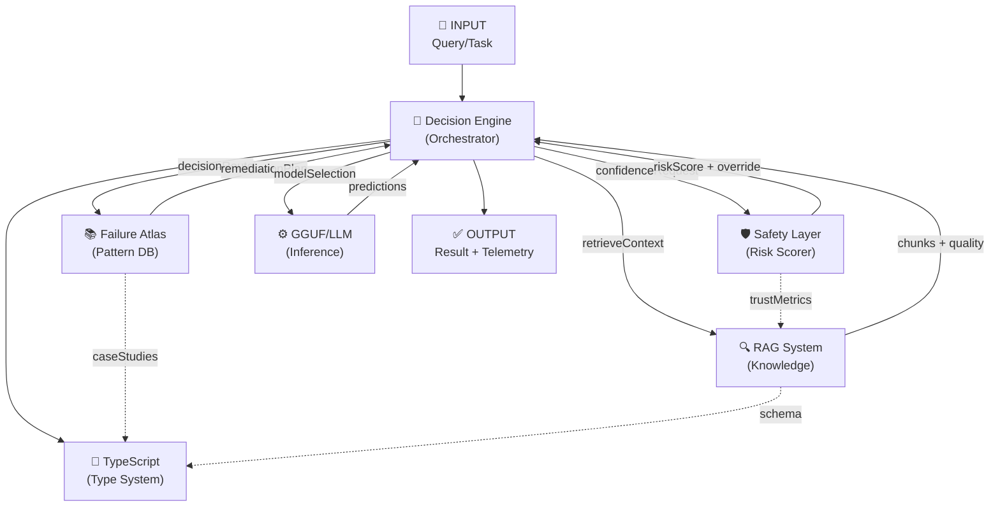

# 🔗 Cross-Layer Integration Contract

> **Diğer 6 dokümanı tek I/O sözleşmesinde birleştiren entegrasyon katmanı**

---

## 📌 Doküman Kartı

| Alan | Değer |
|---|---|
| Rol | Katmanlar arası entegrasyon ve veri sözleşmesi |
| Durum | Living specification (`v1.5`) |
| Son güncelleme | 2026-04-03 |
| Birincil okur | Platform mimarları, backend ekipleri, MLOps |
| Ana girdi | Katmanlar arası request/response payload'ları |
| Ana çıktı | Sözleşme tipleri, fallback zinciri, telemetry şeması |
| Bağımlı dokümanlar | [ai-decision-execution-engine.md](ai-decision-execution-engine.md), [ai-safety-trust-verification-layer.md](ai-safety-trust-verification-layer.md), [failure-pattern-atlas.md](failure-pattern-atlas.md), [rag-source-quality-rubric.md](rag-source-quality-rubric.md), [gguf_llm_katmanlari.md](gguf_llm_katmanlari.md), [typescript.md](typescript.md) |

**Kalite notu:** Bu doküman normatif sözleşme kaynağıdır. Katman implementasyonları bu tip isimlerini ve zorunlu alanları referans almalıdır.

---

## 🎯 Misyon

Bu doküman, 6 ana katmanın birbirleriyle nasıl iletişim kuracağını, veri değişim formatlarını ve entegrasyon noktalarını tanımlar. Her katmanın I/O sözleşmesi açıkça belirtilir.

---

## 📊 Mimari Görünüm

> **Kod Durumu:** `Reference`


---

## 1. DECISION ENGINE ↔ FAILURE ATLAS

### Decision Engine → Failure Atlas (Request)

> **Kod Durumu:** `Reference`
```typescript
interface FailurePatternRequest {
  // Input context
  executionId: string;
  query: Query;
  currentState: EngineState;
  
  // Error context (optional)
  previousFailures: Failure[];
  currentError?: DecisionError;
  errorStack?: string[];
  
  // Analysis request
  requestType: 'patternMatch' | 'remediationPlan' | 'caseStudySearch';
  
  // Filters
  severity?: 'critical' | 'high' | 'medium' | 'low';
  timeWindow?: number; // milliseconds
  maxResults?: number;
}

interface FailurePatternResponse {
  // Matched patterns
  matchedPatterns: Array<{
    patternId: string;
    matchConfidence: number;
    matchedInstances: FailureInstance[];
  }>;
  
  // Remediation if applicable
  recommendedRemediation?: FailureRemediation;
  remediationSuccessRate?: number;
  
  // Case studies for learning
  relevantCaseStudies: FailureCaseStudy[];
  
  // Metadata
  responseTime: number;
  dataSourceQuality: number; // 0-1
}
```

### Failure Atlas → Decision Engine (Response)

> **Kod Durumu:** `Reference`
```typescript
// Within FailurePatternResponse
type RemediationRecommendation = FailureRemediation;
```

**Calling Pattern:**
> **Kod Durumu:** `Reference`
```typescript
async function decideWithFailureAtlas(
  query: Query,
  state: EngineState
): Promise<Decision> {
  const atlasRequest: FailurePatternRequest = {
    executionId: state.executionId,
    query,
    currentState: state,
    requestType: 'patternMatch'
  };
  
  const atlasResponse = await failureAtlas.analyze(atlasRequest);
  const remediation = atlasResponse.recommendedRemediation;
  
  if (atlasResponse.matchedPatterns.length > 0 && remediation) {
    const pattern = atlasResponse.matchedPatterns[0];
    return {
      route: 'failureAtlasRemediation',
      confidence: pattern.matchConfidence,
      remediation,
      estimatedCost: 0.01,
      estimatedLatency: remediation.estimatedDurationMs
    };
  }
  
  // Fallback to standard decision
  return this.makeStandardDecision(query, state);
}
```

---

## 2. DECISION ENGINE ↔ SAFETY LAYER

### Decision Engine → Safety Layer (Before Execution)

> **Kod Durumu:** `Reference`
```typescript
interface SafetyValidationRequest {
  // Decision to validate
  decision: Decision;
  
  // Execution context
  output: Output; // AI model output
  context: ExecutionContext;
  
  // Previous trust data
  previousTrustScores?: TrustScore[];
  userProfile?: UserProfile;
  taskRiskLevel?: number;
  
  // Validation type
  validationType: 'beforeExecution' | 'afterExecution' | 'continuousMonitoring';
}

interface SafetyValidationResponse {
  // Safety check results
  overallSafety: {
    safeToProceed: boolean;
    trustScore: number; // 0-1
    recommendedAction: 'proceed' | 'modify' | 'escalate' | 'halt';
  };
  
  // Factor-wise analysis
  factors: {
    hallucination: { score: number; status: 'safe' | 'warning' | 'unsafe' };
    safety: { score: number; status: 'safe' | 'warning' | 'unsafe' };
    reliability: { score: number; status: 'safe' | 'warning' | 'unsafe' };
    contextDrift: { score: number; status: 'safe' | 'warning' | 'unsafe' };
  };
  
  // Adaptive thresholds used
  thresholdsApplied: AdaptiveThreshold;
  
  // Required actions if unsafe
  requiredActions?: SafetyAction[];
  monitoringLevel?: 'minimal' | 'standard' | 'intensive';
  
  // Override decision if needed
  overrideDecision?: Decision; // Alternative safe decision
}

interface SafetyAction {
  action: 'requestConfirmation' | 'modifyOutput' | 'logIncident' | 'escalateToHuman';
  reasoning: string;
  requiredParameter?: string;
}
```

### Safety Layer → Decision Engine (Decision Override)

> **Kod Durumu:** `Reference`
```typescript
class DecisionSafetyAdapter {
  async applyOverride(
    originalDecision: Decision,
    safetyResponse: SafetyValidationResponse
  ): Promise<Decision> {
    if (safetyResponse.overallSafety.safeToProceed) {
      // Safe - proceed with monitoring
      return {
        ...originalDecision,
        monitoringLevel: safetyResponse.monitoringLevel,
        trustScore: safetyResponse.overallSafety.trustScore,
        safetyMetadata: safetyResponse
      };
    }
    
    // Not safe - apply override
    if (safetyResponse.overrideDecision) {
      return safetyResponse.overrideDecision;
    }
    
    switch (safetyResponse.overallSafety.recommendedAction) {
      case 'proceed':
        // Monitored execution
        return { ...originalDecision, requiresMonitoring: true };
        
      case 'modify':
        // Modify decision parameters
        return this.modifyDecisionForSafety(originalDecision, safetyResponse);
        
      case 'escalate':
        // Escalate to human
        return {
          route: 'humanReview',
          confidence: 1.0,
          reason: 'Safety escalation',
          requirements: safetyResponse.requiredActions
        };
        
      case 'halt':
        // Stop execution
        throw new Error(`Safety halt: ${safetyResponse.overallSafety.recommendedAction}`);
    }
  }
}
```

---

## 3. DECISION ENGINE ↔ RAG SYSTEM

### Decision Engine → RAG (Context Request)

> **Kod Durumu:** `Reference`
```typescript
interface RAGRetrievalRequest {
  // Query and context
  query: Query;
  queryEmbedding?: number[];
  userContext: ExecutionContext;
  
  // Retrieval parameters
  topK: number; // Default: 5
  filters?: {
    contentType?: string[];
    qualityScoreMin?: number;
    sourceLanguage?: string;
  };
  
  // Ranking preferences
  rankingStrategy: 'qualityAware' | 'hybrid' | 'semanticOnly' | 'keywordOnly';
  qualityWeight?: number; // 0-1
  
  // Monitoring
  trackMetrics: boolean;
}

interface RAGRetrievalResponse {
  // Retrieved chunks
  chunks: Array<{
    chunkId: string;
    content: string;
    metadata: any;
    
    // Relevance scores
    relevanceScore: number;
    qualityScore: number;
    confidenceScore: number;
    
    // Quality metrics
    semanticCoherence: number;
    retrievalEfficiency: number;
    actionability: number;
    
    // Source information
    source: string;
    version: number;
    lastUpdated: number;
  }>;
  
  // Aggregated metrics
  retrievalQuality: number; // Average quality of results
  hallucinationRisk: number; // 0-1
  shouldUseAlternativeSource?: boolean;
  
  // Monitoring data
  executionTimeMs: number;
  costUSD?: number;
}
```

### RAG → Decision Engine (Reliability Feedback)

> **Kod Durumu:** `Reference`
```typescript
interface RAGReliabilityFeedback {
  // Quality assessment for decisions
  retrievalQualityScore: number; // 0-10
  recommendedConfidenceModifier: number; // Multiply decision confidence by this
  
  // Risk assessment
  expectedHallucinationRate: number; // For decision's safety checks
  dataRecencyScore: number; // How fresh is the data
  
  // Integration guidance
  howToUseInDecision: {
    shouldConsiderAlternativeRoutes: boolean;
    recommendedDecisionModifier?: DecisionModifier;
    monitoringRecommendation: string;
  };
}

interface DecisionModifier {
  field: string;
  operation: 'multiply' | 'add' | 'replace';
  value: any;
  reason: string;
}
```

---

## 4. RAG ↔ SAFETY LAYER

### RAG → Safety Layer (Chunk Quality for Trust)

> **Kod Durumu:** `Reference`
```typescript
interface ChunkQualityForTrust {
  chunkId: string;
  
  // Quality indicators for safety assessment
  hasExamples: boolean; // Increases trust
  hasSourceCitation: boolean; // Increases trust
  hasWarnings: boolean; // Should increase scrutiny
  
  // Semantic properties
  semanticCoherence: number; // Higher = more coherent = more trustworthy
  isFromAuthoritativeSource: boolean;
  ageCategoryDays: number; // Older = potentially stale
  
  // Reliability indicators
  userClickThroughRate: number; // If tracked
  falsePositiveRate: number; // How often does it cause errors?
  deprecationStatus: 'current' | 'upcomingDeprecation' | 'deprecated';
}

class SafetyChunkAssessment {
  trustContribution(chunkQuality: ChunkQualityForTrust): number {
    let trustScore = 0.5; // Baseline
    
    // Positive factors
    if (chunkQuality.hasExamples) trustScore += 0.1;
    if (chunkQuality.isFromAuthoritativeSource) trustScore += 0.15;
    trustScore *= (1 + chunkQuality.semanticCoherence * 0.2);
    
    // Negative factors
    trustScore -= chunkQuality.falsePositiveRate * 0.3;
    if (chunkQuality.deprecationStatus === 'deprecated') trustScore -= 0.25;
    
    return Math.max(0.1, Math.min(1, trustScore));
  }
}
```

---

## 5. GGUF/LLM ↔ DECISION ENGINE

### Decision Engine → LLM (Inference Request)

> **Kod Durumu:** `Reference`
```typescript
interface LLMInferenceRequest {
  // Model selection
  modelRoute: string; // From decision
  modelName: string;
  quantization: string; // Q4_K_M, etc.
  
  // Input
  prompt: string;
  systemContext: string;
  
  // Generation parameters
  temperature: number;
  topK: number;
  topP: number;
  maxTokens: number;
  
  // Context
  conversationHistory?: Message[];
  toolContext?: ToolCallContext;
  
  // Budget constraints
  tokenBudget: number;
  latencyBudgetMs: number;
  costBudgetUSD: number;
}

interface LLMInferenceResponse {
  // Output
  text: string;
  tokens: number;
  
  // Quality metrics
  temperature: number; // Used temperature
  repetitionPenalty: number;
  
  // Cost and performance
  inferenceTimeMs: number;
  tokensPerSecond: number;
  costUSD: number;
  
  // Confidence/uncertainty
  logProbabilities?: number[];
  uncertainty?: number;
  
  // Integration metadata
  modelUsed: string;
  quantizationUsed: string;
  batchSize: number;
  
  // For safety layer consumption
  logitsForValidation?: number[];
}
```

### LLM → Decision Engine (Feedback Loop)

> **Kod Durumu:** `Reference`
```typescript
interface LLMPerformanceFeedback {
  // Quality feedback
  outputQuality: number; // 0-10, human rated when available
  hallucinationDetected: boolean;
  requiresFollowUp: boolean;
  
  // Performance metrics
  costEfficiency: number; // Output quality / cost
  latencyPercentile: number; // How did this compare to historical?
  
  // Learning signal
  shouldAdjustTemperature: boolean;
  shouldSwitchQuantization: boolean;
  shouldIncreaseContext: boolean;
  
  // Integration with other layers
  recommendedDecisionAdjustment?: DecisionModifier;
}
```

---

## 6. TYPESCRIPT TYPE SYSTEM ↔ ALL LAYERS

### Type Contracts for Integration

> **Kod Durumu:** `Reference`
```typescript
// Global integration types that all layers must satisfy

interface LayerContract<TInput, TOutput> {
  // Every layer must implement this
  processRequest(input: TInput): Promise<TOutput>;
  
  // Metadata for integration
  metadata: {
    layerName: string;
    version: string;
    expectedLatencyMs: number;
    costPerRequest: number;
  };
  
  // Error handling contract
  onError(error: Error): Promise<TOutput | null>;
}

// Type-safe layer registry
interface LayerRegistry {
  decisionEngine: LayerContract<Query, Decision>;
  failureAtlas: LayerContract<FailurePatternRequest, FailurePatternResponse>;
  safetyLayer: LayerContract<SafetyValidationRequest, SafetyValidationResponse>;
  ragSystem: LayerContract<RAGRetrievalRequest, RAGRetrievalResponse>;
  llmService: LayerContract<LLMInferenceRequest, LLMInferenceResponse>;
}

// Union type for any request in the system
type AnyLayerRequest = 
  | Query 
  | FailurePatternRequest 
  | SafetyValidationRequest 
  | RAGRetrievalRequest 
  | LLMInferenceRequest;

type AnyLayerResponse = 
  | Decision 
  | FailurePatternResponse 
  | SafetyValidationResponse 
  | RAGRetrievalResponse 
  | LLMInferenceResponse;

// Type-safe request routing
class CrossLayerRouter {
  constructor(private readonly registry: LayerRegistry) {}

  async route<T extends AnyLayerRequest, R extends AnyLayerResponse>(
    request: T,
    targetLayer: keyof LayerRegistry
  ): Promise<R> {
    const layer = this.registry[targetLayer] as LayerContract<T, R>;
    return layer.processRequest(request);
  }
}
```

---

## 7. TELEMETRY & OBSERVABILITY CONTRACT

### Shared Telemetry Format

> **Kod Durumu:** `Reference`
```typescript
interface UnifiedTelemetryEvent {
  // Universal identifiers
  traceId: string;
  spanId: string;
  parentSpanId?: string;
  
  // Routing information
  sourceLayer: string;
  targetLayer: string;
  integrationPoint: string; // E.g., "decisionEngine->rag"
  
  // Execution data
  timestamp: number;
  duration: number;
  success: boolean;
  
  // Cost tracking
  tokensUsed?: number;
  computeUnits?: number;
  costUSD?: number;
  
  // Metadata for all layers
  metadata: {
    userId?: string;
    sessionId?: string;
    taskId?: string;
    environment: string;
  };
  
  // Errors if applicable
  error?: {
    code: string;
    message: string;
    severity: 'info' | 'warn' | 'error' | 'critical';
  };
  
  // Tags for monitoring
  tags: Record<string, string>;
}

class CrossLayerTelemetry {
  async recordIntegration(event: UnifiedTelemetryEvent): Promise<void> {
    // Send to centralized telemetry system
    // Format: OpenTelemetry compatible
    // Exporters: Prometheus, Jaeger, Datadog, etc.
  }
}
```

---

## 8. ERROR HANDLING & FALLBACK CHAIN

### Standard Failure Modes

> **Kod Durumu:** `Reference`
```typescript
interface CrossLayerFailure {
  originatingLayer: string;
  failureType: 'timeout' | 'overload' | 'validationError' | 'dependencyFailure';
  severity: 'low' | 'medium' | 'high' | 'critical';
  canFallback: boolean;
  
  // Recovery options
  fallbackLayers: string[];
  retryStrategy: 'exponential' | 'linear' | 'none';
  maxRetries: number;
}

class CrossLayerFallbackHandler {
  async executeWithFallback<T>(
    primaryExecution: () => Promise<T>,
    fallbacks: Array<() => Promise<T>>,
    context: ExecutionContext
  ): Promise<T> {
    try {
      return await primaryExecution();
    } catch (error) {
      for (const fallback of fallbacks) {
        try {
          return await fallback();
        } catch (fallbackError) {
          // Continue to next fallback
        }
      }
      
      // All failed
      throw new Error('All fallback executions failed');
    }
  }
}

// Example fallback chain
const fallbackChain = [
  async () => await decisionEngine.decideFast(query), // Primary
  async () => await decisionEngine.decidePrecise(query), // Fallback 1
  async () => await failureAtlas.suggestFromHistory(query), // Fallback 2
  async () => ({ route: 'default', confidence: 0.5 }) // Last resort
];
```

---

## 9. INTEGRATION VALIDATION CHECKLIST

> **Kod Durumu:** `Production-Ready`
```typescript
interface IntegrationValidation {
  checkName: string;
  layer1: string;
  layer2: string;
  validationRule: () => Promise<boolean>;
  severity: 'critical' | 'warning';
}

const integrationValidations: IntegrationValidation[] = [
  {
    checkName: 'Decision Engine passes correct safety request format',
    layer1: 'DecisionEngine',
    layer2: 'SafetyLayer',
    validationRule: async () => {
      const request: SafetyValidationRequest = {
        decision: mockDecision,
        output: mockOutput,
        context: mockContext,
        validationType: 'beforeExecution'
      };
      return schema.validate(request).valid;
    },
    severity: 'critical'
  },
  {
    checkName: 'RAG chunks have all required quality metrics',
    layer1: 'RAGSystem',
    layer2: 'DecisionEngine',
    validationRule: async () => {
      const response = await rag.retrieve(mockQuery);
      return response.chunks.every(c => 
        c.qualityScore !== undefined &&
        c.semanticCoherence !== undefined &&
        c.relevanceScore !== undefined
      );
    },
    severity: 'critical'
  },
  {
    checkName: 'Safety layer provides adaptive thresholds',
    layer1: 'SafetyLayer',
    layer2: 'DecisionEngine',
    validationRule: async () => {
      const response = await safetyLayer.validate(mockRequest);
      return response.thresholdsApplied?.adaptiveThreshold !== undefined;
    },
    severity: 'warning'
  }
];

class IntegrationTestSuite {
  async runAllValidations(): Promise<ValidationResult[]> {
    return Promise.all(
      integrationValidations.map(async (validation) => ({
        ...validation,
        passed: await validation.validationRule(),
        timestamp: Date.now()
      }))
    );
  }
}
```

---

## 10. DEPLOYMENT VERIFICATION

> **Kod Durumu:** `Reference`
```typescript
interface DeploymentVerification {
  timestamp: number;
  environment: 'dev' | 'staging' | 'production';
  
  // Layer health
  layerHealth: Record<string, 'healthy' | 'degraded' | 'down'>;
  
  // Integration checks
  integrationLatencies: Record<string, number>; // ms
  integrationErrorRates: Record<string, number>; // %
  
  // SLO compliance
  sloCompliance: {
    availability: number; // %
    latencyP99: number; // ms
    errorRate: number; // %
  };
  
  // Rollback readiness
  canRollback: boolean;
  rollbackProcedure: string;
}

class DeploymentVerifier {
  async verifyIntegration(): Promise<DeploymentVerification> {
    // Run integration tests
    // Check latencies
    // Verify error rates
    // Confirm SLOs
    
    const environment = (
      process.env.ENVIRONMENT ?? 'dev'
    ) as DeploymentVerification['environment'];

    return {
      timestamp: Date.now(),
      environment,
      layerHealth: await this.checkLayerHealth(),
      integrationLatencies: await this.measureLatencies(),
      integrationErrorRates: await this.measureErrorRates(),
      sloCompliance: await this.checkSLOs(),
      canRollback: true,
      rollbackProcedure: 'git revert <commit>'
    };
  }
}
```

---

## 🧩 v1.4 Canonical Contract Alignment

Bu bölüm, `ai-decision-execution-engine.md` içindeki `Production Hardening Delta (v1.4)` ile birebir isim uyumunu zorunlu kılar.

### 1) Unified Trace + Replay (Normatif)

> **Kod Durumu:** `Reference`
```typescript
type LayerName = 'decision' | 'rag' | 'model' | 'safety' | 'tool' | 'verification';

interface TraceEnvelope {
  traceId: string;
  spanId: string;
  parentSpanId?: string;
  sessionId: string;
  taskId: string;
  layer: LayerName;
  stage: string;
  timestamp: number;
}

interface ReplayEvent {
  envelope: TraceEnvelope;
  inputHash: string;
  outputHash?: string;
  policySnapshotId: string;
  modelSnapshotId?: string;
  toolSnapshotId?: string;
  safetySnapshotId?: string;
  outcome: 'success' | 'failure' | 'degraded' | 'halted';
  error?: ContractError;
}
```

Kural: Tüm katmanlar aynı `traceId` taşımalı; trace zinciri koparsa request `E_VALIDATION` ile reddedilir.

### 2) Schema Version + Error + Idempotency (Normatif)

> **Kod Durumu:** `Reference`
```typescript
interface ContractVersion {
  schemaName: string;
  version: `${number}.${number}.${number}`;
  backwardCompatibleWith: string[];
  deprecatedAfter?: string;
}

type ContractErrorCode =
  | 'E_VALIDATION'
  | 'E_TIMEOUT'
  | 'E_DEPENDENCY'
  | 'E_SAFETY'
  | 'E_POLICY'
  | 'E_RESOURCE'
  | 'E_INTERNAL';

interface ContractError {
  code: ContractErrorCode;
  message: string;
  layer: LayerName;
  traceId: string;
  retriable: boolean;
  details?: Record<string, unknown>;
}

interface IdempotencyContract {
  idempotencyKey: string;
  operation: string;
  ttlMs: number;
  replaySafe: boolean;
}
```

Kural: Mutating tool çağrısı `idempotencyKey` olmadan geçersizdir.

### 3) Global SLA Contract (Normatif)

> **Kod Durumu:** `Reference`
```typescript
type SLAMode = 'cheap' | 'balanced' | 'critical';

interface BudgetPolicy {
  mode: SLAMode;
  maxCostPerTaskUSD: number;
  maxLatencyMs: number;
  minAccuracy: number;
}
```

Kural: Katmanlar `SLAMode` alan adını aynen kullanır; eşdeğer alias üretilemez.

---

## 🧩 v1.4 Production Semantics Alignment

Bu bölüm, cross-layer sözleşmesini tip tanımı seviyesinden yürütme semantiği seviyesine yükseltir.

### 1) Event-Sourcing Message Contract

> **Kod Durumu:** `Reference`
```typescript
interface LayerEvent {
  traceId: string;
  sequence: number;
  producerLayer: LayerName;
  consumerLayer: LayerName;
  eventType: string;
  payload: Record<string, unknown>;
  createdAt: number;
}

interface OrderedEventBus {
  publish(event: LayerEvent): Promise<void>;
  consume(traceId: string): Promise<LayerEvent[]>;
}
```

Kural: Aynı `traceId` içinde `sequence` monotonik artmak zorundadır; sıra bozulursa replay geçersiz sayılır.

### 2) Schema Version Lifecycle (Normatif)

> **Kod Durumu:** `Reference`
```typescript
type SchemaStage = 'active' | 'compatibility' | 'deprecated' | 'retired';

interface SchemaLifecycleRule {
  schemaName: string;
  currentVersion: string;
  stage: SchemaStage;
  backwardCompatibleWith: string[];
  deprecationAnnouncedAt?: string;
  retiredAt?: string;
}
```

Kural: `deprecated` aşamasındaki şema yalnızca `compatibility window` içinde kabul edilir.

### 3) Idempotency + Retry Matrix

| Operation Type | IdempotencyKey | Retry |
|---|---|---|
| `read` | Optional | `retryable` |
| `write` | Mandatory | `retryable` only if no side-effect commit |
| `externalSideEffect` | Mandatory | Disabled by default |

### 4) Error Propagation Envelope

> **Kod Durumu:** `Reference`
```typescript
interface ErrorEnvelope {
  traceId: string;
  sequence: number;
  sourceLayer: LayerName;
  targetLayer: LayerName;
  error: ContractError;
}
```

Kural: Katmanlar ham exception fırlatamaz; her hata `ErrorEnvelope` ile propagate edilir.

---

## 🧩 v1.5 Ruthless Enforcement Contract

### 1) Fail-Closed Cross-Layer Gateway

> **Kod Durumu:** `Reference`
```typescript
interface CrossLayerGatekeeper {
  enforceInput(layer: LayerName, payload: unknown): Promise<void>;
  enforceOutput(layer: LayerName, payload: unknown): Promise<void>;
  failClosed(error: ContractError): never;
}
```

Kural: Validation veya drift hatasında katman fail-open devam edemez.

### 2) Backward Compatibility Window

> **Kod Durumu:** `Reference`
```typescript
interface CompatibilityWindow {
  schemaName: string;
  fromVersion: string;
  toVersion: string;
  validUntil: string; // ISO date
}
```

Kural: `validUntil` sonrası eski payload otomatik olarak `E_VALIDATION` ile reddedilir.

### 3) Canary Contract Tests (Release Gate)

| Canary Pack | İçerik | Blocking |
|---|---|---|
| `dto-canary` | Cross-layer DTO drift kontrolü | Yes |
| `error-canary` | `ContractErrorCode` propagation | Yes |
| `idempotency-canary` | Duplicate mutation önleme | Yes |

---

### 4) Deterministic Replay Protocol (Operational)

> **Kod Durumu:** `Reference`
```typescript
interface DeterministicReplayRequest {
  traceId: string;
  expectedLastSequence?: number;
}

interface DeterministicReplayResponse {
  traceId: string;
  reconstructed: boolean;
  missingSequences: number[];
  mismatchedInputs: string[];
  replayHash: string;
}

interface DeterministicInputCapture {
  traceId: string;
  sequence: number;
  policySnapshotId: string;
  modelSnapshotId?: string;
  toolVersionMap: Record<string, string>;
  normalizedInputHash: string;
}
```

Kural: `missingSequences.length > 0` veya `mismatchedInputs.length > 0` ise replay `invalid` sayılır.

### 5) Idempotency Collision Semantics (Operational)

| Existing State | Incoming Same Key | Behavior |
|---|---|---|
| `in_progress` | same op | reject with `E_RESOURCE:duplicate_inflight` |
| `succeeded` | same op | return stored response (no re-execution) |
| `failed` | same op | retry only if failure marked `retriable` |
| any | different op | reject with `E_POLICY:idempotency_key_reuse` |

Kural: Bu matris cross-layer zorunludur; katman bazlı override yapılamaz.

---

### 6) Release Governance Engine (Operational)

> **Kod Durumu:** `Reference`
```typescript
interface ReleaseGovernanceEngine {
  canaryPromotionGate(input: {
    dtoCanaryPass: boolean;
    runtimeGateCanaryPass: boolean;
    replayAuditPass: boolean;
  }): boolean;
  onBackwardCompatibilityBreach(schemaName: string, version: string): Promise<void>;
  emergencyDowngrade(targetVersion: string, reason: string): Promise<void>;
  schemaDriftAlarm(layer: LayerName, details: string): Promise<void>;
}
```

Kural: Canary gate fail durumunda promotion otomatik durur; kritik breach'te `emergencyDowngrade` tetiklenir.

### 7) Compatibility Breach Escalation Table

| Breach Type | Severity | Action |
|---|---|---|
| backward incompatible DTO | critical | block + downgrade |
| non-deterministic replay | high | block + incident |
| schema drift in prod | critical | block + alert + rollback |

---

### 8) Multi-Actor Coordination Contract (Operational)

> **Kod Durumu:** `Reference`
```typescript
interface SharedStateLockContract {
  lockKey: string;
  ownerAgentId: string;
  leaseTtlMs: number;
  acquiredAt: number;
}

interface SharedStateArbitrationRequest {
  traceId: string;
  stateKey: string;
  proposals: Array<{ agentId: string; valueHash: string; priority: number }>;
}
```

Kural: Cross-layer shared state write'ları lock/lease olmadan kabul edilemez.

### 9) Queue Pressure / Backpressure Signal Contract

> **Kod Durumu:** `Reference`
```typescript
interface SchedulerPressureSignal {
  timestamp: number;
  queueDepth: number;
  runningTasks: number;
  cpuPressure: number;
  memoryPressure: number;
  action: 'throttle' | 'defer' | 'degrade' | 'reject';
}
```

Kural: `action` alanı boş bırakılan pressure sinyali geçersizdir.

---

**Bu doküman ve 6 ana doküman ile uçtan uca production-grade hedef mimari ve enforcement sözleşmeleri tanımlanmıştır.**

Gerçek production-readiness, runtime implementasyon ve audit metriklerinin başarıyla doğrulanmasına bağlıdır.
